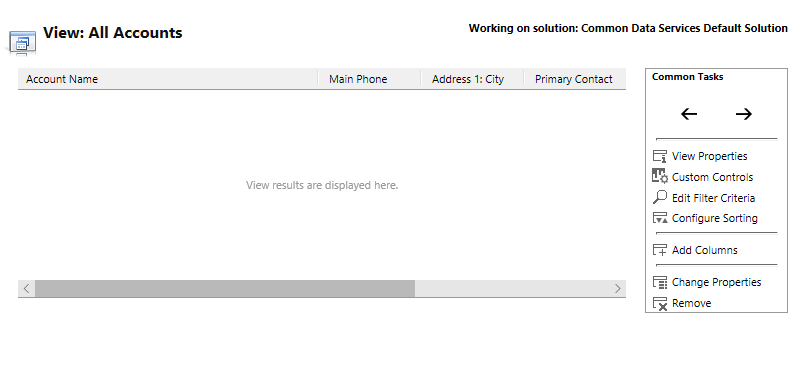

# Access a model-driven app view definition in PowerApps

 In this topic you open a view definition to display properties and options to configure the view. There are several ways you can access view definitions in PowerApps. 
  
  
## Open a view in PowerApps

1.  On the [PowerApps](https://web.powerapps.com/?utm_source=padocs&utm_medium=linkinadoc&utm_campaign=referralsfromdoc) site, select **Model-driven** (lower left of the navigation pane).  

    

    > [!IMPORTANT]
    > “If the **Model-driven** design mode isn't available, you may need to [Create an environment](https://docs.microsoft.com/powerapps/administrator/create-environment). 

2.  Expand **Data**, select **Entities**, and then select the **Account** entity.   
3. Select the **Views** tab, and then select **Remove filter**.

    

4. Select the view you want to open, such as the account entity **All Accounts** view.

    

5. From the view editor you can perform several tasks: 
 
- [Sort records in a view](configure-sorting.md)
- [Choose and configure columns in views](choose-and-configure-columns.md)
- [Use custom controls for data visualizations](use-custom-controls-data-visualizations.md) 

## Open a view from an app

On any list view for an entity, in the command bar you will find the following commands after you select the ellipsis (...) button:  
- **View**: Opens the definition of the current view in the default solution.  
  
- **New System View**: Opens a new window to create a new view for the current entity in the default solution.  
  
- **Customize Entity**: Takes you to the definition of the current entity in the default solution where you can then select **Views**.  
  
- **System Views**: Opens the same window as **Customize Entity**, except with **Views** selected.  

## Open a view in solution explorer 
  
1.  Open [solution explorer](advanced-navigation.md#solution-explorer).  
  
2.  Under **Components**, expand **Entities**, and then expand the entity you want.  
  
3.  Select **Views**.  
  
4.  Double-click the view you want to open.  
  
 This list of views has four filters you can use to find the views you want more easily:  
  
    - **All Active Views**  
  
    - **Active Public Views**  
  
    - **Inactive Public Views**  
  
    - **Active System-Defined Views**  
  
 If the entity that the view is associated with is part of an unmanaged solution, you can still create or edit views for that entity in the default solution. System views are associated with an entity and are not available as separate solution components. Unlike fields, views do not use a customization prefix in a unique name that should be consistent in a solution, so you do not need to create views in the context of a solution. 
 
## Next steps
[Understand views ](create-edit-views.md)

