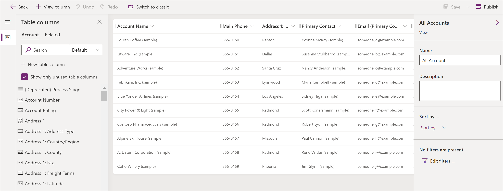

# Opening the view designer

[!INCLUDE [cc-data-platform-banner](../../includes/cc-data-platform-banner.md)]

In this topic a view definition will be opened to display properties and options to configure the view.

## Open a view for editing in the solution explorer

1. Sign in to [Power Apps](https://make.powerapps.com/?utm_source=padocs&utm_medium=linkinadoc&utm_campaign=referralsfromdoc).
1. Select **Solutions** open the solution that needs to be modified.  
1. Select the table that contains the required view, such as the **Account** table.
1. Select the **Views** tab.

    > [!div class="mx-imgBorder"]
    > 

1. Select the required view, such as the account table **All Accounts** view.

    > [!div class="mx-imgBorder"]
    > 

1. From the view editor the following tasks can be performed:

- [Sort rows in a view](configure-sorting.md)
- [Choose and configure columns in views](choose-and-configure-columns.md)
- [Filtering data within views](create-edit-view-filters.md)  
## Next steps

[Creating and editing public views](create-or-edit-model-driven-app-view.md)

[!INCLUDE[footer-include](../../includes/footer-banner.md)]
