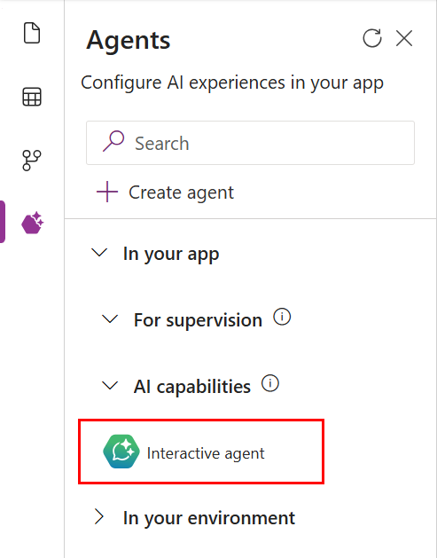
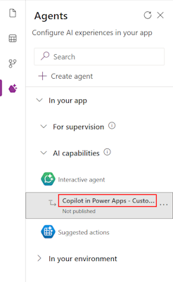

# Add agents to your model-driven app (Preview)

[!INCLUDE [preview-banner](~/../shared-content/shared/preview-includes/preview-banner.md)]

Model-driven apps support the use of agents to enhance user productivity and automate tasks. There are two types of agents available in model-driven apps: 

- **Autonomous agents**, created in Microsoft Copilot Studio, which can be added to apps for supervised execution by end users. 

- **Interactive agent**, which can be created to provide custom topics, knowledge sources, and more within the model-driven app.

> [!IMPORTANT]
>
> - This is a preview feature.
> - Preview features aren't meant for production use and might have restricted functionality. These features are subject to [supplemental terms of use](https://go.microsoft.com/fwlink/?linkid=2216214), and are available before an official release so that customers can get early access and provide feedback.

## Working with Autonomous agents

## Working with an Interactive agent

The **Interactive agent** makes a model-driven app more intelligent and relevant for your organization by adding additional topics, knowledge sources, and more. The Copilot Chat, Agent APIs and Agent reponse components access the topics within this agent.

> [!div class="mx-imgBorder"] 
> 

> [!NOTE]
> The **Interactive agent** is improved experience of the **... > Configure in Copilot Studio**. The agents created with the previous expeience are now shown as the **Interactive agent**

### Creating an Interactive agent

When an Interactive agent is created, it is named as "Copilot in Power Apps - " then the app name. The created agent is associated with the app when it is saved and published.

1. Open **Agents** pane
1. Expand **In your app** > **AI capabilities**
1. On **Interactive agent", click **... > Configure**
1. Click **Configure in Copilot Studio** to create the agent
1. While the agent is being created "Setting up your app's copilot" will be shown in the popup
1. New browser tab for **Copilot Studio** will be opened with the new agent
   > [!NOTE]
   > Popouts need to be enabled to allow editing the created agent
1. Select refresh in pane header after popup to show the created agent
   > [!div class="mx-imgBorder"] 
   > 
1. Switch to the **Copilot Studio** browser tab to add topics, knowledge, etc. to the agent
1. Save and publish the agent
1. Switch to the **App Designer** browser tab to save and publish the app

## Related information

[Overview of App Designer](app-designer-overview.md) 
[Customize Copilot Chat](customize-copilot-chat.md)
