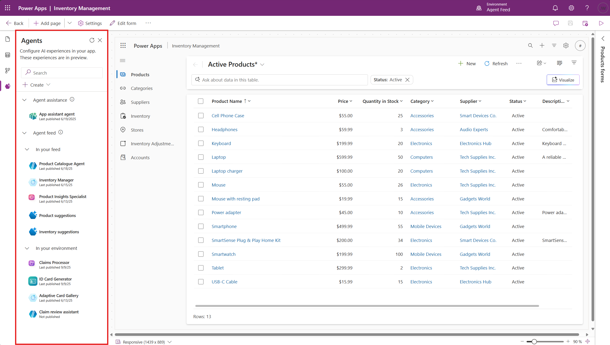
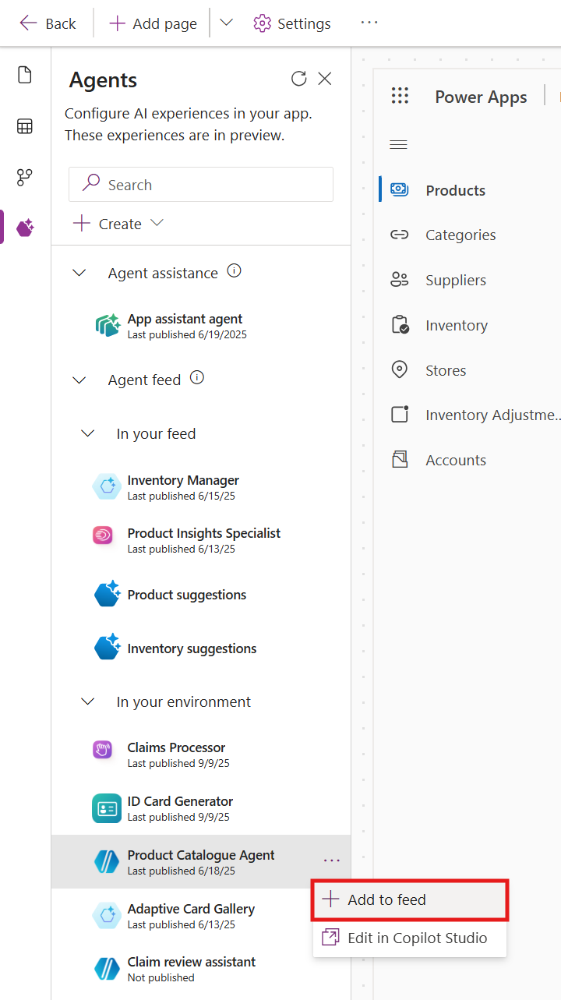
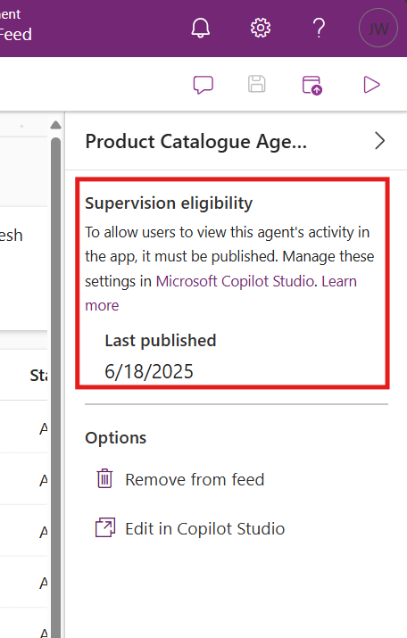
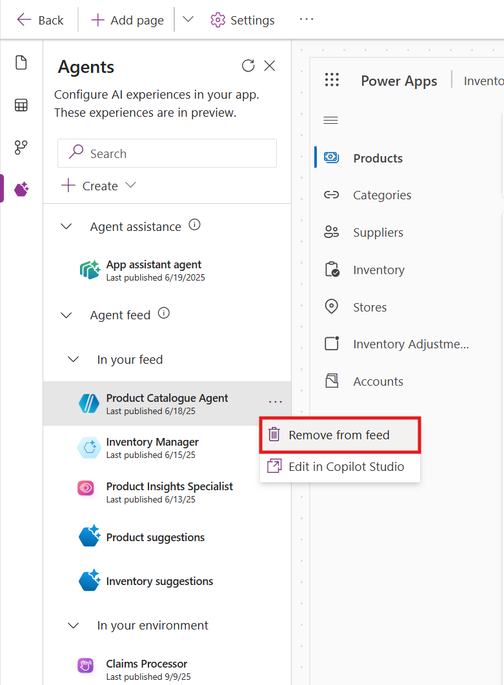
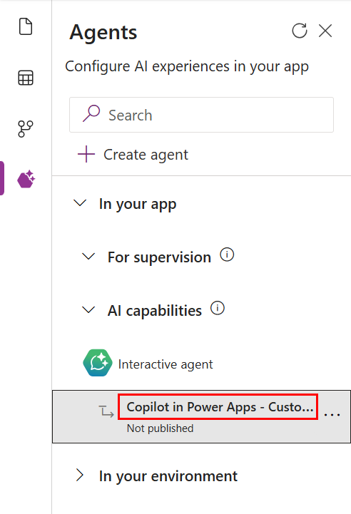

# Add agents to your model-driven app (Preview)

[!INCLUDE [preview-banner](~/../shared-content/shared/preview-includes/preview-banner.md)]

Model-driven apps support the use of agents to enhance user productivity and automate tasks. There are two types of agents available in model-driven apps: 

- **Autonomous agents**, created in Microsoft Copilot Studio, can be added to apps for supervised execution by end users.

- **Interactive agent**, which can be created to provide custom topics, knowledge sources, and more within the model-driven app.

> [!div class="mx-imgBorder"] 
> 

> [!IMPORTANT]
>
> - This is a preview feature.
> - Preview features aren't meant for production use and might have restricted functionality. These features are subject to [supplemental terms of use](https://go.microsoft.com/fwlink/?linkid=2216214), and are available before an official release so that customers can get early access and provide feedback.

## Working with Autonomous agents
Autonomous agents can be added to model-driven apps to assist users with task completion. When added to an app, these agents can be supervised by end users, allowing them to validate completed tasks, intervene when errors occur, and complete tasks that the agent was unable to finish—all within the context of their regular workflows. 

> [!IMPORTANT]
> Currently, only the owner of an agent can view and supervise that agent’s data in a model-driven app. Support for sharing agent data with other users is a top priority and is actively being developed.

### Add autonomous agents to an app
To add an autonomous agent to a model-driven app:
1. Sign in to Power Apps, select **Apps**, and then select **Edit** for the app you want to modify.
1. In the app designer, go to the **Agents** tab.
1. In the **In your environment** dropdown, locate the agent you want to add.
1. Select the **...** (more options) menue next to the agent and choose **Add to app**.
1. To view or edit the agent in Copilot Studio, select **View in Microsoft Copilot Stuio**.

> [!div class="mx-imgBorder"] 
> 

> [!NOTE]
> To be eligible for addition to an app, an agent must be published, have [generative AI enabled](https://learn.microsoft.com/en-us/microsoft-copilot-studio/advanced-generative-actions), and include at least one [trigger](https://learn.microsoft.com/en-us/microsoft-copilot-studio/authoring-triggers-about).A maker can verify an agent's eligibility to be added to an app via the right-hand peroperties pane where the requirements for an agent to be added to an app are displayed. The **Add to app** button will be disabled for any agents that do not meet the requirements to be eligible for addition.

> [!div class="mx-imgBorder"] 
> 

> [!IMPORTANT]
> Use the **Create agent** button to navigate to Microsoft Copilot Studio for agent creation. Note that even if the agent is created through a link inside the App Designer, the maker must ensure it meets all requirements to be added to the app.

### Remove autonmous agents from an app
To remove an autonomous agent from a model-driven app: 
1. In the app designer, go to the **Agents** tab.
1. In the **In your app** dropdown, select **For supervision**.
1. Locate the agent you want to remove, select the **...** (more options) menu, and choose **Remove from app**.

> [!div class="mx-imgBorder"] 
> 

> [!NOTE]
> Removing an agent from an app will not remove the agent from the environment.

## Working with an Interactive agent

The **Interactive agent** makes a model-driven app more intelligent and relevant for your organization by adding additional topics, knowledge sources, and more. The [Copilot Chat](add-ai-copilot.md), Agent APIs and Agent reponse components access the topics within this agent.

> [!div class="mx-imgBorder"] 
> 

> [!NOTE]
> The **Interactive agent** is improved experience for **... > Configure in Copilot Studio** and is gradually rolling out. The agents created with the previous expeience are now shown as the **Interactive agent**.

### Creating an Interactive agent

When an Interactive agent is created, it is named as "Copilot in Power Apps - " then the app name. The created agent is associated with the app when it is saved and published.

1. Open **Agents** pane
1. Expand **In your app** > **AI capabilities**
1. On **Interactive agent**, select **... > Configure**
1. Select **Configure in Copilot Studio** to create the agent
1. While the agent is being created "Setting up your app's copilot" will be shown in the popup
1. New browser tab for **Copilot Studio** will be opened with the new agent
   > [!NOTE]
   > Popouts need to be enabled to allow editing the created agent
1. Select refresh in pane header after popup to show the created agent
   > [!div class="mx-imgBorder"] 
   > 
1. Switch to the **Copilot Studio** browser tab to add topics, knowledge, etc. to the agent
1. Save and publish the agent
1. Switch to the **App Designer** browser tab to save and publish the app

## Related information

[Overview of App Designer](app-designer-overview.md) 
[Customize Copilot Chat](customize-copilot-chat.md)
