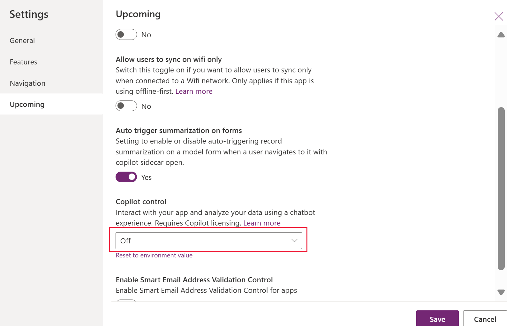

# Add copilot for app users in model-driven apps 

Copilot for model-driven apps in Power Apps is a next-generation AI assistant for app users to get insights about the data in their apps through conversation in natural language. Copilot helps app users boost their productivity through AI-powered insights and intuitive app navigation.

> [!IMPORTANT]
> This feature is generally available in Dynamics 365 apps.
>
> This feature is a preview feature in Power Apps.
> - To use this capability, your environment must be in the US region and have its language set to en-US.
> - You must allow data movement across regions for Generative AI features as a prerequisite for running copilot in Power Apps. This step is especially important if your organization and your environment are in different regions. More information: [Enable copilots and generative AI features](/power-platform/admin/geographical-availability-copilot#enable-data-movement-across-regions).
> - Preview features aren’t meant for production use and may have restricted functionality. These features are available before an official release so that customers can get early access and provide feedback.
> - For more information, go to our [preview terms](https://go.microsoft.com/fwlink/?linkid=2189520).
> - This capability is powered by [Azure OpenAI Service](/azure/cognitive-services/openai/overview).
> - This capability  may be subject to usage limits or capacity throttling.

When enabled, copilot can be accessed through the copilot icon in the right navigation bar in a model-driven app. The copilot pane can be opened or minimized as desired.

:::image type="content" source="media/model-driven-app-copilot.png" alt-text="Copilot right pane in a model-driven app" lightbox="media/model-driven-app-copilot.png":::

Copilot in model-driven apps can answer questions about the Microsoft Dataverse table data in the environment. Copilot can also help you navigate the model-driven app. For example, when a user enters *take me to Online Cases* or *show me Cruise Support Tickets*, the copilot in the model-driven app automatically opens the relevant app screens.

## Enable copilot for model-driven apps feature for your environment

Power Platform administrators enable the copilot feature in model-driven apps for all the users in their environments from the [Power Platform admin center](https://admin.powerplatform.microsoft.com).

> [!IMPORTANT]
>
> - The copilot for app users in model-driven apps feature isn't enabled by default. Administrators must manually enable this feature for their environments in [Power Platform admin center](https://admin.powerplatform.microsoft.com).
> - Questions and answers for enterprise data environments that have [customer managed key](/power-platform/admin/customer-managed-key) or [Customer Lockbox](/power-platform/admin/about-lockbox) won't use your data stored in Dataverse. You might get answers from copilot, but they won't be based on your Dataverse database.

1. Sign in to the Power Platform admin center at https://admin.powerplatform.microsoft.com.

2. In the navigation pane, go to **Environments** and select the environment where you want to enable copilot for app users in model-driven apps in. Select **Settings** for this environment on the command bar.

   > [!div class="mx-imgBorder"]
   > 
 
3. In **Settings** for the selected environment, select **Product** > **Features**.

   > [!div class="mx-imgBorder"]
   > 

4. In the **Features** section, set the value for **Allow users to analyze data using an AI-powered chat experience in canvas and model-driven apps** to **On**, and then **Save** your changes.
   
   > [!div class="mx-imgBorder"]
   > 

## Set your environment to receive monthly updates for model-driven apps

Makers must set their environment to receive monthly model-driven apps updates as a prerequisite for having copilot for end users in model-driven apps.

1. Sign in to the Power Platform admin center at https://admin.powerplatform.microsoft.com.
2. In the navigation pane, go to **Environments** and select the environment where you want to enable copilot for app users in model-driven apps. Select **Settings** on the command bar.
3. Select **Product** > **Behavior**.  Set **Release channel** for model-driven apps to **Monthly channel**, and then **Save** your changes.
   
  > [!div class="mx-imgBorder"]
  > 

More information: [Behavior settings](/power-platform/admin/settings-behavior#settings) and [Changing release channels for model-driven apps](channel-change.md).

## Disable copilot for a model driven app

Makers can disable copilot for their model-driven app. In app designer, open your model-driven app for **Edit**, and then select **Settings** on the command bar. Select **Upcoming** on the **Settings** screen, and then set **Copilot Control** to **Off**. **Save** and **Publish** the model-driven app for the changes to take effect.

> [!div class="mx-imgBorder"]
> 

## Provide feedback in copilot

To provide feedback to help improve copilot, app users select the thumb up or thumb down icon included in each copilot response. Feedback can be submitted for each copilot response in the pane.

### Provide positive feedback

1. On the right navigation bar, select the thumb up icon.
1. Optionally, provide feedback in your own words about what you liked.
1. Select **Submit** after you're done entering your feedback.

### Provide feedback for improvement

1. On the right navigation bar, select the thumb down icon.
1. Optionally, provide feedback, such as feedback about the content of copilot’s response, or a description in your own words about what went wrong, or how you would like copilot to improve.
1. Select **Submit** after you're done entering your feedback.

## Disable feedback for app users

If you want to disable the ability for users to submit feedback about copilot in model-driven apps, follow these steps.

1. Sign in to [Power Apps](https://make.powerapps.com/).
1. Go to **Tables**, and then open the **Organization** table.
1. In the **Organization columns and data** section, select **+nnn more** to display the column search box.
1. In the search box, search for the *Allow users to provide feedback for App Copilot* column.
   :::image type="content" source="media/disable-mda-copilot-feedback1.png" alt-text="Find the Allow users to provide feedback for App Copilot column":::

1. Set the column to **No**, and then **Save** the table.
   :::image type="content" source="media/disable-mda-copilot-feedback2.png" alt-text="Set the Find the Allow users to provide feedback for App Copilot column to No":::

## See also

[FAQ for copilot in model-driven apps](../common/faqs-copilot-model-driven-app.md)  
[Responsible AI FAQs for Power Apps](../common/responsible-ai-overview.md)  
[Add copilot control to a canvas app (preview)](../canvas-apps/add-ai-copilot.md)  
[Enable copilots and generative AI features in Power Apps](/power-platform/admin/geographical-availability-copilot#enable-data-movement-across-regions)
