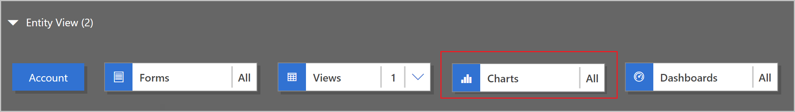
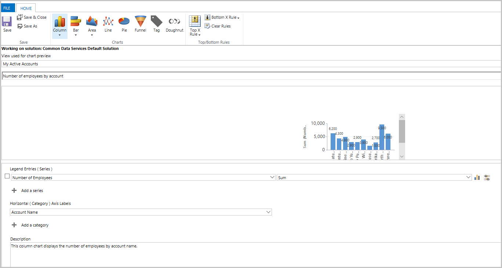
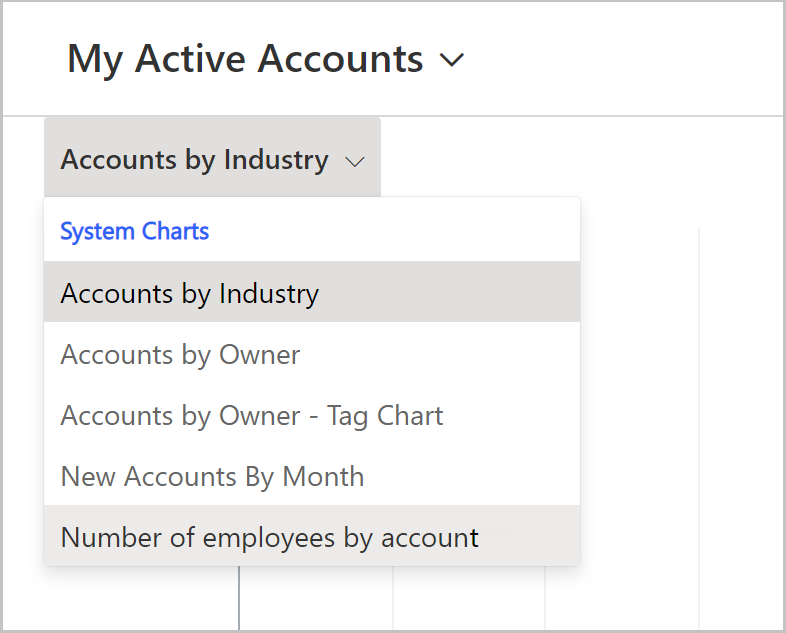
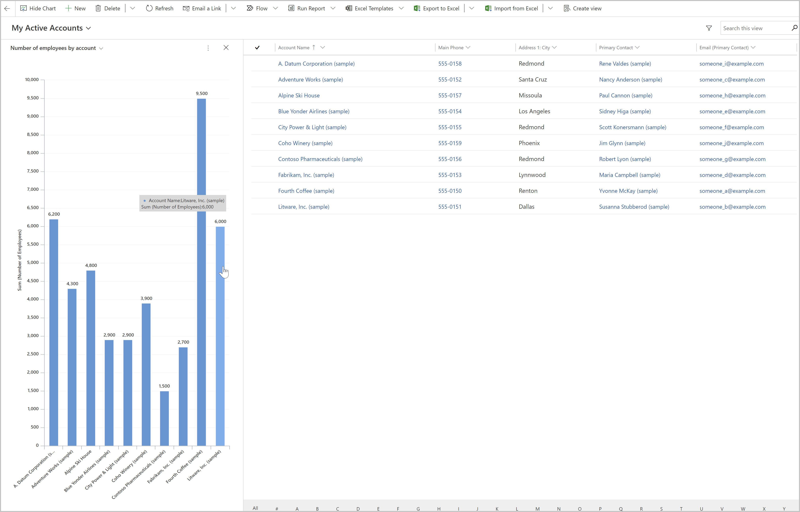

# Example: Add and customize visualizations in model-driven apps

In this topic you learn how to create a system chart. System charts are organization-owned charts, which makes them available to anyone with access to read the data running the app. System charts can't be assigned or shared with specific app users.

1.  Sign in to [Power Apps](https://make.powerapps.com/?utm_source=padocs&utm_medium=linkinadoc&utm_campaign=referralsfromdoc).

2.  Select **Apps**

3.  Find the model driven app to which you want to add a chart. In our example we will use the **Manage Customers** app used in the lesson **How to create a model driven app** (insert link)

4.  Select the three dots next to the app

5.  Select **Edit**

6.  From App Designer, locate the Table to which you want to add the chart and select the corresponding **Charts** tile. In this example, we will add a chart to the **Account** table

7.  In the **Properties** pane, select **Create New**

8.  New chart form will open

9.  Specify the type of chart, and how the data is displayed in the chart.

-   Enter the chart name, such as *Number of employees by account*.

-   In the **Select Column** dropdowns:

    -   In the **Select Column** **Series** axis dropdown select a column such as **Number of Employees**.

    -   In the **Select Column** **Category** axis dropdown select a column such as **Account Name**.

    -   Add a description to identify the purpose of the chart, such as *This column chart displays the number of employees by account name*.

10. Select **Save and Close**.

11. You should now see the **Number of employees by account** chart in the App Designer chart list

## Known issues

In the chart designer, adding a order by on certain calculated columns are not supported and will cause an error. The calculated columns causing this are using another calculated columns, a related table column, or a local column on the table.

## View your visualization in your Model-Driven app

Now that you have created your chart in your app, you should now be able to use it to visualize account data in your app. Follow these steps to view your chart:

1.  In App Designer, select the **Play** button

2.  App will launch

3.  Select **Accounts** in menu on left

4.  In the Command Bar, select **Show Chart**

5.  Chart pane will open

6.  Select the chart selector drop-down

7.  Select **Number of employees by account**

8.  Your visualization will appear in-line with the data view

Selecting a bar in the chart will filter the data in the view

Changing the view selected will refresh the chart to display the data from the newly selected view

Charts can also be added to model-driven app dashboards