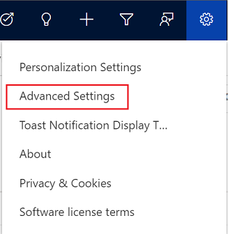
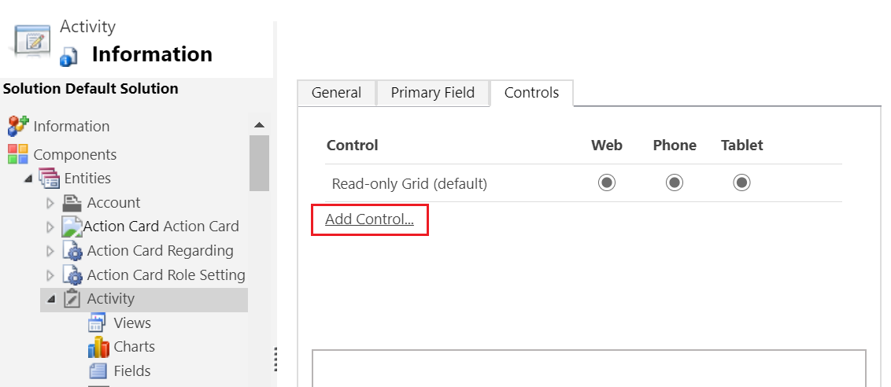
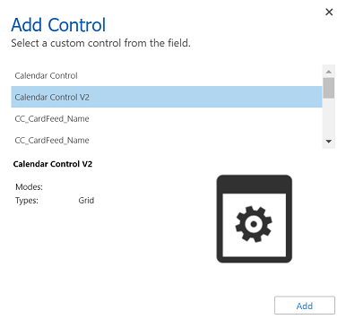
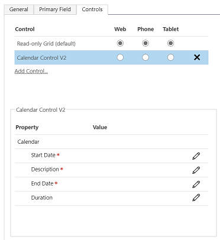
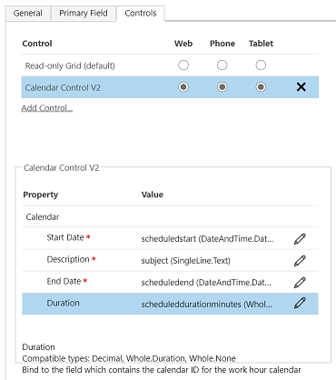

# Add the calendar control to tables

[!INCLUDE [cc-data-platform-banner](../../includes/cc-data-platform-banner.md)]

[!INCLUDE [cc-classic-interface-control-migration](../../includes/cc-classic-interface-control-migration.md)]

The **Calendar Control V2** control displays scheduled activities and their associated details in a calendar. Activities can be viewed, created, and deleted in a day, week, or month view. System customizer or system administrator privileges are needed to add the **Calendar Control V2** control.

## To add the control

1. In the app, select the **Settings** icon, and then select **Advanced Settings**.

    > [!div class="mx-imgBorder"]
    > 

    The **Business Management** page opens in a new browser tab.
1. On the navigation bar, select **Settings**, and then under **Customization**, select **Customizations**.
1. Select **Customize the System**.
1. Under **Components** in the solution explorer, expand **Tables**, and then select a table. For example, **Activity**.

    > [!IMPORTANT]
    > For **Description** and **Regarding** columns to be displayed in the Calendar Control v2, the table where the Calendar Control V2 is configured must be created as an activity table. More information: [Activity tables](../data-platform/types-of-entities.md#activity-tables)
1. On the **Controls** tab, select **Add Control**.

    > [!div class="mx-imgBorder"]
    >  

1. In the **Add Control** dialog box, select **Calendar Control V2**, and then select **Add**.

    > [!div class="mx-imgBorder"]
    > 

1. The calendar control is added to the list of controls.

    > [!div class="mx-imgBorder"]
    > 

1. **Read-only grid** is the default option, so when users select a table from the site map, they'll see a read-only grid of opportunities. To make the calendar view the default view instead, select the corresponding **Calendar Control V2** option buttons.

1. Select the edit icon for each of the mandatory columns, and then select the binding values.

    > [!div class="mx-imgBorder"]
    > 

1. Select **Save** to save changes.

1. To publish the changes select **Publish**.

### See also

[Work with rows in the new calendar view](../../user/calendar-view.md)

[!INCLUDE[footer-include](../../includes/footer-banner.md)]
