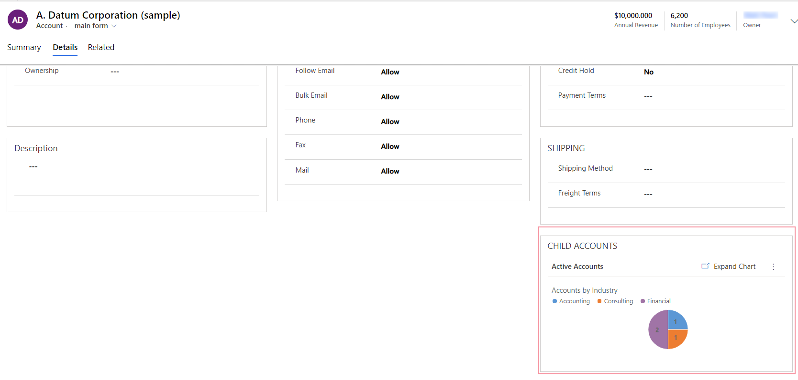
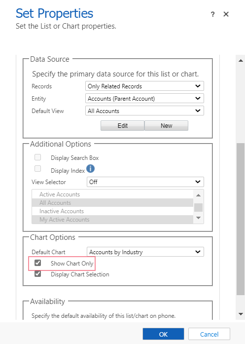

# Add a chart to a form

[!INCLUDE [cc-data-platform-banner](../../includes/cc-data-platform-banner.md)]

A chart can be added to a form or an existing list to a chart can be updated. For example, the Child Accounts filtered sub-grid can be changed to display a chart instead of a list on the account main form.

> [!div class="mx-imgBorder"]
> 

1. Sign into Power Apps, select **Solutions**
1. Open the solution with the required table and open this table. Then select the **Forms** tab.
1. Open the required form. In the form designer select **Switch to classic** from the command bar.
1. Add a sub-grid to the form, or to change an existing list in a sub-grid, double-click a sub-grid on the form.
1. On the **Set Properties** page for the sub-grid, select the **Show Chart Only** option. When enabled, this option displays the view in a chart format.
      > [!div class="mx-imgBorder"]
      > 

1. On the **Set Properties** page for the sub-grid, consider from the following options that affect how the chart is displayed, and then select **OK**. For more information about these properties, see [Set properties for a model-driven app chart or list included in a dashboard](set-properties-chart-list-included-dashboard.md).

    - **Records**:
         - **Only Related Records**: Shows the rows based on the selected view, but only with rows related to the table row.  
         - **All Row Types**: Shows all the rows based on the selected view.
    - **View Selector**: When enabled, users can change to a different view, which displays the chart with different data and filtering that are associated with the view:

         - **Off**. Don’t display the view selector. Users won’t be able to change views at runtime.
         - **Show All Views**. Provide a full list of views associated with the value set in the **Table** property.
         - **Show Selected Views**. Select this setting to limit the list of views available at runtime. To select the specific views to be displayed, hold down the Ctrl key and tap or select each view that needs to be included.

    - **Display Chart Selection**: When enabled, users can change the type of chart, such as column, bar, or pie, on the form. If the user changes the type of chart, the settings aren’t saved. The chart type reverts to the **Default Chart** setting when the form is closed.

1. Publish your customization.More information: [Publish changes](../data-platform/create-solution.md#publish-changes)

## See also

[Create a model-driven app system chart](create-edit-system-chart.md)

[Add a Power BI Visual to a model-driven app](add-powerbi-visual.md)

[!INCLUDE[footer-include](../../includes/footer-banner.md)]
