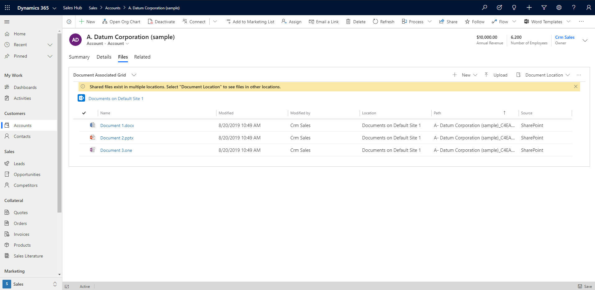
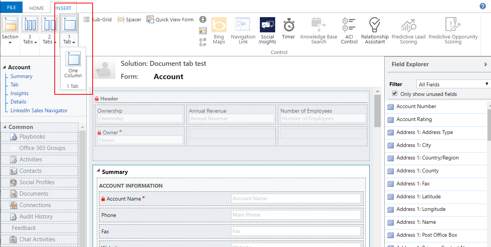
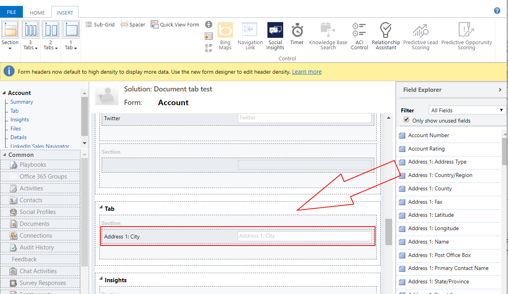
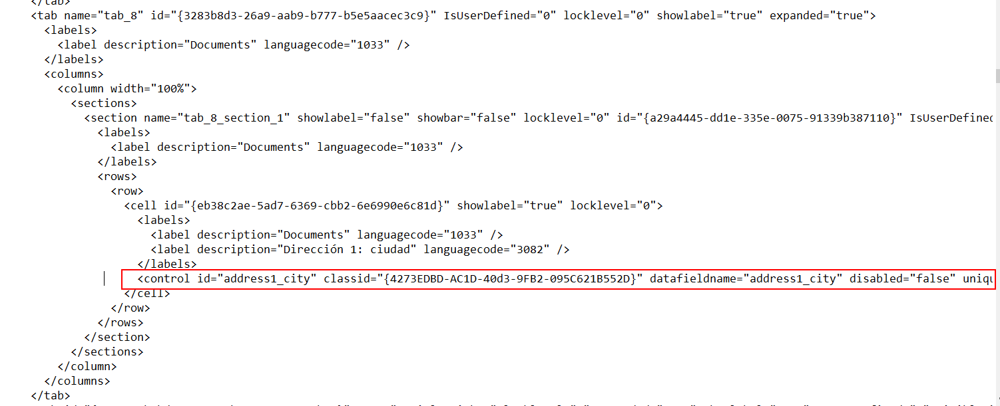
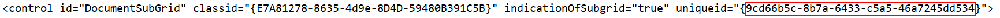
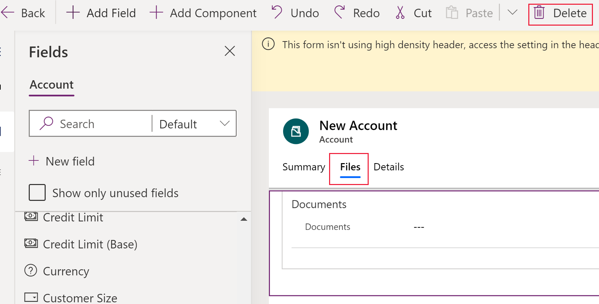

# Add or remove the SharePoint documents tab to the main form for any table

[!INCLUDE [cc-beta-prerelease-disclaimer](../../includes/cc-beta-prerelease-disclaimer.md)]

[!INCLUDE [cc-data-platform-banner](../../includes/cc-data-platform-banner.md)]

Adding a tab on a table main form to display SharePoint documents helps users discover and use the SharePoint integration features that are available in a model-driven app.



> [!IMPORTANT]
> To use this feature document management must be enabled. For more information see: [Manage documents using SharePoint](/dynamics365/customer-engagement/admin/manage-documents-using-sharepoint)

## Add the documents tab in the FormXML

1. Create a new solution or open an existing solution. For more information on creating solutions see: [Create a solution](../data-platform/create-solution.md).
1. Add the table to the solution or select an existing table. All standard and custom tables are supported. For more information on tables in solutions see: [Add solution components](../data-platform/create-solution.md#add-solution-components)
1. Include the form for the table in the solution, such as the main form for the account table. Next to the table, select **...**, and then select **Edit**. Select the **Forms** tab. If the required form is missing then it should be added.
1. Add a one-column tab to the main form. To do this, in the form designer select an area on the form canvas, select **Add Component**, and then select **1 Column Tab**.  
   
1. In the form designer select the **New Tab** on the form designer canvas, select **Add Column**, and add a column such as *Address 1: City* from the left pane. Any text or numeric column can be used.
   
1. Rename the tab label. To do this, select **New Tab**, and in the right properties pane replace **New Tab** with something more descriptive, such as *Documents*.
1. Select **Save**, select **Publish**, and then close the form designer.
1. From the Power Apps maker home page, select **Solutions**, select the solution, and the select **Export** to export the solution as an unmanaged solution. More information: [Export solutions](../data-platform/export-solutions.md)
1. Extract the solution and open the customization.xml file with an XML or text editor.
1. In the customization.xml search for **label description="Documents"** (or the name the tab was given in the previous step).
1. Scroll down to the control id="*field name*" element, such as **control id="address1_city"** and replace the entire element with the [XML sample](#xml-sample-for-adding-the-documents-tab-to-a-form) in this topic.

    > [!div class="mx-imgBorder"]
    > 

1. Make these modifications to the XML sample.

     a. Locate the **RelationshipName** element and replace it with the schema name that appears as *entityLogicalName*_SharePointDocument. For example, for the accounts table the schema name for the relationship is Account_SharePointDocument, which is the schema name for the XML sample in this topic. To find the name for a different table, go to **Settings** > **Customizations** > **Customize the System** > **Tables** > select the table > select **1:N Relationships**. Locate the **Related Table** of type **SharePointDocument**.

      

     b. Create a globally unique identifier (guid) and replace the existing **uniqueid** guid located in the **control** element pasted in the previous step while preserving the curly braces {}.  
       
     c. Save the changes made to customizations.xml.

13.Open the solution.xml file and increment the **Version** element value. For example, from *1.1.0.0* to *1.2.0.0*.
14. Package all solution files into a compressed (zipped) folder and import in to the right environment. If an error appears then the previous solution should be removed. For more information on managing solutions see: [Import, update, and upgrade a solution](../data-platform/import-update-export-solutions.md)

## XML sample for adding the documents tab to a form

```xml
  <control id="DocumentSubGrid" classid="{E7A81278-8635-4d9e-8D4D-59480B391C5B}" indicationOfSubgrid="true" uniqueid="{9cd66b5c-8b7a-6433-c5a5-46a7245dd534}"> 
    <parameters> 
      <ViewId>{0016F9F3-41CC-4276-9D11-04308D15858D}</ViewId> 
      <IsUserView>false</IsUserView>         
      <RelationshipName>Account_SharepointDocument</RelationshipName>
      <TargetEntityType>sharepointdocument</TargetEntityType> 
      <AutoExpand>Fixed</AutoExpand> 
      <EnableQuickFind>false</EnableQuickFind> 
      <EnableViewPicker>true</EnableViewPicker> 
      <ViewIds /> 
      <EnableJumpBar>false</EnableJumpBar> 
      <ChartGridMode>Grid</ChartGridMode> 
      <VisualizationId /> 
      <IsUserChart>false</IsUserChart> 
      <EnableChartPicker>false</EnableChartPicker> 
      <RecordsPerPage>10</RecordsPerPage> 
      <HeaderColorCode>#F3F3F3</HeaderColorCode> 
    </parameters> 
  </control> 
```

## Remove the documents tab

1. Sign in to [Power Apps](https://make.powerapps.com/?utm_source=padocs&utm_medium=linkinadoc&utm_campaign=referralsfromdoc), in the left pane expand **Data**, and then select **Tables**.
1. Select the required table and select the **Forms** tab, and then open the form where the documents tab needs to be removed.
1. Select the **Documents** tab, and then on the form designer toolbar, select **Delete**.

    

1. On the form designer toolbar, select **Publish**.

## See also

[Manage documents using SharePoint](/dynamics365/customer-engagement/admin/manage-documents-using-sharepoint)

[!INCLUDE[footer-include](../../includes/footer-banner.md)]
