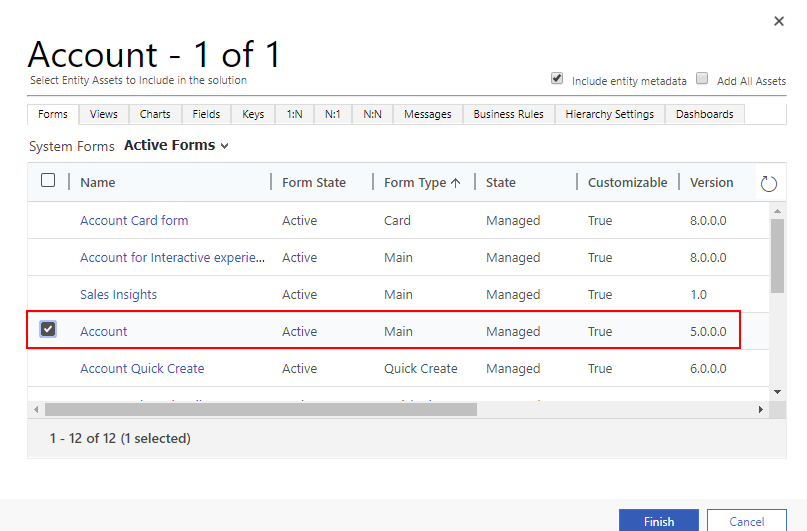

# Add the Documents tab to the main form for an entity
[!INCLUDE [cc-beta-prerelease-disclaimer](../includes/cc-beta-prerelease-disclaimer.md)]

The documents section tab on an entity main form helps users discover and use the SharePoint integration features that are available. 

> [!IMPORTANT]
> To use this feature you must enable document management. More information: [Manage your documents using SharePoint](/dynamics365/customer-engagement/admin/manage-documents-using-sharepoint)

## Add the Documents tab in the FormXML 
1.	Create a new solution. To do this, got to Settings > Solutions, select New and then enter the required and optional information. More information: [Create a solution](../common-data-service/create-solution.md)
2. Add the entity to the solution where you want to add the Documents tab on the main form. All standard and custom entities are supported with the Documents tab. More information: [Add an existing component to a solution](/powerapps/maker/common-data-service/use-solution-explorer#add-an-existing-component-to-a-solution)
3. Include the main form for the entity in the solution. 

   > [!div class="mx-imgBorder"] 
   > 

4. Add a one-column tab to the main form. To do this, in the form designer select **Insert** > **1 Tab** > **One Column**. 
   
5. In the form designer scroll down to where the new tab is located and drag and drop a field, such as *Address 1: City* from the **Field Explorer** on to the **Section** of the **Tab**. Notice that you can use any field for the Document tab.
   
6. Rename the tab, section, and field labels. 
   -  Double-click the field and then on the **Field Properties** page change the **Label** to something more appropriate, such as *Documents*, and then select **OK**. 
   - Double-click the **Section** and then on the **Section Properties** page change the **Label** to something more appropriate, such as *Documents*, and then select **OK**.
   - Double-click the **Tab** and then on the **Tab Properties** page change the **Label** to something more appropriate, such as *SharePoint Files*, and then select **OK**.
8. On the form designer ribbon, select **Save**, select **Publish**, and then close the form designer. 
9. Export the solution as an unmanaged solution. More information: [Export a solution](import-update-export-solutions.md)
10. Extract the solution and open the customization.xml file with an XML or text editor. 
11. In the customization.xml search for **label description="Documents"**.
12. Scroll down to the control id="*field name*" element and replace it with the [XML sample](#xml-sample-for-adding-the-documents-tab-to-a-form) in this topic. 

    > [!div class="mx-imgBorder"] 
    > 

8. Make these modifications to the XML sample. 
   1. Locate the **RelationshipName** element and replace it with the schema name that appears as *entityLogicalName*_SharePointDocument. For example, for the accounts entity the schema name for the relationship is Account_SharePointDocument, which is the schema name for the XML sample in this topic. To find the name for a different entity, go to **Settings** > **Customizations** > **Customize the System** > **Entities** > select the entity > select **1:N Relationships**. Locate the **Related Entity** of type **SharePointDocument**. 

      

    2. Create a globally unique identifier (guid) and replace the existing **uniqueid** guid located in the **control** element while preserving the curly braces {}.  
       
    3. Save your changes to customizations.xml. 
9. Open the solution.xml file and update the **Version** element value. For example, from 0.1 to 0.2. 
10. Package all solution files into a compressed (zipped) folder and import in to Dynamics 365 for Customer Engagement apps (the default solution). More information: [Import, update, and upgrade a solution](import-update-export-solutions.md) 

## XML sample for adding the Documents tab to a form
```xml
  <control id="DocumentSubGrid" classid="{E7A81278-8635-4d9e-8D4D-59480B391C5B}" indicationOfSubgrid="true" uniqueid="{9cd66b5c-8b7a-6433-c5a5-46a7245dd534}"> 
    <parameters> 
      <ViewId>{0016F9F3-41CC-4276-9D11-04308D15858D}</ViewId> 
      <IsUserView>false</IsUserView>         
      <RelationshipName>Account_SharepointDocument</RelationshipName>
      <TargetEntityType>sharepointdocument</TargetEntityType> 
      <AutoExpand>Fixed</AutoExpand> 
      <EnableQuickFind>false</EnableQuickFind> 
      <EnableViewPicker>true</EnableViewPicker> 
      <ViewIds /> 
      <EnableJumpBar>false</EnableJumpBar> 
      <ChartGridMode>Grid</ChartGridMode> 
      <VisualizationId /> 
      <IsUserChart>false</IsUserChart> 
      <EnableChartPicker>false</EnableChartPicker> 
      <RecordsPerPage>10</RecordsPerPage> 
      <HeaderColorCode>#F3F3F3</HeaderColorCode> 
    </parameters> 
  </control> 
```

### See also
[Manage your documents using SharePoint](/dynamics365/customer-engagement/admin/manage-documents-using-sharepoint)