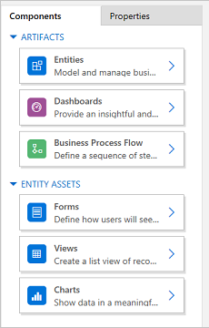
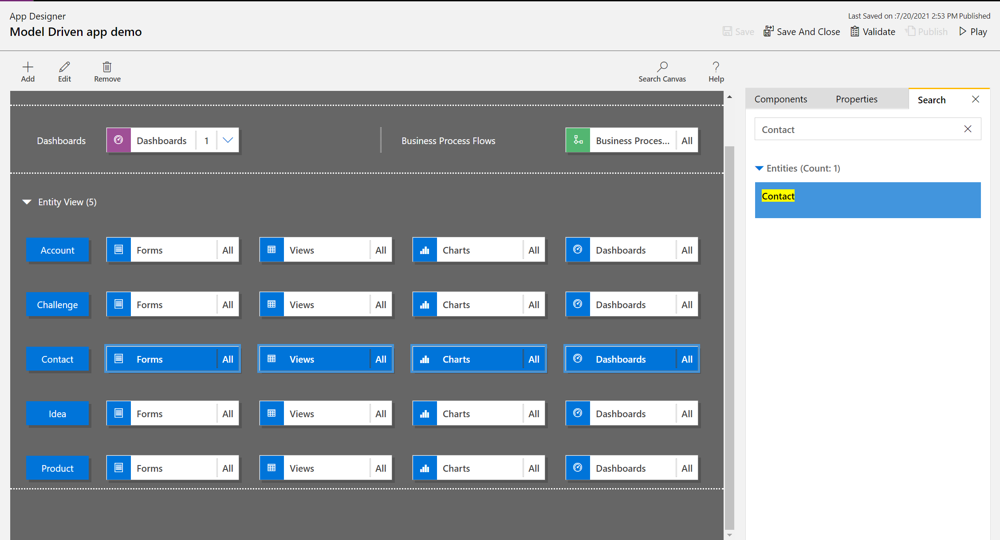

# Add or edit model-driven app components in the Power Apps app designer

[!INCLUDE [cc-data-platform-banner](../../includes/cc-data-platform-banner.md)]

This tutorial describes how to add components to and remove components from a model-driven app.

A model-driven app is made up of various components. Two types of components can be added to an app:

- Artifacts
- Table assets

Tables, dashboards and business process flows are all artifacts of an app.

Table assets consist of forms, views, charts, and dashboards related to a specific table included in an app.

>[!Note]
>Tables used to be called entities. The classic app designer uses the term entity in most places. For example, *Entity assets* rather than *Table assets*.
  
## App designer layout

The app designer has two main areas. On the left side is the canvas, where app components can be added.  
  
 > [!div class="mx-imgBorder"]
 > 

 On the right side are tabs that are used to select components and set component properties.  

 > [!div class="mx-imgBorder"]
 >   
  
 The canvas includes areas for the **Site Map**, *Business Process Flow**, **Dashboards**, and **Tables**.

 After the tables are in place, select each table and add the required table assets such as forms, views, and charts to it.

 Use **Search Canvas** to search for components on the canvas. When **Search Canvas** is selected, a new search tab opens to the right of the tabs in the right pane.

 > [!div class="mx-imgBorder"]
 > 

## Open an app

1. Sign in to [Power Apps](https://make.powerapps.com/) and optionally select an environment to work in.

2. Create a new model-driven app or select an existing one. For information about how to create an app, see [Create or edit a model-driven app by using the app designer](create-edit-app.md).

## Add or edit a site map

You must define a site map before app components can be added to a newly created app. More information: [Create a model-driven app site map using the site map designer](create-site-map-app.md).

## Add a component

 When a dashboard or a business process flow is added to an app, the related tables are automatically added to the app.

 When a table is added to an app, the tiles for its assets are automatically added. There are two ways components can be added to the designer canvas:

- Use the **Add** button   on the command bar.
- Use the tiles on the **Components** tab.  

### Add a dashboard
  
To add a dashboard to an app, follow these steps:

1. On the app designer canvas, select the **Dashboards** tile.  
  
     On the app designer canvas, the right pane shows dashboards that are available in the default solution.  
1. In the **search** box, type keywords for the required dashboard.  
  
     The dashboard list will be filtered to show results that match the keywords.

1. If users need to use only selected dashboard then select the check box for the component that needs to be added. The following types of dashboards are available:
    - **Classic Dashboards** appear on both the web app and the Unified Interface app.
    - **Interactive Dashboards** appear only on the Unified Interface app. If you have selected the client type for the app as web app, then the **Interactive Dashboards** option will not be displayed.

     Those dashboards will be added to the **Dashboard** tile on the app designer canvas. The **Dashboard** tile also shows a count of the number of dashboards added to the app. If no dashboard is selected then **All** will appear instead of the dashboard count and all dashboards will be available to users when they use the app.  
  
     All tables the dashboard uses are also added to the **Entity View** area. For example, when the Customer Service Manager dashboard is added, the **Case**, **Entitlement**, and **Queue Item** tables are added to the **Entity View** area.

     For each table, tiles for its assets are also added. These tiles can be used to add forms, views, and charts. For more information see: [Add or edit app components in the Power Apps app designer](add-edit-app-components.md#edit-or-remove-components)
  
    > [!div class="mx-imgBorder"]
    >   
  
2. If the dashboard you want doesn't exist in the default solution, then create a dashboard by selecting **Create New** on the **Components** tab to the right of the canvas.  
  
     > [!div class="mx-imgBorder"]
     >   
  
     The dashboard designer opens. For more information see: [Create and edit dashboards](create-edit-dashboards.md)  
  
3. Complete the above steps by selecting **Save**.

### Add a business process flow

To add a business process flow to an app, follow these steps:

1. On the app designer canvas, select the **Business Process Flows** tile.  
  
     On the app designer canvas, the right pane shows dashboards that are available in the default solution.  

1. In the **Search** box, type one or more keywords that match the business process flow name you want.
  
     The business process flow list is filtered to show results that match keywords.

1. If the dashboard you want doesn't exist in the default solution, then create a dashboard by selecting **Create New** on the **Components** tab to the right of the canvas.  
  
    > [!NOTE]
    > When adding a business process flow, the **Create New** option opens the **Create Process** dialog. To learn more about creating business process flows, go to [Create a business process flow](/flow/create-business-process-flow)

1. Complete the above steps by selecting **Save**.

### Add a table

To add a table to an app, follow these steps:

1. On the app designer canvas, select the **Tables** tile.  
  
     On the app designer canvas, the right pane shows dashboards that are available in the default solution.  

1. In the **Search** box, type a one or more keywords matching the table name you want.
  
     The table list is filtered to show results that match the keywords.

    > [!NOTE]
    > When adding a table the **Create New** option opens the **New Table** dialog. To learn more about creating tables go to [Create a custom table](../data-platform/data-platform-create-entity.md).

1. Complete the above steps by selecting **Save**.
  
## Add table assets

 With the components in place, table assets like forms, views, charts, and dashboards can be added to the app.
  
 This section describes the steps for adding a form to the app. Use the same steps to add a view or chart to the app.  
  
1. On the app designer canvas, select the **Forms** tile for the related table to add a form to.  
  
     On the app designer canvas, the entire row for the table is selected. On the right side, all existing forms for the selected table will appear.  
  
1. Select the check boxes for the forms that need to be available to users. The forms define how users will see and interact with data in the app.

     The form tile of the selected table will display the number of forms added.  
  
       
  
     If none of the forms for a table are selected then all the forms for that table will be displayed to the users while they use the app. This behavior is similar for views and charts also, if no view or chart is selected. This helps to create apps quickly when all available components are required. There is no need to select each component during app design.  

     If no dashboards or business process flows are selected then all the dashboards and business process flows will be available for users while they use the app.
  
    > [!NOTE]
    > For the app to run, each table that is added must have at least one active form. If multiple forms are selected then the first active form that appears in the default solution will be used when users run the app.  
  
1. To add a new form that is not available in the list, select **Create New**.  
  
     In the drop-down list, select the type of form that is required.

     :::image type="content" source="media/create-new-form.png" alt-text="create a new form":::
  
    > [!NOTE]
    >  The drop-down list is available only when adding forms. It isn't available for views and charts.  
  
     The form designer opens. More information: [Create and design forms](create-design-forms.md)  
  
     When you add a view or a chart, the **Create New** option opens the corresponding designer. For more  information go to: [Understand views](create-edit-views.md) and [Create or edit a system chart](create-edit-system-chart.md)  
  
    > [!NOTE]
    >  When you add a view, public views can be selected that are listed under the **Views** node in the solution explorer.  
  
1. Select the down arrow  to expand the tile and see a list of forms that have been added.  
  
       
  
1. Repeat the previous steps to add table views and charts to the app.  
  
1. Select **Save**.  
  
## Edit or remove components  
  
- To edit a dashboard or a business process flow, select the down arrow  to expand the tile, and then select the site map designer button  corresponding to the dashboard or business process flow that needs to be updated.  
  
     The designer for the selected artifact opens.  
  
- To remove a dashboard or a business process flow, select the down arrow  to expand the tile, and then select the dashboard or business process flow that needs to be removed. On the command bar, select **Remove**.  

    Another way to remove a dashboard or business process flow is by clearing the corresponding check box on the **Components** tab.
  
- To edit or remove a table, select the table tile, and then on the command bar, select **Edit** or **Remove**. When editing a table, the solution explorer opens, where changes to the table can be made.
  
     Another way to remove a component is to select the dashboard, business process flow, or table tile. On the **Components** tab, clear the check boxes for the components that need to be removed from the designer.  
  
    > [!NOTE]
    >  When changes to a table are made, like changing a table display name or description, the changes do not appear in the app designer until the changes are published in the solution explorer.  
  
## Edit or remove table assets  

### Edit table assets
  
1. Select the down arrow  to expand the tile for forms, views, charts, or dashboards.  
  
2. Select the form, view, chart, or dashboard that needs to be updated.  
  
3. On the command bar, select **Edit**.

   or

   Select the site map designer button  corresponding to the form, view, chart, or dashboard.  

### Remove table assets  

1. Select the down arrow  to expand the tile for forms, views, charts, or dashboards.  
  
2. To edit an asset, select the relevant form, view, chart, or dashboard.

3. On the command bar, select **Remove**.

Alternatively, select the forms, views, charts, or dashboards tile and then on the **Components** tab, clear the check boxes for the assets that need to be removed.
  
## Next steps

 [Create a site map for an app](create-site-map-app.md)    
 [Validate and publish an app](validate-app.md)

[!INCLUDE[footer-include](../../includes/footer-banner.md)]
