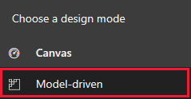

# Add a field to a model-driven app form 

If a PowerApps form for a standard entity doesn’t meet your organization’s business requirements, you can customize the form by changing existing fields or by adding new fields. While it might be simpler to edit the existing fields on a form, sometimes it’s better to add a field to address a specific business scenario.

In this topic, you add a field on to a form.   
  
1.  On the [PowerApps](https://web.powerapps.com) site, select **Model-driven** (lower left of the navigation pane).  

    

    > [!IMPORTANT]
    > “If the **Model-driven** design mode isn't available, you may need to [Create an environment](https://docs.microsoft.com/powerapps/administrator/create-environment). 

2.  Expand **Data**, select **Entities**, select the entity that you want, and then select the **Forms** tab.  

3.  In the list, open a form with the type of **Main** to edit it.  
  
4.  In the form, click the section you want to add a field to, and then in the **Field Explorer** pane, double-click the field you want added to the form.  
  
    > [!TIP]
    >  When you add an option set field on the form, the drop-down list that contains the option set values can only display two values. Users must scroll to see more values in the list. If you want to show more than two values without users having to scroll, add one or more **Spacer** controls below the option set field on the form. Each **Spacer** control provides a space for one additional option set value. For example, if you want to display four values in the drop-down list without scrolling, add two **Spacer** controls below the option set field on the form.  
  
5.  To preview how the form appears and how events function:  
  
    1.  On the **Home** tab, click **Preview**, and then select **Create Form**, **Update Form**, or **Read-Only Form**.  
  
    2.  To close the preview form, click **Close**.  
  
    3.  To publish customizations for the form that you’re editing, with the form open, click **Publish**.  
  
6.  When you’re done editing the form, click **Save and Close**.  
  
7. To publish customizations for all unpublished components at one time, click **File**, and then click **Publish All Customizations**.  
  
> [!NOTE]
>  Publishing customizations can interfere with normal system operation. We recommend that you publish when it’s least disruptive to users.  
  
## Next steps  
 
 [Create and design forms](create-design-forms.md)