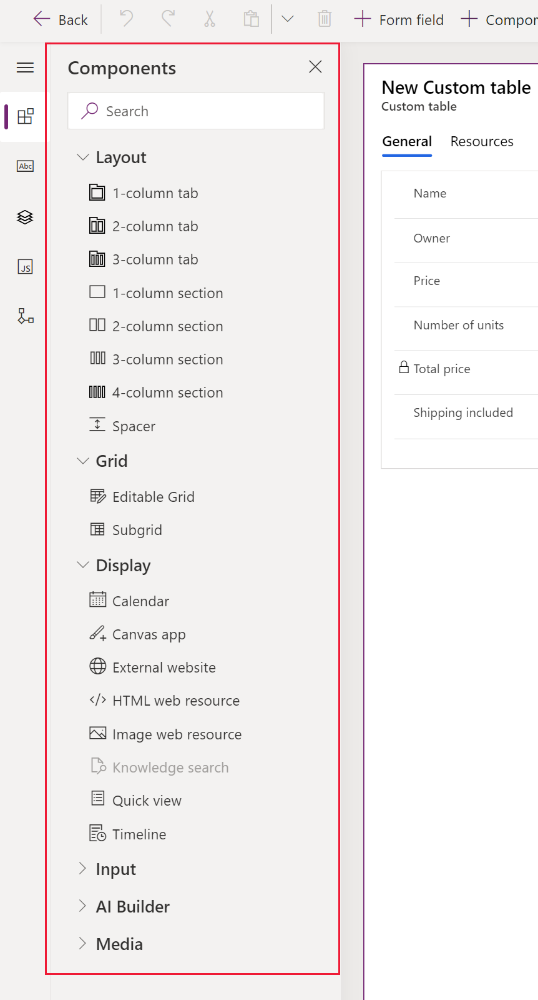

# Add, configure, move, or delete components on a form

By using the form designer, makers can easily add and configure popular components such as [sub-grid](form-designer-add-configure-subgrid.md), [quick view](form-designer-add-configure-quickview.md), arc knob, linear slider, and more.

## Add components to a form
To add components to a form, use the **Components** pane. The **Components** pane also lets you search to quickly find components.  

> [!div class="mx-imgBorder"] 
> 

### Add components to a form using drag and drop
> [!NOTE]
> When adding or moving components using drag and drop, be aware that the form preview is responsive and might render multiple section columns as stacked. To ensure that the component that's added or moved is in the correct section column, drop or paste it anchored to another column or component that is already in that section column.
1. Open the form designer to create or edit a form. More information: [Create a form](create-and-edit-forms.md#create-a-form) or [Edit a form](create-and-edit-forms.md#edit-a-form)
2. On the command bar, select **Add component**, or in the left pane, select **Components** to see a list of available components. You can also hover over a component in the list to see a preview image, description, and other details of that component.
3. In the **Components** pane, search or scroll to find the component that you want to add and then select it.
4. Drag and drop the component onto the form preview. As you drag the component on the form preview, you will see drop targets where you can add the component. 

   Note the following: 
    - Components can be dropped before or after any existing component or column.
    - Components can also be dropped in the empty area within a section. In this case the component will be added in an available space so as to evenly distribute columns and components across the section columns.
    - Hovering over a tab header when dragging a component changes the currently selected tab, allowing you to add the component to a different tab.
    - When you drop the component, in most cases, you will see a dialog to configure the properties of the component. Ensure that you have configured all the required properties of the component. 
5. In the dialog to configure the properties of the component, under **Show component on**, the **Web**, **Mobile**, and **Tablet** options are selected by default to ensure the component is used when the form is displayed on the web, mobile app, and tablet app. Based on your requirements you can clear some of these options to limit the usage of the component. Select **Done**.
6. Repeat steps 3-5 above to add more components.
7. On the command bar, select **Save** to save the form, or select **Publish** if you want to save and make your changes visible to users. 

### Add components for a column on the form
1. Open the form designer to create or edit a form. More information: [Create a form](create-and-edit-forms.md#create-a-form) or [Edit a form](create-and-edit-forms.md#edit-a-form)
2. In the form preview, select an existing column.
3. In the property pane, under the **Components** area, select **+ Component**.
4. The **Add component** dialog displays a list of components that are available for the current column type. You can hover over a component in the list to see a preview image, description, and other details of that component.
5. In the **Add component** dialog, search or scroll to find the component you want to add and then select it.
   In most cases, a dialog is displayed so you can configure the properties of the component. Ensure that you have configured all the required properties of the component.
6. In the dialog to configure the properties of the component, under **Show component on**, the **Web**, **Mobile**, and **Tablet** options are selected by default to ensure the component is used when the form is displayed on the web, mobile app, and tablet app. Based on your requirements you can clear some of these options to limit the usage of the component. Select  **Done**.
7. Repeat steps 2-6 above if you want to add more components to the same or another column.
8. On the command bar, select **Save** to save the form, or select **Publish** if you want to save and make your changes visible to users.

## Configure components on a form
1. Open the form designer to create or edit a form. More information: [Create a form](create-and-edit-forms.md#create-a-form) or [Edit a form](create-and-edit-forms.md#edit-a-form)
2. In the form preview, select an existing column.
3. In the property pane, under the **Components** area, select the component that you want to configure.
4. You might see a dialog to configure the properties of the component. Change the properties of the component as needed and select **Done**.
5. Repeat steps 2-4 to configure more components on the same or another column.
6. On the command bar, select **Save** to save the form, or select **Publish** if you want to save and make your changes visible to users.

## Move components on a form
You can move components on a form by either drag-and-drop or cut-and-paste actions. 

### Move components on a form using drag and drop
1. Open the form designer to create or edit a form. More information: [Create a form](create-and-edit-forms.md#create-a-form) or [Edit a form](create-and-edit-forms.md#edit-a-form)
2. In the form preview, select the component that you want to move and drag and drop it. As you drag the component on the form preview, drop targets appear where you can move the component.     

   Note the following: 
    - Components can be dropped before or after any existing component or column.
    - Components can also be dropped in the empty area within a section. In this case the component will be added in an available space to evenly distribute components and columns across the section columns.
    - Hovering over a tab header when dragging a component changes the currently selected tab, allowing you to add the component to a different tab.   
4. Repeat steps 2-3 above to move more components.
5. On the command bar, select **Save** to save the form, or select **Publish** if you want to save and make your changes visible to users. 

### Move components on a form using cut and paste
1. Open the form designer to create or edit a form. More information: [Create a form](create-and-edit-forms.md#create-a-form) or [Edit a form](create-and-edit-forms.md#edit-a-form)
2. In the form preview, select the component that you want to move.
3. On the command bar, select **Cut**.
4. In the form preview, select another existing component, column, or section. You can switch to a different tab if needed.
5. On the command bar, select **Paste** or select the chevron, and then select **Paste before**.     

   Note the following:
    - When you select **Paste**, the component being moved is pasted after the existing component or column. 
    - When you select **Paste before**, the component being moved is pasted before the existing component or column.
    - When you select a section, the component being moved is added in an available space so as to evenly distribute components and columns across the section columns. The **Paste before** action is not applicable and therefore not available in this case.
6. Repeat steps 2-5 above if you want to move more components.
7. On the command bar, select **Save** to save the form, or select **Publish** if you want to save and make your changes visible to users. 

## Delete components on a form
1. Open the form designer to create or edit a form. More information: [Create a form](create-and-edit-forms.md#create-a-form) or [Edit a form](create-and-edit-forms.md#edit-a-form)
2. In the form preview, select the component that you want to delete from the form, and then on the command bar, select **Delete**. 
3. Repeat step 2 if you want to delete more components.
4. On the command bar, select **Save** to save the form, or select **Publish** if you want to save and make your changes visible to users. 

     > [!NOTE]
     >   -  If you delete a component by mistake, on the command bar, select **Undo** to revert the form to its previous state. 
     >   -  You can't delete a component that is locked or is using a required column that is not present anywhere else on the form. 

### See also
[Overview of the model-driven form designer](form-designer-overview.md)  
[Create, edit, or configure forms using the form designer](create-and-edit-forms.md)  
[Add, configure, move, or delete columns on a form](add-move-or-delete-fields-on-form.md)  
[Add, configure, move, or delete sections on a form](add-move-or-delete-sections-on-form.md)  
[Add, configure, move, or delete tabs on a form](add-move-or-delete-tabs-on-form.md)  
[Configure header properties in the form designer](form-designer-header-properties.md)  
[Add and configure a sub-grid component on a form](form-designer-add-configure-subgrid.md)  
[Add and configure a quick view component on a form](form-designer-add-configure-quickview.md)  
[Configure a lookup component on a form](form-designer-add-configure-lookup.md)  
[Using the tree view in the form designer](using-tree-view-on-form.md)  
[Create and edit columns](../data-platform/create-edit-field-portal.md)  

[!INCLUDE[footer-include](../../includes/footer-banner.md)]