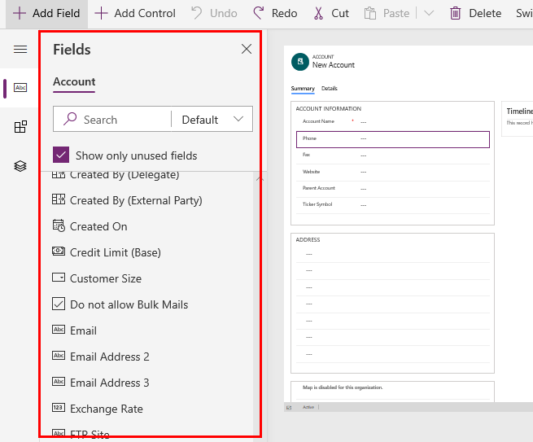

# Add, move, or delete fields on a form  
[!INCLUDE [cc-beta-prerelease-disclaimer](../../includes/cc-beta-prerelease-disclaimer.md)]

Add, move, and remove fields using the form designer.

> [!NOTE]
> When adding or moving fields using drag and drop be aware that the form preview is responsive and may be rendering multiple section columns as stacked. To ensure that the field being added or moved is in the correct section column, drop or paste it anchored to another field that is already in that section column.

## Add fields to a form
To add fields to a form, use the **Fields** pane. The **Fields** pane lets you search and filter to help you quickly find fields. It also includes the option to show only unused fields. 

> [!div class="mx-imgBorder"] 
> 

### Add fields to a form using drag and drop

1. Open the form designer to create or edit a form. More information: [Create a form](create-and-edit-forms.md#create-a-form) or [Edit a form](create-and-edit-forms.md#edit-a-form)
2. In the command bar, select **Add field**, or in the left pane, select **Fields**.  The **Fields** pane is open by default when the form designer is opened. 
3. In the **Fields** pane, search, filter, or scroll to find the field you want to add. If you can't find a field, it might already be on the form. Clear **Show only unused fields** to view all fields, including those already added to the form. 
4. In the **Fields** pane, select a field and drag it onto the form preview. As you drag the field on the form preview, you will see drop targets where you can add the field. 
5. Drop the field in the location you want. Note the following: 
    - Fields can be dropped before or after any existing field.
    - Fields can also be dropped in the empty area within a section. In this case the field will be added in an available space so as to evenly distribute fields across the section columns.
    - Hovering over a tab header when dragging a field changes the currently selected tab, allowing you to add the field to a different tab.   
6. Repeat steps 3-5 above if you want to add more fields.
7. In the command bar, select **Save** to save the form, or select **Publish** if you want to save and make your changes visible to users. 

### Add fields to a form using selection 

1. Open the form designer to create or edit a form. More information: [Create a form](create-and-edit-forms.md#create-a-form) or [Edit a form](create-and-edit-forms.md#edit-a-form)
2. In the form preview, select another existing field or section. Note the following:
    - When you select an existing field, the new field is added after the existing field. 
    - When you select a section, the new field is added in an available space so as to evenly distribute fields across the section columns. 
3. In the command bar, select **Add field**, or in the left pane, select **Fields**. The **Fields** pane is open by default when the form designer is opened. 
4. In the **Fields** pane, search, filter, or scroll to find the field you want to add. If you can't find a field, it might already be on the form. Clear **Show only unused fields** to view all fields, including those already added to the form. 
5. In the **Fields** pane, select a field to add it to the form. Alternatively, select **...** next to the field you want, and then select **Add to selected section**. 
6. Repeat steps 2-5 above if you want to add more fields.
7. In the command bar, select **Save** to save the form, or select **Publish** if you want to save and make your changes visible to users. 

## Move fields on a form

### Move fields on a form using drag and drop

1. Open the form designer to create or edit a form. More information: [Create a form](create-and-edit-forms.md#create-a-form) or [Edit a form](create-and-edit-forms.md#edit-a-form)
2. In the form preview, select the field that you want to move and initiate the drag action. As you drag the field on the form preview, you will see drop targets where you can move the field to. 
3. Drop the field in the location you want. Note the following: 
    - Fields can be dropped before or after any existing field.
    - Fields can also be dropped in the empty area within a section. In this case the field will be added in an available space so as to evenly distribute fields across the section columns.
    - Hovering over a tab header when dragging a field changes the currently selected tab, allowing you to add the field to a different tab.   
4. Repeat steps 2-3 above if you want to move more fields.
5. In the command bar, select **Save** to save the form, or select **Publish** if you want to save and make your changes visible to users. 

    > [!NOTE]
    >   Moving fields in the header and footer using drag and drop is not yet supported. 

### Move fields on a form using cut and paste

1. Open the form designer to create or edit a form. More information: [Create a form](create-and-edit-forms.md#create-a-form) or [Edit a form](create-and-edit-forms.md#edit-a-form)
2. In the form preview, select the field that you want to move.
3. In the command bar, select **Cut**.
4. In the form preview, select another existing field or section. You can also switch to a different tab if needed.
5. In the command bar, select **Paste** or select the chevron, and then select **Paste before**. Note the following:
    - When you select **Paste**, the field being moved is pasted after the existing field. 
    - When you select **Paste before**, the field being moved is pasted before the existing field.
    - When you select a section, the field being moved is added in an available space so as to evenly distribute fields across the section columns. The **Paste before** action is not applicable and therefore not available in this case.
6. Repeat steps 2-5 above if you want to move more fields.
7. In the command bar, select **Save** to save the form, or select **Publish** if you want to save and make your changes visible to users. 

## Delete fields on a form
1. Open the form designer to create or edit a form. More information: [Create a form](create-and-edit-forms.md#create-a-form) or [Edit a form](create-and-edit-forms.md#edit-a-form)
2. In the form preview, select the field that you want to delete from the form. 
3. In the command bar, select **Delete**. 
4. Repeat steps 2-3 above if you want to delete more fields.
5. In the command bar, select **Save** to save the form, or select **Publish** if you want to save and make your changes visible to users. 

     > [!NOTE]
     >   -  If you delete a field by mistake, in the command bar, select **Undo** to revert the form to its previous state. 
     >   -  You can't delete a field that is required or locked. 

### See also
[Overview of the model-driven form designer](form-designer-overview.md)  
[Create or edit forms using the form designer](create-and-edit-forms.md)  
[Add, move or delete sections on a form using the form designer](add-move-or-delete-sections-on-form.md)  
[Add, move or delete tabs on a form using the form designer](add-move-or-delete-tabs-on-form.md)  
[Properties available in the form designer](form-designer-properties.md)  
[Using the tree view in the form designer](using-tree-view-on-form.md)  
[Create and edit fields](../common-data-service/create-edit-field-portal.md)
