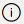

# Add, move, configure, or delete columns on a form

Columns define the individual data items that can be used to store information in a table. Create new columns to capture data when existing standard tables don’t have columns that meet your requirements. After you create a new column, be sure to include it on the appropriate forms and views for the table so that they're available in your app. For information about the different column types, go to [Types of columns](../data-platform/types-of-fields.md).

Add, configure, move, or delete columns using the form designer.

## Add columns to a form

To add columns to a form, use the **Columns** pane. The **Columns** pane lets you search and filter to help you quickly find columns. It also includes the option to show only unused columns.

### Add columns to a form using drag and drop

> [!NOTE]
> When adding or moving columns using drag and drop be aware that the form preview is responsive and might be rendering multiple section columns as stacked. To ensure that the column being added or moved is in the correct section column, drop or paste it anchored to another column that is already in that section.

1. Open the form designer to create or edit a form. More information: [Create a form](create-and-edit-forms.md#create-a-form) or [Edit a form](create-and-edit-forms.md#edit-a-form)
2. On the command bar, select **Add column**, and then select **Columns**. The **Columns** pane is open by default when the form designer is opened.
3. In the **Columns** pane, search, filter, or scroll to find the column you want to add. If you can't find a column, it might already be on the form. Clear **Show only unused columns** to view all columns, including those already added to the form.
4. In the **Columns** pane, select a column and drag it onto the form preview. As you drag the column on the form preview, you notice drop targets where you can add the column.
5. Drop the column in the location you want. Note the following behavior:
    - Columns can be dropped before or after any existing column or component.
    - Columns can also be dropped in the empty area within a section. In this case, the column is added in an available space so as to evenly distribute columns and components across the section columns.
    - Hovering over a tab header when dragging a column changes the currently selected tab, allowing you to add the column to a different tab.
6. Repeat steps 3-5 above if you want to add more columns.
7. On the command bar, select **Save and Publish** if you want to save and make your changes visible to users.

:::image type="content" source="../../maker/model-driven-apps/media/add-columns-drag-and-drop.gif" alt-text="Add columns using drag and drop":::

### Add columns to a form using selection

1. Open the form designer to create or edit a form. More information: [Create a form](create-and-edit-forms.md#create-a-form) or [Edit a form](create-and-edit-forms.md#edit-a-form)
2. In the form preview, select another existing column or section. Note the following behavior:
    - When you select an existing column, the new column is added after the existing column.
    - When you select a section, the new column is added in an available space so as to evenly distribute columns across the section columns.
3. In the command bar, select **Add column**, or in the left pane, select **Columns**. The **Columns** pane is open by default when the form designer is opened.
4. In the **Columns** pane, search, filter, or scroll to find the column you want to add. If you can't find a column, it might already be on the form. Clear **Show only unused columns** to view all columns, including those already added to the form.
5. In the **Columns** pane, select a column to add it to the form. Alternatively, select **...** next to the column you want, and then select **Add to selected section**.
6. Repeat steps 2-5 above if you want to add more columns.
7. In the command bar, select **Save** to save the form, or select **Publish** if you want to save and make your changes visible to users.

:::image type="content" source="../../maker/model-driven-apps/media/add-form-columns-using-selection.gif" alt-text="Add form columns using selection":::

## Create a choice column

1. In the form designer on the command bar, select **Form field**.
1. Select **New table column**.
1. In the **New column** pane, enter or select the values for the following complete the properties for the choice column. More information: [Configure properties for a local choice](../data-platform/custom-picklists.md#configure-properties-for-a-local-choice)

## Configure column properties on a form

The properties and events can be configured for column when you create or edit a form using the form designer.

### Column properties

The **Properties** tab displays the following properties.

|Area  |Name  |Description  |
|---------|---------|---------|
|**Display options** | **Table column** | The name of the column. This comes from the column properties on the table and is read-only.  |
|**Display options** |  **Label** | By default the label matches the display name of the column. You can override that name for the form by entering a different label here.   This property is required. |
|**Display options** | **Hide label** | When selected, the column label is hidden. |
|**Display options** | **Hide on phone** | The column can be hidden to render a condensed version of the form on phone screens. |
|**Display options** | **Hide** | When selected, the column is hidden by default and can be shown using code. |
|**Display options** | **Lock** |  Lock this column so it can't be removed from the form. |
|**Display options** | **Read-only** | When selected, the column value isn't editable on the form. |
|**Formatting** | **Form field width** |  When the section containing the columns has more than one column, you can set the column to occupy up to the number of columns that the section has. |
|**Formatting** | **Form field height** |  Some columns, such as the multiline text column, let you control the height of the column by specifying the number of rows the column occupies. |
|**Formatting** | **Use all available vertical space** |  Instead of setting the height by a number of rows, some columns, such as the multiline text column, let you set the column height to expand to all the available space on the form. |
| **Components**  |  **+ Component**  | Adds a control to the column such as the canvas app control or the AI business card control.    |

> [!WARNING]
> The **Hide** and **Read-only** properties should never be used as a secure way to prevent users from viewing or editing column values. These properties only apply to a form and don't have an effect on a user's data privileges. When a column is hidden on a form, users can still access data in other ways like viewing other forms or by making Web API calls. To secure columns, use [column-level security to control access](/power-platform/admin/field-level-security).

> [!NOTE]
> In Unified Interface, the label size setting is ignored because the form adjusts width for all columns to ensure proper rendering for screen sizes from very small to extra-large.

:::image type="content" source="../../maker/model-driven-apps/media/app-designer-form-column-properties.png" alt-text="view  column properties":::

### Edit a column and view column names

To view column names, such as schema name or to change additional column properties, such as required, searchable, description, and size, select the column, and then in the right column properties pane select the information icon  next to the column name.

   :::image type="content" source="../data-platform/media/data-platform-import-export/column-actions-form-designer.png" alt-text="Select the column information icon.":::

To edit the column data type format, required, and advanced options, follow these steps.
1. On the column **Properties** tab, select **Edit table column** to display the **Edit Table Column** pane where you can make the changes you want.
1. When you're finished making your changes, select **Done**.
1. Select **Save and Publish** to make your changes available to app users.

## Column events

The **Events** tab is where event handlers for model-driven app forms can be configured for a column. An event handler consists of a reference to a JavaScript web resource and a function defined within that web resource that will execute when the event occurs, such as when the value for the column changes. More information: [Configure model-driven app form event handlers](configure-event-handlers-legacy.md)

## Move columns on a form

You can move a column on a form using drag and drop or cut and paste actions.

### Move columns on a form using drag and drop

1. Open the form designer to create or edit a form. More information: [Create a form](create-and-edit-forms.md#create-a-form) or [Edit a form](create-and-edit-forms.md#edit-a-form)
2. In the form preview, select the column that you want to move and drag and drop it. As you drag the column on the form preview, you'll see drop targets where you can move the column to.
   Note the following:
    - Columns can be dropped before or after any existing column or component.
    - Columns can also be dropped in the empty area within a section. In this case, the column is added in an available space so as to evenly distribute columns and components across the section columns.
    - Hovering over a tab header when dragging a column changes the currently selected tab, allowing you to add the column to a different tab.
3. Repeat step 2 above if you want to move more columns.
4. On the command bar, select **Save** to save the form, or select **Publish** if you want to save and make your changes visible to users.

:::image type="content" source="../../maker/model-driven-apps/media/moving-form-columns-drag -and-drop.gif" alt-text="moving form columns using drag and drop approach":::

### Move columns on a form using cut and paste

1. Open the form designer to create or edit a form. More information: [Create a form](create-and-edit-forms.md#create-a-form) or [Edit a form](create-and-edit-forms.md#edit-a-form)
2. In the form preview, select the column that you want to move.
3. On the command bar, select **Cut**.
4. In the form preview, select another existing column, component, or section. You can also switch to a different tab if needed.
5. On the command bar, select **Paste** or select the chevron, and then select **Paste before**.      Note the following:
     - When you select **Paste**, the column that is moved is pasted after the existing column or component. 
     - When you select **Paste before**, the column that is moved is pasted before the existing column or component.
     - When you select a section, the column that is moved is added in an available space so as to evenly distribute columns and components across the section columns. The **Paste before** action isn't applicable and therefore not available in this case.
6. Repeat steps 2-5 above if you want to move more columns.
7. On the command bar, select **Save** to save the form, or select **Publish** if you want to save and make your changes visible to users.

:::image type="content" source="../../maker/model-driven-apps/media/moving-form-columns-cut-paste.gif" alt-text="move form columns cut and paste":::

## Delete columns on a form

1. Open the form designer to create or edit a form. More information: [Create a form](create-and-edit-forms.md#create-a-form) or [Edit a form](create-and-edit-forms.md#edit-a-form)
2. In the form preview, select the column that you want to delete from the form.
3. On the command bar, select **Delete**.
4. Repeat steps 2-3 if you want to delete more columns.
5. On the command bar, select **Save** to save the form, or select **Publish** if you want to save and make your changes visible to users.

   > [!NOTE]
   >
   > - If you delete a column by mistake, on the command bar, select **Undo** to revert the form to its previous state. 
   > - You can't delete a column that is locked or is required and not present anywhere else on the form.

## Create a new column on the table when editing a form (preview)

[!INCLUDE [cc-beta-prerelease-disclaimer](../../includes/cc-beta-prerelease-disclaimer.md)]

Create new columns from the form designer. When a column is created on a table, it isn't limited to the current form and is available for use in other forms and views for the table.

> [!IMPORTANT]
>
> - This is a preview feature.
> - You can use the modern form designer to create any available column type.

1. Open the form designer to create or edit a form. More information: [Create a form](create-and-edit-forms.md#create-a-form) or [Edit a form](create-and-edit-forms.md#edit-a-form)
1. On the left navigation pane, select the **Table columns** pane, and then select **New table column**.
1. In the **New column** pane, provide the **Display name** for the column.
1. Select the **Data type** and configure any other required properties of the column.
1. Select **Save** to create a new column on the table. The column appears in the **Table columns** pane.
1. If you want to add the newly created column to the form, follow the steps outlined in the [**Add columns to a form**](add-move-or-delete-fields-on-form.md#add-columns-to-a-form) section.

### See also

[Overview of the model-driven form designer](form-designer-overview.md)  
[Create, edit, or configure forms using the form designer](create-and-edit-forms.md)  
[Add, configure, move, or delete components on a form](add-move-configure-or-delete-components-on-form.md)  
[Add, configure, move, or delete sections on a form](add-move-or-delete-sections-on-form.md)  
[Add, configure, move, or delete tabs on a form](add-move-or-delete-tabs-on-form.md)  
[Configure header properties in the form designer](form-designer-header-properties.md)  
[Add and configure a subgrid component on a form](form-designer-add-configure-subgrid.md)  
[Add and configure a quick view component on a form](form-designer-add-configure-quickview.md)  
[Configure a lookup component on a form](form-designer-add-configure-lookup.md)  
[Using the tree view in the form designer](using-tree-view-on-form.md)  
[Create and edit columns](../data-platform/create-edit-field-portal.md)  

[!INCLUDE[footer-include](../../includes/footer-banner.md)]
