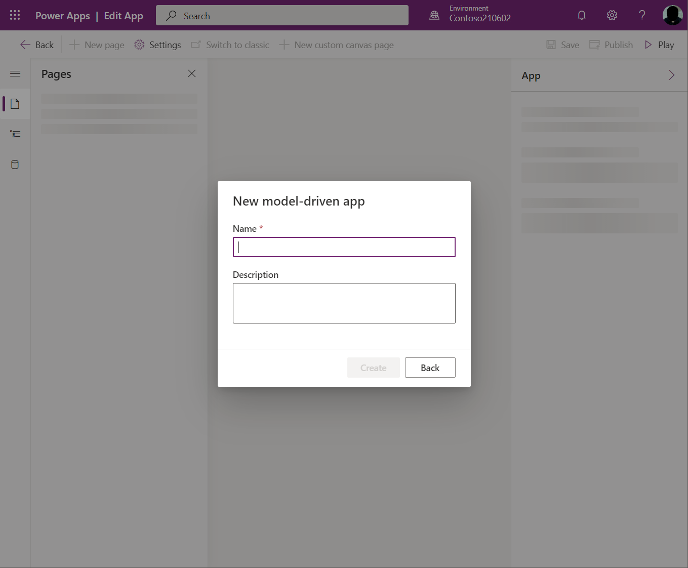
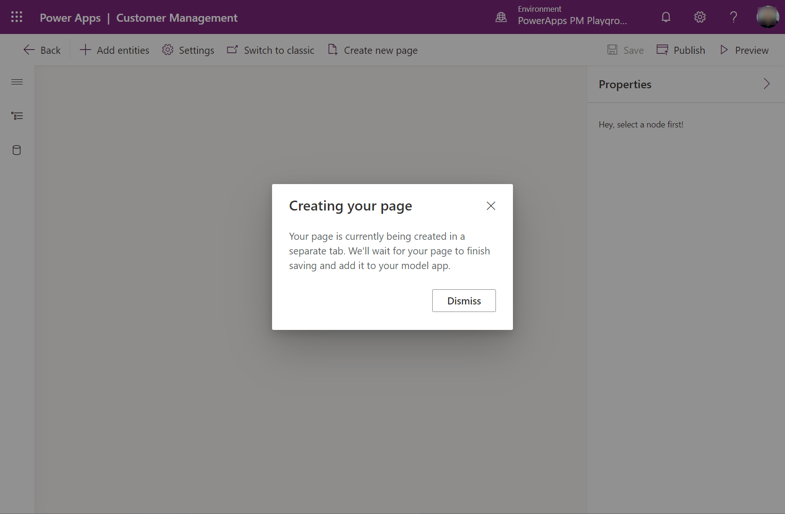

# Add a custom page to your model-driven app

[!INCLUDE [cc-beta-prerelease-disclaimer](../../includes/cc-beta-prerelease-disclaimer.md)]

This topic guides you through creating and editing a custom page for a model-driven app using the modern app designer.

  > [!IMPORTANT]
  > - This is a preview feature, and may not be available in all regions.
  > - [!INCLUDE[cc_preview_features_definition](../../includes/cc-preview-features-definition.md)]

  > [!NOTE]
  > Custom page must be created from a solution either from the modern app designer and or the Solution area in Power Apps using **New** > **Page**. The custom page is a different canvas app type than the normal standalone canvas app.

## Create or edit a model-driven app using modern app designer

The following steps walk you through opening the new modern app designer, which is needed to add custom pages into a model-driven app.

### Create a new model-driven app using modern app designer

1. Go to [make.powerapps.com](https://make.powerapps.com/?cds-app-module-designer.isCustomPageEnabled=true&oneCdsDesigner.enableCustomCanvasPage=true)

1. On the left navigation pane, select **Solutions** and then open or create a solution to contain the new model-driven app.

1. Select **New** > **App** > **Model-driven app**

1. Select **Use modern app designer**, and then select **Next**

    > [!div class="mx-imgBorder"]
    > 

1. Enter the new app's name.

    > [!div class="mx-imgBorder"]
    > 

### Open an existing model-driven app using modern app designer

1. Open [make.powerapps.com](https://make.powerapps.com/?cds-app-module-designer.isCustomPageEnabled=true&oneCdsDesigner.enableCustomCanvasPage=true)

1. On the left navigation pane, select **Solutions**, and then open the solution containing the existing model-driven app.

1. Open the model-driven app menu and select **Edit** > **Edit in preview** to open the modern app designer.

    > [!div class="mx-imgBorder"]
    > 

## Create or edit a custom page

Custom pages can be created from two places. The first is while authoring a model-driven app in the modern app designer. The other is from the **Solutions** area in Power Apps. Custom pages can be edited from the the **Solutions** area. Custom pages won't appear in the **Home** or **Apps** areas of make.powerapps.com.

### Create new custom page from modern app designer

1. Open modern app designer.

1. Either click **New page** in the command bar or within the **Pages** pane

    > [!div class="mx-imgBorder"]
    > 

1. Select **Custom (preview)** as the page type.

    > [!div class="mx-imgBorder"]
    > 

1. Canvas designer opens to allow page authoring

    > [!div class="mx-imgBorder"]
    > 

### Create new custom page from solution explorer

1. Open up [make.powerapps.com](https://make.powerapps.com/?cds-app-module-designer.isCustomPageEnabled=true&oneCdsDesigner.enableCustomCanvasPage=true)

1. Switch to Solutions and open or create a solution to contain the new custom page

1. Click **New > App > Page**

    > [!div class="mx-imgBorder"]
    > 

### Editing existing custom page

1. Open up [make.powerapps.com](https://make.powerapps.com/?cds-app-module-designer.isCustomPageEnabled=true&oneCdsDesigner.enableCustomCanvasPage=true)

1. Switch to Solutions and open or create a solution to contain the new custom page

1. Select the custom page with **Page** type and click **Edit**

    > [!div class="mx-imgBorder"]
    > 

## Author custom page content

1. Design the custom page content using [Design a custom page for your model-driven app](design-page-for-model-app.md)

1. Save and publish the custom page

1. Close canvas designer

1. Return to App Designer browser table and refresh app designer by clicking **Dismiss**

    > [!div class="mx-imgBorder"]
    > 

1. Click **Publish** in the app designer to add the changed custom page into the model-driven app

1. Click **Preview** to play the app in a new browser tab

## Add existing custom page into model-driven app sitemap

1. Open [make.powerapps.com](https://make.powerapps.com/?cds-app-module-designer.isCustomPageEnabled=true&oneCdsDesigner.enableCustomCanvasPage=true)

1. Select model-driven app and click **Edit** to open the new app designer

1. Switch to **Navigation** pane in left bar

    > [!div class="mx-imgBorder"]
    > 

1. Expand the navigation and select the location to place the page

1. Click **Add > Subarea** to add a new item after the selection

    > [!div class="mx-imgBorder"]
    > 

1. In the right-side property pane, select an existing  **Page** from the drop and enter a **Title**

    > [!div class="mx-imgBorder"]
    > 

1. Click **Publish** which will also save if there are changes

1. Click **Preview** to play the app in a new browser tab

1. To leave the App Designer click **Back** to return to solution

## Enabling custom page before public preview

By default custom pages is not available in the new app designer until custom page public preview.  These parameters are not needed for internal test.
```
?cds-app-module-designer.isCustomPageEnabled=true&oneCdsDesigner.enableCustomCanvasPage=true
```

## Upcoming changes in new App Designer

* Adding custom page in app designer without being in the navigation

    * Workaround: add into sitemap which adds to both sitemap and pages collection, then remove from sitemap which leaves in the pages collection

## Related topics

[Model-driven app custom page overview](model-app-page-overview.md)

[Design a custom page for your model-driven app](design-page-for-model-app.md)

[Using PowerFx in custom page](page-powerfx-in-model-app.md)

[Navigating to and from a custom page in your model-driven app](navigate-page-examples.md)

[Code components for custom page designer](../../developer/component-framework/component-framework-for-canvas-apps.md)
