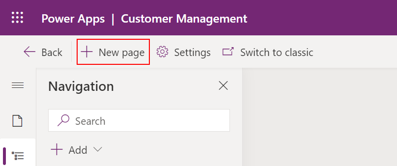

# Add a custom page to your model-driven app (preview)

[!INCLUDE [cc-beta-prerelease-disclaimer](../../includes/cc-beta-prerelease-disclaimer.md)]

This article guides you through creating and editing a custom page for a model-driven app using the modern app designer.

  > [!IMPORTANT]
  > - This is a preview feature, and may not be available in all regions.
  > - [!INCLUDE[cc_preview_features_definition](../../includes/cc-preview-features-definition.md)]

## Create or edit a model-driven app using modern app designer

The following steps walk you through opening the new modern app designer, which is needed to add a custom page to a model-driven app.

### Create a new model-driven app using modern app designer

1. Go to [make.powerapps.com](https://make.powerapps.com/?cds-app-module-designer.isCustomPageEnabled=true&oneCdsDesigner.enableCustomCanvasPage=true)

1. On the left navigation pane, select **Solutions** and then open or create a solution to contain the new model-driven app.

1. Select **New** > **App** > **Model-driven app**.

1. Select **Use modern app designer**, and then select **Next**.

    > [!div class="mx-imgBorder"]
    > 

1. Enter the new app's **Name**, optionally a **Description**, and then select **Create**.

    > [!div class="mx-imgBorder"]
    > 

### Open an existing model-driven app using modern app designer

1. Open [make.powerapps.com](https://make.powerapps.com/?cds-app-module-designer.isCustomPageEnabled=true&oneCdsDesigner.enableCustomCanvasPage=true)

1. On the left navigation pane, select **Solutions**, and then open the solution containing the existing model-driven app.

1. Open the model-driven app menu and select **Edit** > **Edit in preview** to open the modern app designer.

    > [!div class="mx-imgBorder"]
    > 

## Create or edit a custom page

Custom pages can be created from two places. The first is while authoring a model-driven app in the modern app designer. The other is from the **Solutions** area in Power Apps. Custom pages can be edited from the **Solutions** area but won't appear in the **Home** or **Apps** areas of make.powerapps.com.

  > [!NOTE]
  > Custom pages must be created from a solution either from the modern app designer and or the **Solutions** area in Power Apps using **New** > **Page**. The custom page is a different canvas app type than the normal standalone canvas app.

### Create new custom page from modern app designer

1. Open modern app designer.

1. Select **New page** on the command bar or on the **Pages** pane.

    > [!div class="mx-imgBorder"]
    > 

1. Select **Custom** as the page type.

    > [!div class="mx-imgBorder"]
    > 

1. The canvas app designer opens for page authoring.

    > [!div class="mx-imgBorder"]
    > 

1. When you're finished creating your canvas app custom page, **Save**, **Publish**, and then close the canvas app designer browser tab to return to the model-driven app designer.

### Create new custom page from the solutions area

1. Sign in to [Power Apps](https://make.powerapps.com/?cds-app-module-designer.isCustomPageEnabled=true&oneCdsDesigner.enableCustomCanvasPage=true)

1. Select **Solutions** from the left navigation pane, and open or create a solution to contain the new custom page

1. Select **New > App > Page**.

    > [!div class="mx-imgBorder"]
    > 

### Edit an existing custom page

1. Open up [make.powerapps.com](https://make.powerapps.com/?cds-app-module-designer.isCustomPageEnabled=true&oneCdsDesigner.enableCustomCanvasPage=true)

1. Select **Solutions** from the left navigation pane, and then open or create a solution to contain the new custom page.

1. Select the custom page with **Page** type, and then select **Edit**.

    > [!div class="mx-imgBorder"]
    > 

## Author custom page content

1. Design the custom page content. More information: [Design a custom page for your model-driven app](design-page-for-model-app.md)

1. Save and publish the custom page.

1. Close canvas app designer.

1. Return to the app designer browser tab and refresh the app designer by selecting **Dismiss**.

    > [!div class="mx-imgBorder"]
    > 

1. Select **Publish** in the app designer to add the changed custom page into the model-driven app.

1. Select **Preview** to play the app in a new browser tab.

## Add an existing custom page into a site map

1. Sign into [make.powerapps.com](https://make.powerapps.com/?cds-app-module-designer.isCustomPageEnabled=true&oneCdsDesigner.enableCustomCanvasPage=true)

1. [Open an existing model-driven app using modern app designer](#open-an-existing-model-driven-app-using-modern-app-designer)

1. Select the **Navigation** tab.

    > [!div class="mx-imgBorder"]
    > 

1. Expand the navigation, and then select the location to place the page.

1. Select **Add > Subarea** to add a new item after the selection.

    > [!div class="mx-imgBorder"]
    > 

1. In the right property pane, select an existing  **Page** from the list, and then enter a **Title**.

    > [!div class="mx-imgBorder"]
    > 

1. Select **Publish**, which also saves the app if there are changes.

1. Select **Play** to run the app in a new browser tab.

1. To close the app designer select **Back** and return to the solution.

<!-- ## Enabling custom page before public preview

By default custom pages are not available in the new app designer until custom page public preview.  These parameters are not needed for internal test.  
```
?cds-app-module-designer.isCustomPageEnabled=true&oneCdsDesigner.enableCustomCanvasPage=true
```

## Upcoming changes in new App Designer

* Adding custom page in app designer without being in the navigation

    * Workaround: add into sitemap which adds to both sitemap and pages collection, then remove from sitemap which leaves in the pages collection  -->

### See also

[Model-driven app custom page overview](model-app-page-overview.md)

[Design a custom page for your model-driven app](design-page-for-model-app.md)

[Using PowerFx in custom page](page-powerfx-in-model-app.md)

[Navigating to and from a custom page using client API](../../developer/model-driven-apps/clientapi/navigate-to-custom-page-examples.md)

[Code components for custom page designer](../../developer/component-framework/component-framework-for-canvas-apps.md)
