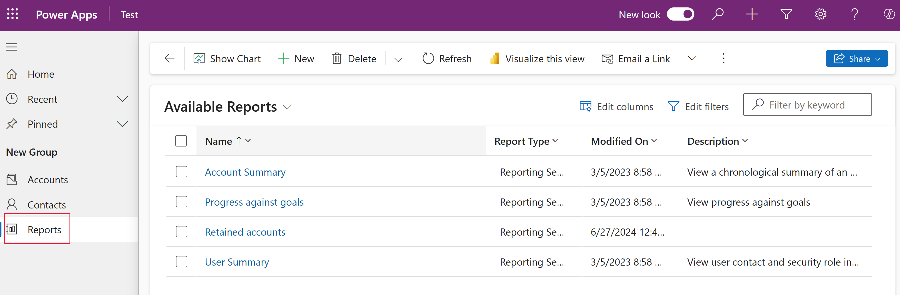

# Add reporting to your model-driven app

PowerApps apps can include reports that provide useful business information to the user. These reports are based on SQL Server Reporting Services and provide the same set of features that are available for typical SQL Server Reporting Services reports.

> [!div class="mx-imgBorder"] 
> 

System reports are available to all users. Individuals who create or otherwise own reports can share them with specific colleagues or teams, or can make the reports available to the organization, so that all users can run them. These reports use FetchXML queries that are proprietary to Common Data Service and Dynamics 365 for Customer Engagement apps and retrieve data to build the report. Reports that you create in a PowerApps app are Fetch-based reports.

> [!NOTE]
> Report features don't work with canvas apps or model-driven apps running on mobile devices, such as tablets and phones. 

Reports can be built in either of the following ways.

- From a model-driven app using the report wizard. More information: [Create or edit a report using the Report Wizard](/dynamics365/customer-engagement/basics/create-edit-copy-report-wizard) 
<!-- From a model-driven app using an advanced find query. To do this, you build an advanced find query and then select **Download as FetchXML**. Next, from the reports area select **New**, for **Report Type** select **Existing File**, select **Choose File** open the xml file, fill in the required fields, and save the report. More information: [Add a report](/dynamics365/customer-engagement/basics/add-existing-report) -->
- Create custom reports using SQL Server Data Tools and Report Authoring Extensions. More information: [Reporting and Analytics Guide](/dynamics365/customer-engagement/analytics/reporting-analytics-with-dynamics-365)

## Add reporting to a Unified Interface app
You can add fetch-based reporting functionality to your app so that users can run, share, create, and edit reports. To do this, you add the report entity to your app's site map. 

1. Sign in to [PowerApps](https://web.powerapps.com/?utm_source=padocs&utm_medium=linkinadoc&utm_campaign=referralsfromdoc) and open an existing app for editing. 
2. In App Designer, select  next to **Site Map**. 
3. In the Sitemap Designer, select **Add** and then select **Area**. 
4. In the **Title** box, enter a name for the area title, such as *Reports*. 
5. Select the area that you named in the previous step, select **Add**, select **Group**, and then in the group **Title** box enter a name for the group title, such as *Reports*. 
6. Select the group that you named in the previous step, select **Add**, select **Subarea** and then include the following properties: 

   - **Type**. Select **Entity**.
   - **Entity**. From the list of entities, select the **Report** entity.  
   - **Title**. Enter a descriptive title, such as *Reports*.

      

7. Select **Save and Close** to return to the app designer. 

8. In App Designer select **Save**, and then select **Publish**.

Now the app displays a **Reports** area where users can view, run, assign, share, and edit the reports they have permission to as well as create new reports using the report wizard. 

> [!div class="mx-imgBorder"] 
> 

## Related topics
[Work with reports](/powerapps/user/work-with-reports) 
[Create a report using the Report Wizard](/powerapps/user/create-report-with-wizard) 
[Add a report from outside PowerApps](/powerapps/user/add-existing-report) 
[Edit the default filter of a report](/powerapps/user/edit-report-filter) 
[Troubleshoot reports](/powerapps/user/troubleshoot-reports)
