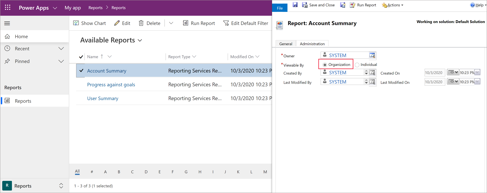

# Add reporting features to your model-driven app

[!INCLUDE [cc-data-platform-banner](../../includes/cc-data-platform-banner.md)]

Power Apps apps can include reports that provide useful business information to the user. These reports are based on SQL Server Reporting Services and provide the same set of features that are available for typical SQL Server Reporting Services reports.

> [!div class="mx-imgBorder"] 
> 

System reports are available to all users. Individuals who create or otherwise own reports can share them with specific colleagues or teams, or can make the reports available to the organization, so that all users can run them. These reports use FetchXML queries that are proprietary to Microsoft Dataverse and retrieve data to build the report. Reports that you create in a Power Apps app are Fetch-based reports.

> [!NOTE]
> Report features don't work with canvas apps or model-driven apps running on mobile devices, such as tablets and phones. 

<!-- Reports can be built in either of the following ways.

- From a model-driven app using the report wizard. More information: [Create or edit a report using the Report Wizard](/dynamics365/customer-engagement/basics/create-edit-copy-report-wizard) 
- Create custom reports using SQL Server Data Tools and Report Authoring Extensions. More information: [Reporting and Analytics Guide](/dynamics365/customer-engagement/analytics/reporting-analytics-with-dynamics-365)  -->

## Add reporting to a Unified Interface app
You can add fetch-based reporting functionality to your app so that users can run, share, create, and edit reports. To do this, you add the report table to your app's site map. 

1. Sign in to [Power Apps](https://make.powerapps.com/?utm_source=padocs&utm_medium=linkinadoc&utm_campaign=referralsfromdoc) and open an existing app for editing. 
2. In App Designer, select  next to **Site Map**. 
3. In the Sitemap Designer, select **Add** and then select **Area**. 
4. In the **Title** box, enter a name for the area title, such as *Reports*. 
5. Select the area that you named in the previous step, select **Add**, select **Group**, and then in the group **Title** box enter a name for the group title, such as *Reports*. 
6. Select the group that you named in the previous step, select **Add**, select **Subarea** and then include the following properties: 

   - **Type**. Select **Entity**.
   - **Entity**. From the list of tables, select the **Report** table.  
   - **Title**. Enter a descriptive title, such as *Reports*.

      

7. Select **Save and Close** to return to the app designer. 

8. In App Designer select **Save**, and then select **Publish**.

Now the app displays a **Reports** area where users can view, run, assign, share, and edit the reports they have permission to as well as create new reports using the report wizard. 

> [!div class="mx-imgBorder"] 
> 

## Options for creating new reports
You can create a new report in one of two ways:
- Use the Report Wizard. Open a model-driven app that has been enabled for reporting and run the Report Wizard to create a new report. The Report Wizard can create table and chart reports, including drill-through reports and top N reports. More information: [Create a report using the Report Wizard](../../user/create-report-with-wizard.md) 
- Use the Report Authoring Extension. You can write new or customize existing fetch-based Reporting Services reports with Visual Studio, SQL Server Data Tools, and the Report Authoring Extension. More information: [Create a new report using SQL Server Data Tools](/dynamics365/customer-engagement/analytics/create-a-new-report-using-sql-server-data-tools)

## Report visibility
Standard table reports, such as the Accounts Summary report for the account table, are available to all app users. Users who own reports can share them with specific colleagues or teams. System administrators and system customizers can make reports available with organization-wide visibility, so that all users can use them. For information about how to share a report, see [Share a report with other users and teams](../../user/work-with-reports.md#share-a-report-with-other-users-or-teams). 

## Reports in solutions
Reports are solution aware. Adding a report as a component to a solution makes it become a single unit of software that extends Power Apps functionality and the user interface. Only reports that are visible to the organization can be added to solutions.

To find if a report is viewable to the organization: In the list of reports, open a model-driven app, select a report, and then select **Edit**. On the **Administration** tab, see if **Viewable By** is set to **Organization**. 

> [!div class="mx-imgBorder"] 
> 

You can add, import, or export snapshots of reports as part of a solution. In model-driven apps, reports, sub reports, report category, report display area, and report-related row type are considered as components of a report set. When you import a solution update in non-overwrite mode, any updates by the solution to a report will be ignored if any component of the report set has been customized.

## Related topics

[Work with reports](../../user/work-with-reports.md) 
[Create a report using the Report Wizard](../../user/create-report-with-wizard.md) 
[Add a report from outside Power Apps](../../user/add-existing-report.md) 
[Edit the default filter of a report](../../user/edit-report-filter.md) 
[Troubleshoot reports](../../user/troubleshoot-reports.md)

[!INCLUDE[footer-include](../../includes/footer-banner.md)]