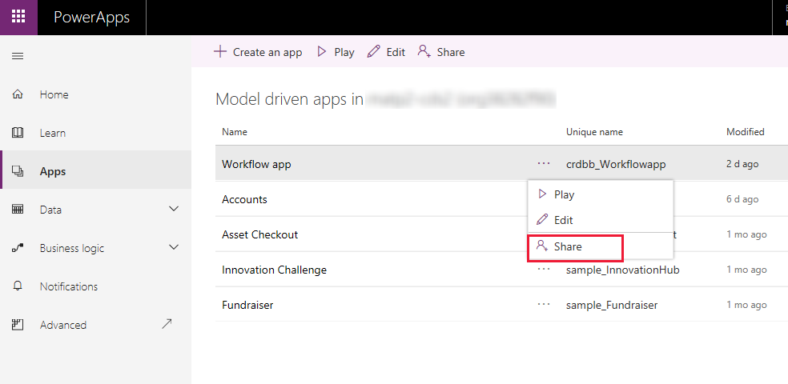
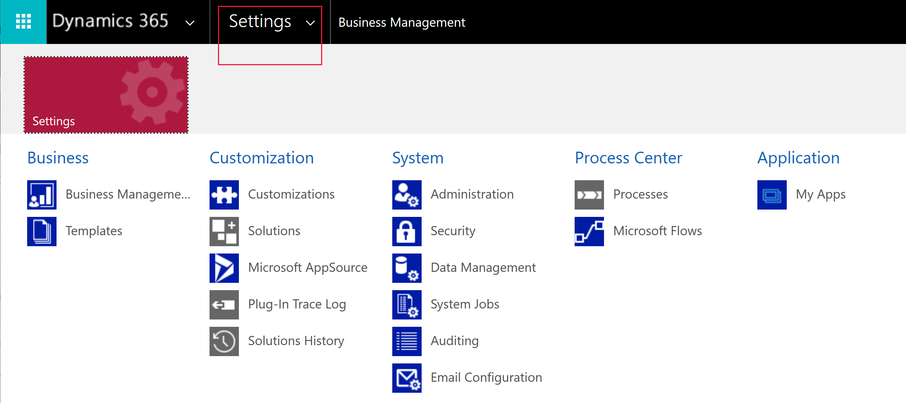

# Navigate to advanced model-driven app making and customization areas

This topic describes how to access advanced customization and administration areas that are available within a Power Apps environment.

## Solutions
The solutions area is where you can view, edit, create, import, export, and delete managed and unmanaged solutions. 

1.	Sign in to [Power Apps](https://make.powerapps.com/?utm_source=padocs&utm_medium=linkinadoc&utm_campaign=referralsfromdoc).
2.	On the left navigation pane select **Solutions**. 

## Solution explorer
Use solution explorer to perform app making and customization tasks that can’t be completed from the Power Apps home page.

1.	From [Power Apps](https://make.powerapps.com/?utm_source=padocs&utm_medium=linkinadoc&utm_campaign=referralsfromdoc) (make.powerapps.com) or a model-driven app, select **Settings**  on the command bar, and then select **Advanced Settings**.

2.	Select **Settings** > **Customizations** > **Customize the System**, and then select the customization area that you want.

## Apps
The Apps area lists all model-driven and canvas apps that you have privileges to in your environment. In addition to launching an app, from the Apps area you can also assign security roles to it. 

To share an app:
1.	Sign in to [Power Apps](https://make.powerapps.com/?utm_source=padocs&utm_medium=linkinadoc&utm_campaign=referralsfromdoc).

2.  Select **Apps**.
 
3.  Select **…** > **Share**. 

    > [!div class="mx-imgBorder"] 
    >  

4. Then follow these steps: [Share a model-driven app](./share-model-driven-app.md#preview-share-a-model-driven-app)
 
## Settings
Use the settings area to configure environment settings, activate or deactivate processes, and more. 

1.  From a Power Apps model-driven app, select **Settings**  on the app toolbar, and then select **Advanced Settings**.

2.  Select **Settings**, and then select the settings area that you want.

    > [!div class="mx-imgBorder"] 
    >  

## See also
[Create or edit a model-driven app by using the app designer](create-edit-app.md)

[!INCLUDE[footer-include](../../includes/footer-banner.md)]
