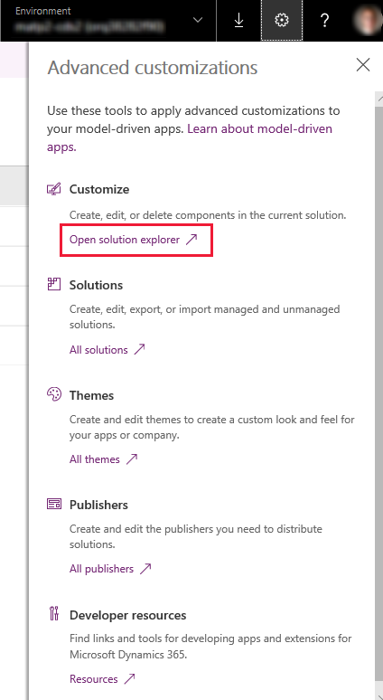
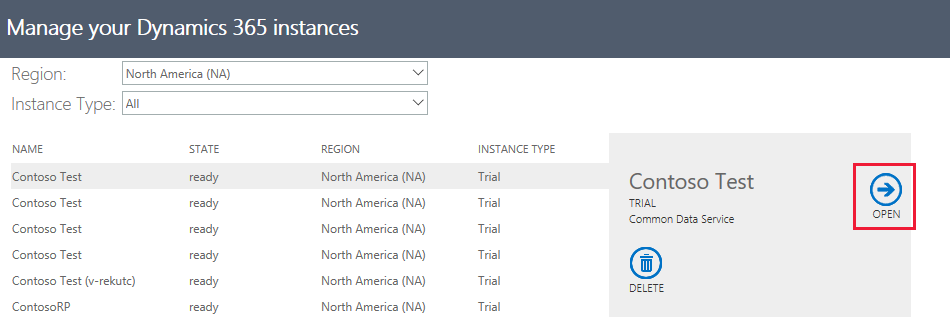

# Navigate to advanced model-driven app making and customization areas

This topic describes how to access advanced customization and administration areas that are available within a PowerApps environment.

## Solution explorer
Use solution explorer to perform app making and customization tasks that can’t be completed from the PowerApps model-driven home page.

1.	Sign in to [PowerApps](https://web.powerapps.com/?utm_source=padocs&utm_medium=linkinadoc&utm_campaign=referralsfromdoc). 
2.	Select  (upper right) > **Advanced customizations**. 
3.	Under **Customize**, select **Open solution explorer**. 

    > [!div class="mx-imgBorder"] 
    > 

## Solutions

The solutions area is where you can view, edit, create, import, export, and delete managed and unmanaged solutions. 

1.	Sign in to [PowerApps](https://web.powerapps.com/?utm_source=padocs&utm_medium=linkinadoc&utm_campaign=referralsfromdoc).
2.	On the left navigation pane select **Solutions**. 

## My Apps

Like the PowerApps model-driven area, the My Apps page lists all model-driven apps in your environment. In addition to launching an app, from My Apps you can also assign security roles to it. 

To get to My Apps:
1.	Sign in to [PowerApps](https://web.powerapps.com/?utm_source=padocs&utm_medium=linkinadoc&utm_campaign=referralsfromdoc).
2.  Select **…** > **Share**. 

    > [!div class="mx-imgBorder"] 
    >  

4. Then follow these steps: [Add security roles to the app](https://docs.microsoft.com/powerapps/maker/model-driven-apps/share-model-driven-app#add-security-roles-to-the-app)
 
## Settings

Use the settings area to manage solutions, configure environment settings, activate or deactivate processes, and more. 

First, see if the setting you need is in the   > **Advanced customizations** menu.

To find settings not availabe from **Advanced customizations**:  
1.	Access your environment from the Dynamics 365 Administration Center. For environments located in North America go to [https://port.crm.dynamics.com/G/instances/InstancePicker.aspx](https://port.crm.dynamics.com/G/instances/InstancePicker.aspx). For other locations, see Direct sign in to the Dynamics 365 Administration Center.
2.	Select the environment you want, and then select **Open**.

    > [!div class="mx-imgBorder"] 
    > 

## Next steps

[Create or edit a model-driven app by using the app designer](create-edit-app.md)
