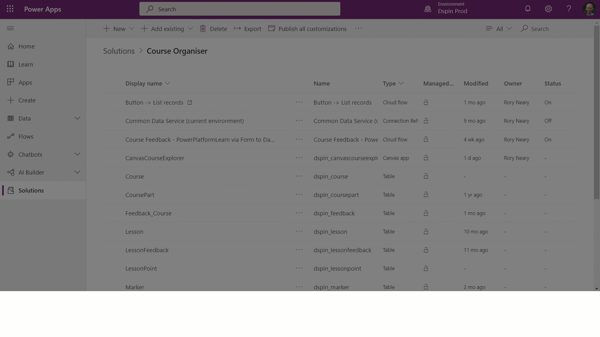

# Steps to building a model-driven app

This page describes the steps associated with building a model-driven app. For a simple walk-through of building a first app, go to [building a first model-driven app](build-first-model-driven-app.md).

## Steps to building and sharing a model driven app

At a fundamental level, model-driven app making consists of the following stages.

|Stage|Purpose|
|-----|-------|
|Modeling business data|To ensure that the data constructed in the correct way to address the business problem.
|Defining business processes|To help users to update the tables and complete their work efficiently and accurately.
|Composing the app|To create the app and select the tables, and elements of tables relevant to the app.
|Configuring security roles|To ensure that app users can only interact with data relevant to their roles.
|Sharing the app|App distribution.

Each stage requires a range of [editors](model-driven-designers.md) to ensure that the application can be created, whether the app maker is updating the data model, or going through the process of composing the app.

Whilst it may seem strange to have multiple editors these reflect the various technologies that have been brought to bear within Dataverse. Often makers will move seamlessly through the editors to construct the app.

## Modeling business data

To model business data, you determine what data your app will need and how that data will relate to other data. Model-driven design uses a metadata-driven architecture so that designers can customize the application without writing code. Metadata means “data about data” and it defines the structure of the data stored in the system.

>[!NOTE]
>Model-driven apps can't be created without Dataverse tables. However, Dataverse tables can be used by many Power Platform services, including canvas apps and Power Automate.

[Tutorial: Create a custom table that has components in Power Apps](../data-platform/create-custom-entity.md)

## Defining business processes

Defining and enforcing consistent business processes is an important aspect of model-driven app design. However, it should be noted that it's possible to create a model-driven app without a business process configured around it.

Nevertheless, consistent processes help make sure your app users focus on their work and not on remembering to perform a set of manual steps. These processes can be simple or complex and can contain operations on multiple tables.

The screenshot below illustrates the impact of having a business process flow in place.

:::image type="content" source="../../user/media/business-process.png" alt-text="Sample model-driven app with business process flow":::

Business process flows are created and configured using Power Automate.  

More information: [Business process flows overview](/power-automate/business-process-flows-overview) and [Apply business logic with Microsoft Dataverse](../data-platform/processes.md).

## Composing the model-driven app

After creating a data model and defining business processes where necessary, the app can be built.

This can be done in one of two ways, by building an app using the modern interface, or the classic interface.

With the modern interface makers can see the effects of the changes that they make whilst designing, whereas with the classic interface there is a level of abstraction between the final user experience and the design experience.
More information: 
- [Learn how to build a modern app](build-first-model-driven-app.md)
- [Learn how to build an app using the classic interface](build-first-model-driven-app-classic.md)

With both experiences a [site map](model-driven-app-glossary.md#site-map) is created, defining the navigation experience for users.  With the modern approach this is a part of the app design process, whereas with the classic app designer a separate site map designer is used.

### Playing the app

Play your app through the [app designer](model-driven-app-glossary.md#app-designer), or via the [solution explorer](model-driven-app-glossary.md#solution-explorer).

Once these stages are complete, you can move onto the final phases associated with distributing your app.

More information: [Building a site map](create-site-map-app.md)

## Configuring security roles

Access to tables is defined using security roles and these roles govern the actions that users can perform with the tables within Dataverse. Without this, users will have no meaningful access to the app.

These actions cover Create, Read, Write, Delete, Append, Append To, Assign and Share. Security roles need to be first configured and then users are assigned to roles at the point of sharing.

For more information on understanding, creating and configuring security roles go to:

- [Power Platform documentation](/power-platform/admin/security-roles-privileges)
- [Microsoft Learn module](/learn/modules/get-started-security-roles/)

## Sharing the app

To share an app, two actions are required.

- Assign the user a security role. This means that they have permission to see the data.

   :::image type="content" source="media/share-model-driven-app/share-app.png" alt-text="Sample model-driven app":::

- Share a link to the app. To get the link:

1. Edit the app and select the **Properties** tab.
2. Copy the **Unified Interface URL.**
3. Paste the app URL in a location so that your users can access it, such as by posting it on a SharePoint site or send via email.

  <!--  -->

Sharing an app and security roles are intrinsically linked. To properly share an app, you need to have a strong understanding of both.  [Discover more about sharing apps and establishing security](share-model-driven-app.md)

## Using a model-driven app

Documentation has been developed that is dedicated to helping users of model-driven apps successfully navigate around and interact in ways that help make them more productive. [Learn more about using model-driven apps](/powerapps/user/use-model-driven-apps)

## Next steps

[Build your first modern app](build-first-model-driven-app.md)

[Meet the model-driven app designers](model-driven-designers.md)

[!INCLUDE[footer-include](../../includes/footer-banner.md)]
