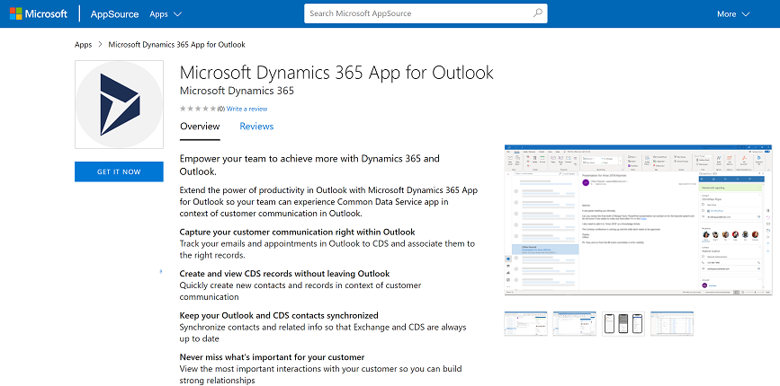

# Set up and customize Dynamics 365 App for Outlook

Set up and customize the Dynamics 365 App for Outlook to best suit your organization needs. 

## Deploy the app

Before you can customize the App for Outlook, you must install the solution and then deploy it in your environment. 
   
1. To deploy the app, see, [Deploy Dynamics 365 App for Outlook](/dynamics365/customer-engagement/outlook-app/deploy-dynamics-365-app-for-outlook).
2. For environments in Microsoft Dataverse an administrator can get the App for Outlook solution from Microsoft AppSource. Go to go [Install Microsoft Dynamics 365 App for Outlook](https://appsource.microsoft.com/product/dynamics-365/mscrm.fa50aa98-e8bb-4757-83ce-6d607959b985?tab=Overview), then choose **GET IT NOW** and follow the steps to select the environment to install it on.

   > [!div class="mx-imgBorder"]
   > 

## Customize App for Outlook

Once the app has been deployed to your organization, you can then customize it.

- Modify the columns on a contact card that is used to track an email or appointment using Set Regarding: [Customize the track regarding contact card](/dynamics365/customer-engagement/outlook-app/customize-the-track-regarding-card)
- Enable a table to appear in the create New menu (quick create) in App for Outlook: [Add a table to the quick create menu](/dynamics365/customer-engagement/outlook-app/add-a-custom-entity-to-quick-create)
- Enable Set Regarding lookup: [Enable activities to use Set Regarding lookup in App for Outlook](/dynamics365/customer-engagement/outlook-app/enable-a-custom-entity-to-appear-in-the-regarding-lookup)
- Enable the quick create auto-populate option for the case table: [Customize App for Outlook to auto populate data from an Outlook item to a quick create case table](/dynamics365/outlook-app/auto-populate-data-into-quickcreate)
- Enable columns that Set Regarding lookup searches on: [Expand the columns which the Set Regarding lookup searches on](/dynamics365/outlook-app/search-on-custom-field-regarding-lookup)
- Expose only the relevant set of tables to your users: [Filter tables and views that appear in Dynamics 365 App for Outlook](/dynamics365/outlook-app/filter-entities-and-views)

### See also
 [Basic navigation in App for Outlook](/dynamics365/outlook-app/user/basic-navigation)  

[!INCLUDE[footer-include](../../includes/footer-banner.md)]
