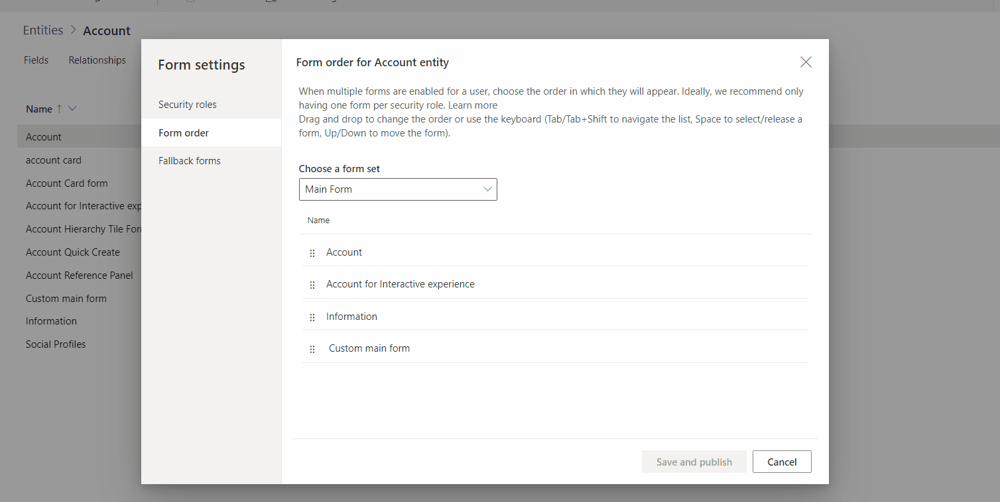

# Assign model-driven app form order

 When there are multiple main, quick create, quick view, or card forms for a table, a form order can be assigned. The form order determines which of the available forms will be shown by default.

 The available main forms can be further controlled by assigning [security roles](../model-driven-apps/model-driven-app-glossary.md#security-role) to the form. See [control access to forms](control-access-forms.md) for more information.  
  
 It is not possible to assign security roles to quick create, quick view, or card forms, so the **only** form that will be used by everyone is the one at the top of the form order.  

## Set the form order

1. Sign into Power Apps, select **Solutions**, open the solution required, select a table, and then select the **Forms** tab.
2. Next to the main form you want to configure the fallback form for, select **...**, and then select **Form settings**.
3. In the left navigation on the **Form settings** page, select **Form order**.
4. Select the form set that is required, such as **Main Form**, **Quick Create Form**, **Quick View Form** or **Card Form**.
5. Change the order by dragging and dropping the form up and down the list in the order best suited to the users. It is also possible to use these keyboard shortcuts: Tab/Tab + Shift to move the focus, Space to select or release a form, and Down/Up arrow keys to move a form. Select **Save and publish**.
   

## Using the classic editor to assign the form order

> [!NOTE]
> To set form order using the new experience, see [Set the form order](control-access-forms.md#set-the-form-order).

1.  Open the [solutions explorer](advanced-navigation.md#solution-explorer), expand the table required, and then select **Forms**.  
  
2.  In the form list toolbar select **Form Order**.  

     > [!div class="mx-imgBorder"] 
     > 
  
3.  Choose either **Main Form Set**, **Quick Create Form Set**, **Quick View Form Set**, or **Card Form Set** depending on the type of forms you want to work with. More information: [Type of forms](types-forms.md). 
  
4.  The **Form Order** dialog is a simple list where a selected form can be moved up or down in the form order.  
  
5.  After the order has been set, click **OK** to close the dialog.  

## Next steps

[Change navigation within a form](use-the-form-editor-legacy.md)

[!INCLUDE[footer-include](../../includes/footer-banner.md)]