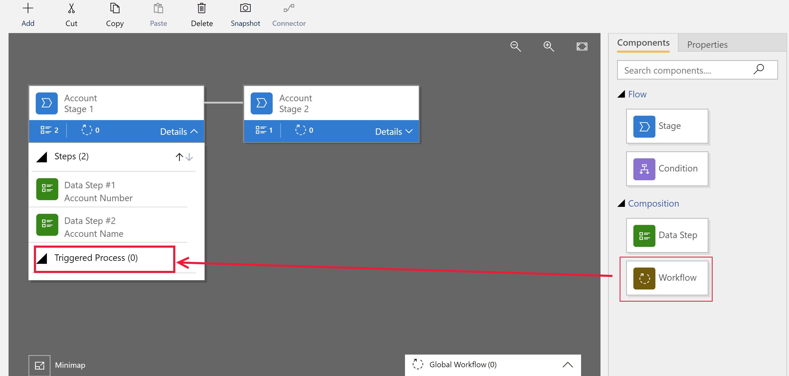
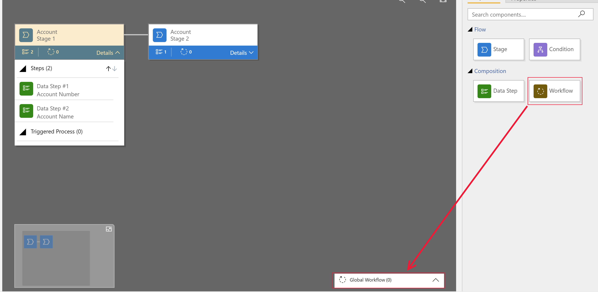
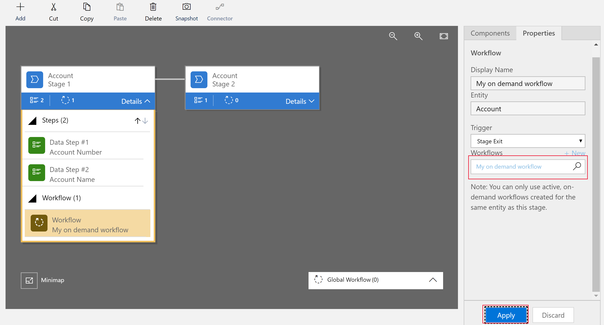

# Add an on-demand workflow to a business process flow

You can trigger on-demand workflows from inside a business process flow. For example, you can add an on-demand workflow to a business process flow so that an activity, such as a task or email, is created whenever a stage is completed. 

To add a workflow to a business process flow, the workflow must have the following. 

- The **As an on-demand process workflow** attribute selected.
- The same primary entity for the workflow is also used for the process or the business process flow stage.

## Add an on-demand workflow to a business process flow stage

You add an on-demand  workflow from the business process flow designer by dragging the workflow component to a process stage or to the global workflows section. 

On the [PowerApps](https://web.powerapps.com) site, select **Model-driven** (lower left of the navigation pane). 

Open the business process flow designer. You can do this in one of two ways.
- If the business process flow is already added to an app, go to **Apps**, next to the app you want select **…**, and then select **Edit**. In the app designer, select the business process flow, and then select .  
- Otherwise, open [solution explorer](advanced-navigation.md#solution-explorer), in the left navigation pane select **Processes**, and then select the business process flow that you want. 

Decide whether you want the on-demand workflow to be triggered by one of the following business process flow events. 
- On-demand stage processes. Triggers the workflow on entry or on exit of the stage. 
- On-demand global processes. Triggers the workflow either on process activation or process archival (when the status transitions to a **Finished** or **Abandoned** state). 

In the example below, an on-demand workflow named **My on demand workflow** is added to **Stage 1** of the business process flow. 

1. Expand stage 1 to reveal the **Triggered Process** section. 
2. Select the **Components** tab and drag **Workflow** to the **Triggered Process** section.
    
Alternatively, you can drag **Workflow** to the **Global Workflows** section, which triggers the workflow either on process activation or process archival.
    
3. In the search box of the **Properties** tab, enter and search the name of the on-demand workflow you want to add to the business process flow stage, and then select **Apply**.
    
4. On the **Properties** tab under **Trigger** select either **Stage Entry** or **Stage Exit**.  
    
   
    Alternatively, when you drop the workflow onto the **Global Workflows** section, the trigger options are **Process applied**, **Process reactivated**, **Process abandoned**, and **Process completed**.

5. Select **Update** on the business process flow designer toolbar.
 
## Next steps
[Use Workflow processes to automate processes that don't require user interaction](../common-data-service/workflow-processes.md)  
[Tutorial: Create a business process flow to standardize processes](create-business-process-flow.md)  
[Business process flow automation in Dynamics 365](https://blogs.msdn.microsoft.com/crm/2017/03/28/business-process-flow-automation-in-dynamics-365/)
