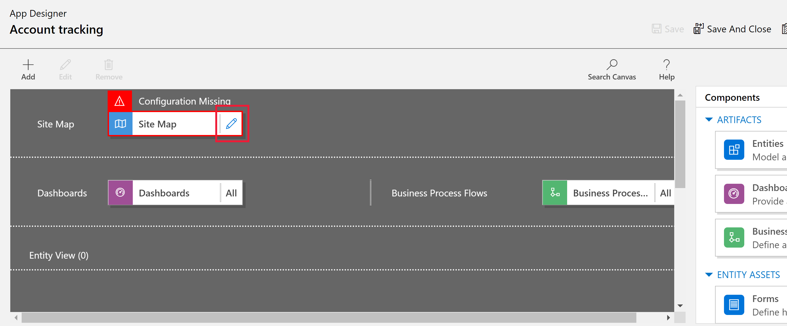

# Build your first model-driven app using the classic designer

[!INCLUDE[cc-data-platform-banner](../../includes/cc-data-platform-banner.md)]

In this article, you build a straightforward model-driven app that you can use to create, update, and delete account records as well as view data in one of the standard charts for the account table.

  > [!div class="mx-imgBorder"]
  > 

## Create your model-driven app

> [!NOTE]
> If you plan to share and distribute the app you create, see this article: [Create a model-driven app by using the app designer](create-edit-app.md) 

1. Sign in to [Power Apps](https://make.powerapps.com/). If you don't already have a [!INCLUDE [powerapps](../../includes/powerapps.md)] account, you can [get started free](https://powerapps.microsoft.com/#).

2. On the **Home** page, select **Model-driven app from blank**, select the **classic app designer** option and then **Create**.

   :::image type="content" source="../../maker/model-driven-apps/media/build-first-model-driven-app/start-from-blank-model-driven.png" alt-text="Start from blank model":::

3. On the **Create a New App** page, enter the following details, and then select **Done**:

- **Name**: Enter a name for the app, such as *Account tracking*.
  
- **Unique Name**: By default, the unique name uses the name you specify in the **Name** box without spaces and preceded by the publisher prefix and an underscore (_). For example, *crecf_Accounttracking*.

- **Description**: Type a short description of what the app is or does, such as *This is my first app*.

    > [!div class="mx-imgBorder"] 
    > 

4. Select the **Open the Site Map Designer** edit button (pencil icon) to open the sitemap designer.

      > [!div class="mx-imgBorder"]
      > 

    Notice that when you create a new app, you must first create the site map for it.

5. On the sitemap designer, select **New Subarea**.

   :::image type="content" source="media/build-first-model-driven-app/new-subarea.png" alt-text="Select new subarea.":::

6. In the right pane, select the **Properties** tab, and then select the following properties.

- **Type**: **Entity**
  
- **Entity**: **Account**

    > [!div class="mx-imgBorder"] 
    > 

    When you leave the **Title** property blank, the app uses the table name in the app's left navigation pane. For this app, **Accounts** will be displayed in the app at runtime.

7. Select **Save And Close** to close the sitemap designer.

   By default, all the account table's forms, views, charts, and dashboards are enabled for the app. From the app designer **Components** tab on the right pane, you can clear a component so it isn't available in the app at runtime. You can also create new components, such as a custom form. For this app, leave all components enabled.

8. On the app designer toolbar, select **Save**.

9. After your app is saved, on the app designer toolbar, select **Publish** to make it available to run and share.

## Play your app

On the app designer toolbar, select **Play**.

- To create a record, select **+ New**.
- To view a chart, on the app command bar select **Show Chart**. 
- To change the view, select the **My Active Accounts** view, and then select the view you want.
  
  > [!div class="mx-imgBorder"]
  > 

To learn more about how to use your app, see [Basic navigation in a model-driven app](../../user/navigation.md).

> [!NOTE]
> Don't see any of the data in your app like in the above screenshot? This is probably because your environment database doesn't have **Deploy sample apps and data** provisioned. More information: [Create an environment with a database](/power-platform/admin/create-environment#create-an-environment-with-a-database)

## Next steps

In this article, you built a simple model-driven app.

- To identify the URL of your model-driven app see [Run a model-driven app in a browser](run-model-driven-app.md)

- To see how your app looks when you run it, see [Run a model-driven app on a mobile device](/dynamics365/customerengagement/on-premises/basics/dynamics-365-phones-tablets-users-guide-onprem).
  
- To learn how to share your app, see [Share a model-driven app](share-model-driven-app.md).
- To get started and learn more about building model-driven apps, see [Understand model-driven app components](model-driven-app-components.md)

> [!TIP]
> Ready to convert your ideas into an app? Start here: [Planning a Power Apps project](../../guidance/planning/introduction.md).  
> For detailed information about model-driven apps and how to build it, start here: [Understand model-driven app components](model-driven-app-components.md).

[!INCLUDE[footer-include](../../includes/footer-banner.md)]
