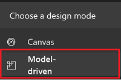
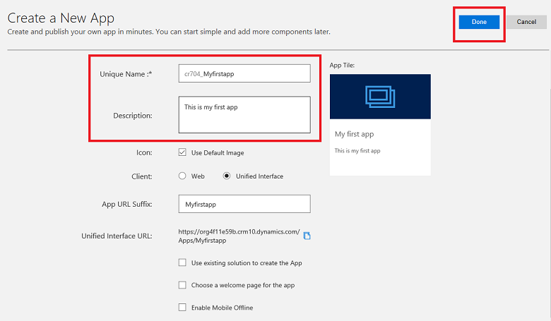
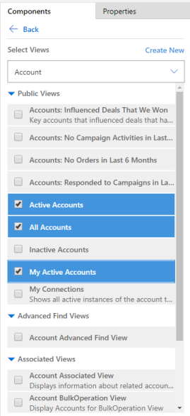
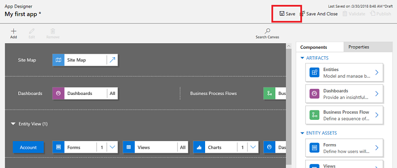
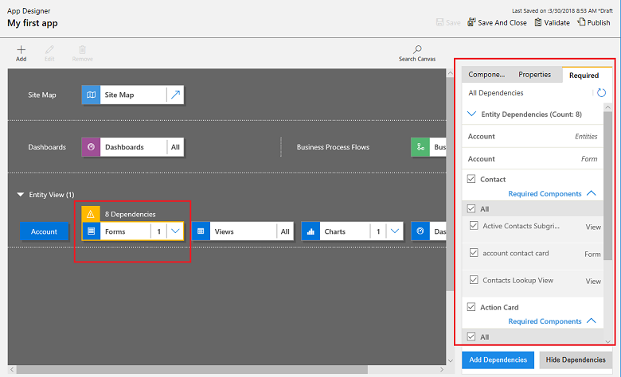

# Quickstart: Build your first model-driven app from scratch
Model-driven app design is a component-focused approach to app development. In this quickstart, you simplify how to create a model-driven app by using one of the standard entities that's available in your [!INCLUDE [powerapps](../../includes/powerapps.md)] environment. 

> [!IMPORTANT]
> [!INCLUDE [cc-preview-features-definition](../../includes/cc-preview-features-definition.md)]

## Sign in to PowerApps
Sign in to [PowerApps](https://web.powerapps.microsoft.com/). If you don’t already have a [!INCLUDE [powerapps](../../includes/powerapps.md)] account, select the **Get started free** link. 

## Create your model-driven app

1.	Select the environment you want, or go to the [PowerApps admin center](https://admin.powerapps.microsoft.com/) to create a new one.
2.	From the left navigation pane, select **Model-driven**. 

    

3. From the left pane, select **Apps**, and then select **Create an app**.

4.	On the **Create a New App** page, enter the following details, and then select **Done**: 
  - **Name**: Enter a name for the app, such as *Myfirstapp*. 
  - **Description**: Type a short description of what the app is or does, such as *This is my first app*.
For information about the additional app properties, see [Create an app](https://docs.microsoft.com/dynamics365/customer-engagement/customize/create-edit-app#create-an-app).
 
    

## Add components to your app
From the app designer you add components to your app.
1.	Select the **Open the Site Map Designer** arrow to open the sitemap designer. 

    

2.	On the sitemap designer select **New Subarea**, in the right pane select the **Properties** tab, and then select the following properties.
  - **Type**: Entity
  - **Entity**: Account

    

3.	Select **Save And Close**.
4.	On the app designer canvas select **Forms**, and then on the right pane under the **Main Forms** group select the **Account** form.

    

5.	On the app designer canvas select **Views**, and then select the **Active Accounts**, **All Accounts**, and **My Active Accounts** views.

    

6. On the app designer canvas select **Charts**, and then select the **Accounts by Industry** chart.
7. On the app designer toolbar, select **Save**.

    
 
<!-- ##  Validate your app
This step checks for component dependencies that are required for the app to work, but haven't yet been added to the app. 

1. On the app designer canvas, select the component that indicates a dependency, such as the **Forms** component. Then, on the right-pane select the **Required** tab, expand **Entity Dependencies** and then select all required dependencies. 

    

2. Select **Add Dependencies**.
3. On the app designer toolbar, select **Save**.  -->

## Publish your app
On the app designer toolbar, select **Publish**.

After publishing the app it's ready for you to run or share with others.

## Next steps
In this quickstart, you built a simple model-driven app. To see how your app looks when you run it, see [Quickstart: Run a model-driven app on a mobile device](../../user/run-app-client-model-driven.md).
To learn how to share your app, continue to the tutorial for how to share a model-driven app [Share a model-driven app](share-model-driven-app.md).
