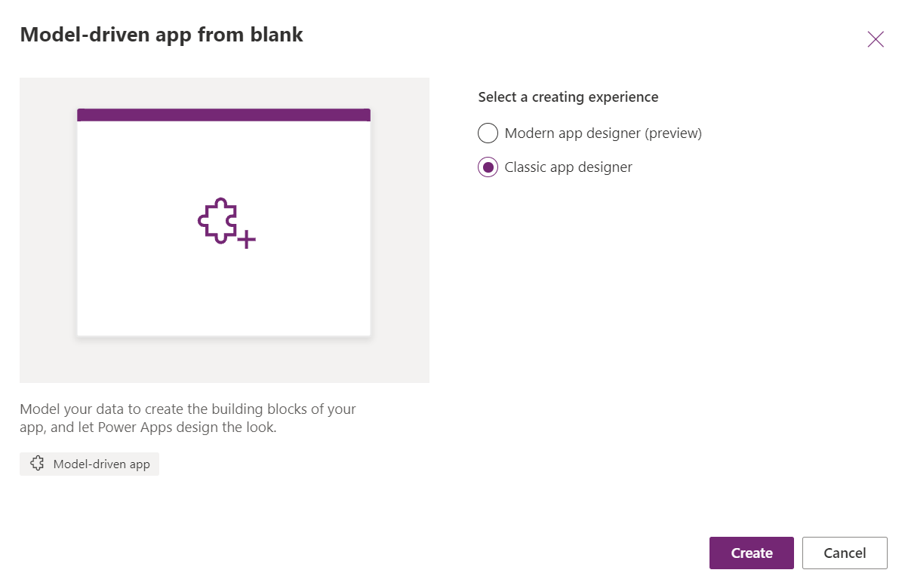
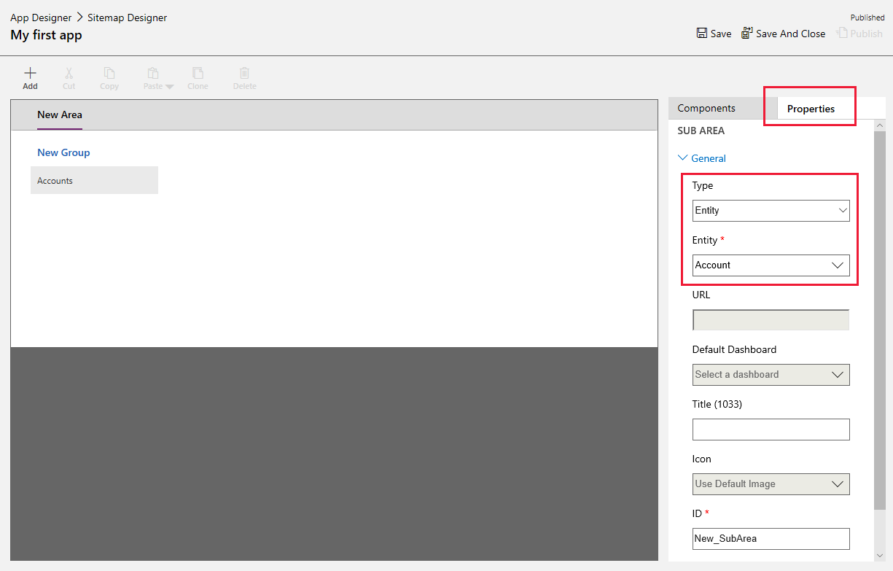

# Build your first model-driven app from scratch

[!INCLUDE[cc-data-platform-banner](../../includes/cc-data-platform-banner.md)]

Model-driven app design is a component-focused approach to app development. In this topic, you simplify how to create a model-driven app by using one of the standard tables that's available in your Power Apps environment.

> [!TIP]
> Ready to convert your ideas into an app? Start here: [Planning a Power Apps project](/powerapps/guidance/planning/introduction).  
> For detailed information about model-driven apps and how to build it, start here: [Understand model-driven app components](model-driven-app-components.md). 

## Sign in to Power Apps
Sign in to [Power Apps](https://make.powerapps.com/). If you don't already have a [!INCLUDE [powerapps](../../includes/powerapps.md)] account, select the **Get started free** link. 

## Create your model-driven app

1. Select the environment you want, or go to the [Power Platform admin center](https://admin.powerplatform.microsoft.com/) to create a new one.

2. On the **Home** page, select **Model-driven app from blank**.

    > [!div class="mx-imgBorder"] 
    > 

3. Select **Create**.

3. On the **Create a New App** page, enter the following details, and then select **Done**: 
  - **Name**: Enter a name for the app, such as *My first app*. 
  - **Unique Name**: By default, the unique name uses the name your specify in the **Name** box without spaces and preceded by the publisher prefix and an underscore (_). For example, *crecf_Myfirstapp*. More information: [Change the solution publisher prefix](../data-platform/create-solution.md#solution-publisher)
  - **Description**: Type a short description of what the app is or does, such as *This is my first app*.
For information about the additional app properties, see [Create an app](create-edit-app.md#create-an-app).

  > [!div class="mx-imgBorder"] 
  > 

## Add components to your app
From the app designer you add components to your app.
1. Select the **Open the Site Map Designer** edit button to open the sitemap designer.

      > [!div class="mx-imgBorder"] 
      > 

2. On the sitemap designer select **New Subarea**, in the right pane select the **Properties** tab, and then select the following properties.
  - **Type**: **Entity**
  - **Entity**: **Account**

    > [!div class="mx-imgBorder"] 
    > 

3. Select **Save And Close**.
4. On the app designer canvas select **Forms**, and then on the right pane under the **Main Forms** group select the **Account** form.

      > [!div class="mx-imgBorder"] 
      > 

5. On the app designer canvas select **Views**, and then select the **Active Accounts**, **All Accounts**, and **My Active Accounts** views.<!-- All checkbox seems to be selected by default -->

      > [!div class="mx-imgBorder"] 
      > 

6. On the app designer canvas select **Charts**, and then select the **Accounts by Industry** chart.
7. On the app designer toolbar, select **Save**.

      > [!div class="mx-imgBorder"] 
      > 
 
## Publish your app
On the app designer toolbar, select **Publish**.

After publishing the app it's ready for you to run or share with others.

  > [!div class="mx-imgBorder"] 
  > 

## Next steps
In this topic, you built a simple model-driven app. 
- To see how your app looks when you run it, see [Run a model-driven app on a mobile device](../../user/run-app-client-model-driven.md).
- To learn how to share your app, see [Share a model-driven app](share-model-driven-app.md).
- To get started and learn all about building model-driven apps, see [Understand model-driven app components](model-driven-app-components.md)

[!INCLUDE[footer-include](../../includes/footer-banner.md)]