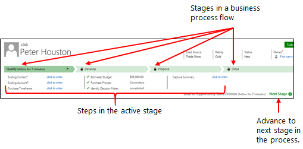
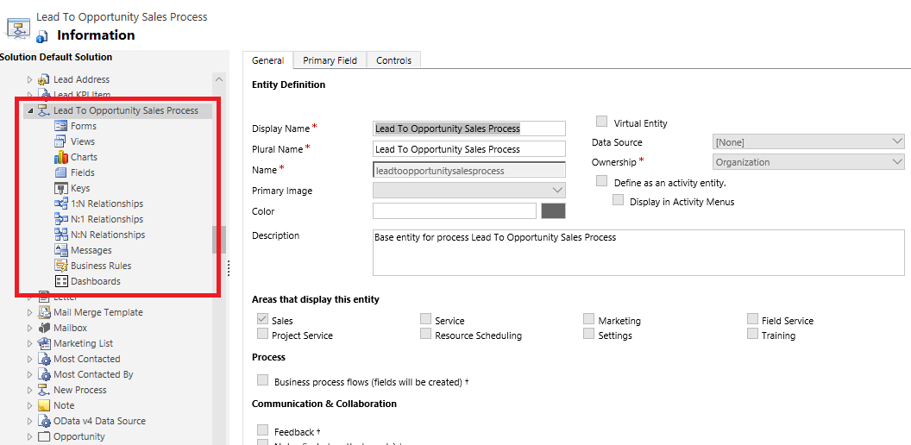
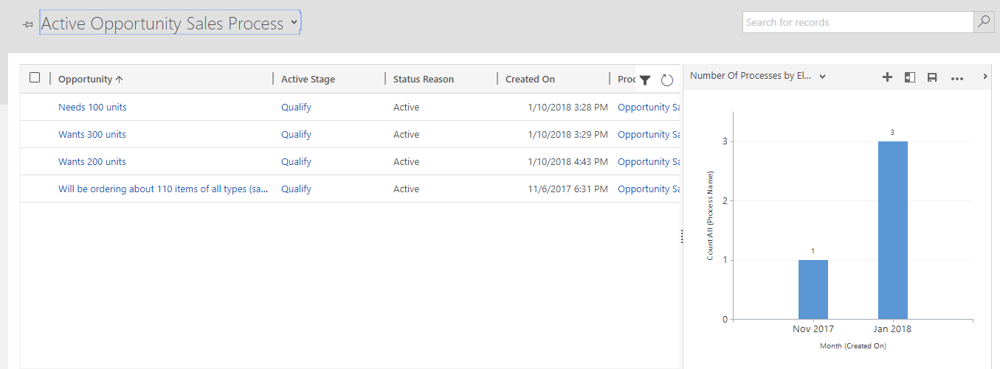

# Business process flows overview

You can help ensure that people enter data consistently and follow the same steps every time they work with a customer by creating a business process flow. For example, you might want to create a business process flow to have everyone handle customer service requests the same way, or to require that people get approval for an invoice before submitting an order. Business process flows use the same underlying technology as other processes, but the capabilities that they provide are very different from other features that use processes. To learn how to create or edit a business process flow, see [Create a business process flow](create-business-process-flow.md).  
  
 [Watch a short video (4:49) about business process flows.](https://go.microsoft.com/fwlink/p/?linkid=842226)  
  
   
## Why use business process flows?  
Business process flows provide a guide for people to get work done. They provide a streamlined user experience that leads people through the processes their organization has defined for interactions that need to be advanced to a conclusion of some kind. This user experience can be tailored so that people with different security roles can have an experience that best suites the work they do.  
  
 Use business process flows to define a set of steps for people to follow to take them to a desired outcome. These steps provide a visual indicator that tells people where they are in the business process. Business process flows reduce the need for training because new users don’t have to focus on which entity they should be using. They can let the process guide them. You can configure business process flows to support common sales methodologies that can help your sales groups achieve better results. For service groups, business process flows can help new staff get up-to-speed more quickly and avoid mistakes that could result in unsatisfied customers.  
  
   
## What can business process flows do?  
 With business process flows, you define a set of *stages* and *steps* that are then displayed in a control at the top of the form.  
  
   
  
 Each stage contains a group of steps. Each step represents a field where data can be entered. People advance to the next stage by using the **Next Stage** button. You can make a step required so that people must enter data for the corresponding field before they can proceed to the next stage. This is commonly called ”stage-gating”.  
  
 Business process flows appear relatively simple compared to other types of processes because they do not provide any conditional business logic or automation beyond providing the streamlined experience for data entry and controlling entry into stages. However, when you combine them with other processes and customizations, they can play an important role in saving people time, reducing training costs, and increasing user adoption.  

   
### Business process flows integrated with other customizations  
 When you or your user enters data using business process flows, the data changes are also applied to form fields so that any automation provided by business rules or form scripts can be applied immediately. Steps can be added that set values for fields that are not present in the form and these fields will be added to the `Xrm.Page` object model used for form scripts. Any workflows that are initiated by changes to fields included in a business process flow will be applied when the data in the form is saved. If the automation is applied by a real-time workflow, the changes will be immediately visible to the user when the data in the form is refreshed after the record is saved.  
  
 Although the business process flow control in the form does not provide any direct client-side programmability, changes applied by business rules or form scripts are automatically applied to business process flow controls. If you hide a field in a form, that field will also be hidden in the business process flow control. If you set a value by using business rules or form scripts, that value will be set within the business process flow.  
  
### Concurrent process flows  
 Concurrent business process flows let customizers configure multiple business processes and associate them with the same starting record. Users can switch between multiple business processes running concurrently, and resume their work at the stage in the process that they were on.  
  
   
### System business process flows  
 The following business process flows are included. To understand how business process flows work, review these system business process flows:  
  
-   Lead to Opportunity Sales Process  
  
-   Opportunity Sales Process  
  
-   Phone to Case Process  
  
   
## Multiple entities in business process flows  
 You can use a business process flow for a single entity or span multiple entities. For example, you may have a process that begins with an opportunity, then continues to a quote, an order, and then an invoice, before finally returning to close the opportunity.  
  
 You can design business process flows that tie together the records for up to five different entities into a single process so that people using the app can focus on the flow of their process rather than on which entity they are working in. They can more easily navigate between related entity records.  
  
   
## Multiple business process flows are available per entity  
 Not every user in an organization may follow the same process and different conditions may require that a different process be applied. You can have up to 10 active business process flows per entity to provide appropriate processes for different situations.  
  
   
### Control which business process flow will be applied  
 You can associate business process flows with security roles so that only people with those security roles can see or use them. You can also set the order of the business process flows so that you can control which business process flow will be set by default. This works in the same way that multiple forms for an entity are defined.  
  
 When someone creates a new entity record, the list of available active business process definition is filtered by the user’s security role. The first activated business process definition available for the user’s security role according to the process order list is the one applied by default. If more than one active business process definitions is available, users can load another from the Switch Process dialog. Whenever processes are switched, the one currently rendered goes to the background and is replaced by the selected one, but it maintains its state and can be switched back. Each record can have multiple process instances associated (each for a different business process flow definition, up to a total of 10). On form load, only one business process flow is rendered. When any user applies a different process, that process may only load by default for that particular user.  
  
 To make sure a business process is loaded by default for all user (behavior equivalent to “pinning” the process), a custom Client API script (web resource) can be added on form load that specifically loads an existing business process instance based on the business process definition ID. 
 
  
   
## Business process flow considerations  
 You can define business process flows only for those entities that support them. You also need to be aware of the limits for the number of processes, stages, and steps that can be added.  
  
### Business process flows that call a workflow  
 You can call on-demand workflows from inside a business process flow. You can configure this from the new business process flow designer by dragging a workflow component to a process stage or to the Global Workflows section. For more information about using workflows in business process flows, see [Blog: Business process flow automation in Dynamics 365](https://blogs.msdn.microsoft.com/crm/2017/03/28/business-process-flow-automation-in-dynamics-365/).  
  
 When you include a workflow that you want to trigger on Stage Exit of a stage in your business process flow, and that stage is  the last stage in the flow, the designer gives the impression that the workflow will be triggered when that stage is completed. However, the workflow will not be triggered because a stage transition does not take place. You will not receive a warning or error preventing you from including the workflow on the stage. When a user interacts with the business process flow, finishing or abandoning the process does not result in a stage transition, and therefore the workflow is not triggered. Consider the following examples:  
  
-   You create a business process flow with two stages, S1 connects to  S2, with a workflow on stage S2 and set the trigger to **Stage Exit**.  
  
-   You create a business process flow with three stages, S1 connect to S2, then S2 branches to S3. You include a workflow on S2 and set the trigger to **Stage Exit**.  
  
 The workflow will not trigger in either case. To work around this issue, you can add a Global Workflow and add the workflow you want to trigger to it so that the workflow is triggered for the business process rather than a stage of the process. You can set the trigger for a Global workflow to Process Abandoned or Process Completed to cause the workflow to trigger when a user abandons or completes the business process.  
  
   
### Entities that can use business process flows  
 All custom entities can use business process flows. The following standard entities can also use business process flows:  
  
-   Account  
-   Appointment  
-   Campaign  
-   Campaign Activity  
-   Campaign Response  
-   Competitor  
-   Contact  
-   Email  
-   Entitlement  
-   Fax  
-   Case  
-   Invoice  
-   Lead  
-   Letter  
-   Marketing List  
-   Opportunity  
-   Phone Call  
-   Product  
-   Price List Item  
-   Quote  
-   Recurring Appointment  
-   Sales Literature  
-   Social Activity  
-   Order  
-   User  
-   Task  
-   Team  
  
 To enable a custom entity for business process flows, select the **Business process flows (fields will be created)** check box in the entity definition. Note that you can’t undo this action.  
  
> [!NOTE]
>  If you navigate to the business process flow stage that contains the `Social Activity` entity and choose the **Next Stage** button, you’ll see the **Create** option. When you choose **Create**, the **Social Activity** form loads. However, because `Social Activity` isn’t valid for `Create` from the app user interface, you won’t be able to save the form and you’ll see the error message: “Unexpected error.”  
  
   
### Maximum number of processes, stages, and steps  
 To ensure acceptable performance and the usability of the user interface, there are some limitations you need to be aware of when you plan to use business process flows:  
  
-   There can be no more than 10 activated business process flow processes per entity.  
  
-   Each process can contain no more than 30 stages.  
  
-   Multi-entity processes can contain no more than five entities.
  
## Business process flow entity customization support 

Introduced in the Dynamics 365 (online), version 9.0 update, business process flow entities can appear in the system so that entity record data can be made available in grids, views, charts, and dashboards. 

### Use business process flow entity records with grids, views, charts, and dashboards

With business processes flows available as an entity, you can now use advanced finds, views, charts, and dashboards sourced from business process flow data for a given entity, such as a lead or opportunity. System administrators and customizers can create custom business process flow grids, views, charts, and dashboards similar to those created with any other entity.

Business process flows, such as **Lead To Opportunity Sales Process**, appear as a customizable entity in solution explorer.

To access a default business process flow view, open solution explorer, expand **Entities** > expand the process that you want, such as **Lead To Opportunity Sales Process**, select **Views**, and then select the view that you want.

Several default views are available that you can view as a chart, such as the **Active Opportunity Sales Process** view. 

### Interact with the business process flow entity from a workflow
You can also interact with business process flow entities from a workflow. For example, you can create a workflow for the Business Process Flow entity record to change the Active Stage when a field on the Opportunity entity record is updated. For more information about how to do this, see [Automate business process flow stages using workflows](https://blogs.msdn.microsoft.com/crminthefield/2017/12/18/automate-business-process-flow-stages-using-workflows).

### Limitations of using business process flow entities

- Currently, you can’t create custom forms for entities based on a business process flow.
- If a solution includes a business process flow entity, the business process flow entity must be manually added to the solution before you export it. Otherwise, the business process flow entity will not be included in the solution package. More information: [Add solution components](../common-data-service/create-solution.md#add-solution-components)

### Next steps  
 [Watch a short video (4:49) about business process flows](https://go.microsoft.com/fwlink/p/?linkid=842226)   
 [Create a business process flow](create-business-process-flow.md)   
 [Enhance business process flows with branching](enhance-business-process-flows-branching.md)  
 [Whitepaper: Process Enablement with Dynamics 365](http://download.microsoft.com/download/C/3/B/C3B46E35-9445-43B9-800B-474E022EE352/Process%20Enablement%20with%20Microsoft%20Dynamics%20CRM%202013.pdf) 
 [Create custom business logic through processes](guide-staff-through-common-tasks-processes.md) 
 [Workflow Processes](../common-data-service/workflow-processes.md)   
 [Actions - Overview](../common-data-service/actions.md)
