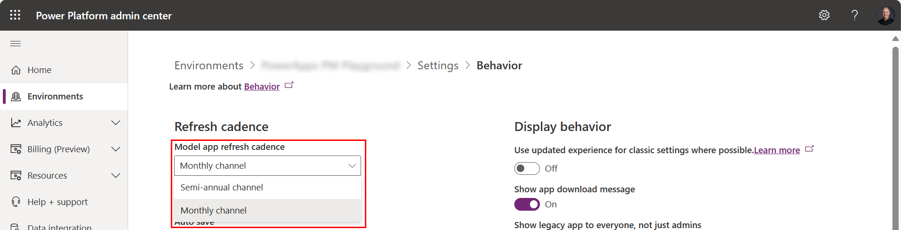

# Changing release channels for model-driven apps

The release channel affects the features that are shown to a user. When the monthly channel is enabled for an environment, makers need to validate that their customizations work with each monthly release. This page outlines different approaches for a maker.

## Flexible channel configuration

The release channel for model-driven apps can be changed in a few different ways.

1. Environment channel
1. Browser session channel

Environment channel can be set using the Power Platform Admin Center or through WebApi calls.

> Note: When the release channel is changed on the environment level, a user will need to refresh twice to take effect. The first refresh will trigger a background update of feature configuration to a local cache. The second refresh will use the feature configuration local cache.

Browser session channel can be applies using a URL parameter so is a temporary override.

## Changing the environment channel

Power Platform Admin Center provides a UI that allows an easy way to change the environment channel. Admins can open **Settings** > **Product** > **Behavior** and change the **Model-driven app release channel**. Click **Save** in the bottom right of the page.



Starting with weekly release 2305.1, an admin can use WebApi to update the organization table ReleaseChannel field using the following field values.

| Name | Value | Notes |
| --- | --- | --- |
| Semi-Annual | 0 | Default; follows normal twice yearly release waves |
| Monthly | 1 |

Set the current environment's channel to **Monthly** (```value = 1```).
```Javascript
Xrm.WebApi.online.updateRecord('organization', 
    Xrm.Utility.getGlobalContext().organizationSettings.organizationId, 
    { 'releasechannel': 1 })
```

Set the current environment's channel to **Semi-annual** (```value = 0```).
```Javascript
Xrm.WebApi.online.updateRecord('organization', 
    Xrm.Utility.getGlobalContext().organizationSettings.organizationId, 
    { 'releasechannel': 0 })
```

## Changing browser session channel

A single browser session can be changed by adding the URL parameter ```&channel=<channelname>```. This URL parameter is used for all navigation within the browser tab. It might not be copied to a new browser tab.

| Channel | URL parameter |
| --- | --- |
| Semi-annual | ```&channel=semiannual``` |
| Monthly | ```&channel=monthly``` |

When the channel is monthly, the monthly release can be changed using the URL parameter ```&channelrelease=<releasename>```. The release name is three letter month and four digit year like MmmYYYY.

| Monthly Release | Release Name Parameter |
| --- | --- |
| May 2023 | ```&channelrelease=May2023``` |  
| June 2023 | ```&channelrelease=Jun2023``` |  
| July 2023 | ```&channelrelease=Jul2023``` |  
| August 2023 | ```&channelrelease=Aug2023``` |  

> Note: Any valid ```MmmYYYY``` date can be entered but future dates might not have any features defined.  

# Working with channels

## Validating the next monthly release

Validation should be done for each monthly channel release before it is automatically enabled for users. This can be done when the validation build version has reached the environment.

1. Find the current monthly release in **Settings** > **About** dialog. It will be after "Channel: Monthly" and be a date like "July 2023".

1. Find the next monthly release short name by opening [Unified Interface Monthly Channel Releases](/power-platform/released-versions/common-data-service/unified-interface-monthly-releases)

1. Add the URL parameter ```&channelrelease=``` with the next release short name like "Aug2023"

## Comparing features across channels and releases

When users running monthly channel report has unexpected behavior, the following steps can help investigate where it is occurring.

1. Check if the unexpected behavior exists in the semi-annual channel by using the URL parameter ```&channel=semiannual```. If the behavior also exists in semi-annual channel, is it unrelated to monthly channel and should follow normal support processes.

1. Check if the unexpected behavior exists in the previous monthly release by using the URL parameter ```&channelrelease=``` with the prior release short name (e.g. "Jun2023"). If the two monthly releases behave the same, hten it is likely unrlated to a specific monthly channel release and should follow normal support processes.

1. When a change is noticed between monthly releases, review the changed features in [Unified Interface Monthly Channel Releases](/power-platform/released-versions/common-data-service/unified-interface-monthly-releases) to learn more.

## Related links

* [Release Channel Overview](channel-overview.md)
* [User About Dialog - Channel](../../user/about-dialog.md)
* [Power Platform Admin Center - Manage behavior settings](/power-platform/admin/settings-behavior)
* [Unified Interface Monthly Channel Releases](/power-platform/released-versions/common-data-service/unified-interface-monthly-releases)