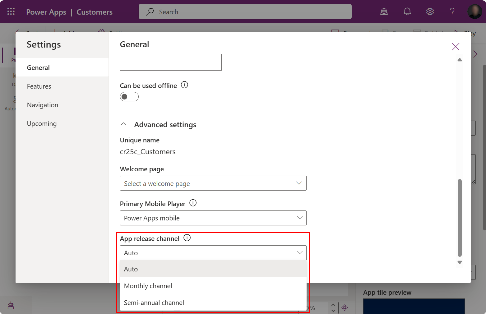

# Changing release channels for model-driven apps

The release channel affects the features that impact users. When the monthly channel is enabled for an environment, makers need to validate that their customizations work with each monthly release. This article describes different approaches for a maker to change channels and validate an upcoming release.

## Flexible channel configuration

The release channel for model-driven apps can be changed in two primary ways.

- [App channel](#changing-the-app-channel)
- [Environment channel](#changing-the-environment-channel)

In addition, the release channel can be overridden with either of these options.

- [User channel override](/power-platform/admin/user-channel-override)
- [Browser session channel override](#changing-the-browser-session-channel)

> [!NOTE]
> When the release channel is changed on the environment level, a user must refresh the browser tab twice to update the release channel information. The first refresh triggers a background update of feature configuration to a local cache. The second refresh uses the feature configuration local cache.

### Ordering of channel release usage

The order of checks to determine which setting controls the channel is:

1. URL override.
1. User channel override.
1. App release channel value other than Auto (for example, Monthly, Semi-annual).
1. Environment release channel value other than Auto (for example, Monthly, Semi-annual).
1. App release channel and environment release channel are both Auto.
   1. With 2024 release wave 1, Power Apps environments use monthly channel.
   2. Starting with 2024 release wave 2, Dynamics 365 environments use monthly channel.
  
### Dynamics 365 app release channel settings

With 2024 release wave 1, the following Dynamics 365 apps changed their app release channel to **Monthly**:

- Customer Service workspace
- Customer Service Hub
- Customer Service admin center
- Field Service
- Field Resource Hub
- Field Service Mobile
- Resource Scheduling
- Resource Scheduling Optimization
- Customer Insights - Journeys
- Business performance analytics
- Project Operations Team Member
- Power Platform environment settings

With 2024 Release wave 2, this app is changing the app release channel to **Monthly**:

- Sales Hub

### Keeping semi-annual release channel

When an environment needs to have a slower release cadence, these configurations are recommended.

#### Change apps with explicit app release channel

Model-driven apps with the app release channel set to a value other than **Auto** need to be changed to **Semi-annual**. These apps can be deployed to all environments as a managed solution.

1. Customize any out of box Dynamics 365 app.
1. Update any custom app created after 2024 release wave 1 when the new app started defaulting to **Monthly**.

The preferred approach is to follow [Change app channel in app designer](#change-app-channel-in-app-designer) and then deploy the app's solution to all environments.

> [!NOTE]
> Model-driven apps in Power Platform environments use **Monthly** when the app release channel is **Auto** regardless of the environment release channel. All model-driven apps in Power Platform environments need to set the app release channel explicitly.

#### Override apps when no explicit app release channel

Model-driven apps in a Dynamics 365 environment that have **Auto** for app release channel can choose either option:

- Change each environment release change to **Semi-annual**.
- Change each app with to **Semi-annual**.
 
## Changing the environment channel

The environment channel can be set using the Power Platform admin center or with code.

| Environment release channel | Environment setting value | Behavior |
|--|--|--|
| Auto | 0 | Environment default value is currently **Semi-annual**, but changes to **Monthly** with 2024 release wave 2. |
| Monthly | 1 | Environment explicitly set to **Monthly Channel**. |
| Semi-annual | 3 | Environment explicitly set to **Semi-Annual Channel**. |

Power Platform admins can change the release channel using the environment's behavior settings. More information: [Manage behavior settings](/power-platform/admin/settings-behavior).

Developers can change the environment channel by updating the [ReleaseChannel](/power-apps/developer/data-platform/reference/entities/organization#BKMK_ReleaseChannel) column value for the row in the [Organization](/power-apps/developer/data-platform/reference/entities/organization) table. There's always a single row in the organization table.
More information:

* [Update a record using Web API](/power-apps/developer/data-platform/webapi/update-delete-entities-using-web-api#basic-update)
* [Update a record using the SDK for .NET](/power-apps/developer/data-platform/org-service/entity-operations-update-delete?tabs=late#basic-update)

## Changing the app channel

The app channel can be used to override the release channel for a model-driven app using Power Apps [app designer](model-driven-app-glossary.md#app-designer) or solutions area.

| App release channel | App setting value | Behavior |
|--|--|--|
| Auto | 0 | App default value is **Semi-annual** for Dynamics 365 environments and **Monthly** for Power Apps environments. With 2024 release wave 2, the default changes to **Monthly**. |
| Monthly | 1 | App explicitly set to **Monthly Channel**. |
| Semi-annual | 3 | App explicitly set to **Semi-Annual Channel**. |

> [!NOTE]
>  App release value `2` is used for internal testing and receives updates faster than monthly channel so is not supported for production usage.

### Change app channel in app designer

A maker can use the app designer to explicitly set the release channel for an app, which overrides the environment channel.

1. Open https://make.powerapps.com/.
1. Under **Solutions** open an existing solution containing a model-driven app.
1. Open the app in the app designer.
1. Open **Settings** dialog.
1. Under the General tab, expand **Advanced settings**.
1. Use **App release channel** to change the app release value. More information: [Changing the app channel](#changing-the-app-channel)
   > [!div class="mx-imgBorder"]
   > 

1. Save and publish the app.

### Change app channel in the solutions area

As an alternative, a maker can use the **Solutions** area to explicitly set the release channel for all apps within the environment.

  > [!div class="mx-imgBorder"]
  > 

1. Open https://make.powerapps.com/
1. Under **Solutions** open an existing solution with one or more model-driven apps:
1. Add the existing app setting **Allow new app channel default** into the solution:
   1. Select **Add existing** > **More** > **Setting**.
   1. Search for *app channel*.
   1. Select the item **App channel**.
   1. Select **Add**.
1. To change the app channel for all apps in the environment:
   1. Edit the setting **App channel**.
   1. Find the section **Setting environment values**.
   1. Select **New environment value** and then enter the integer for the channel.
   1. Select **Save** which publishes the Setting Definition

> [!NOTE]
> When the setting definition is used to change one or more apps as part of a single solution, you must republish the apps for the change to take effect. Also, making this change causes the apps to have dependencies on the solution with the customization.


### Set the default for new apps to monthly channel

As part of the gradual migration to default all apps to use monthly channel, newly created model-driven apps gradually start seeing the app channel defaulted. Admins or makers can control the release channel default for new apps using an app setting. The app setting **Allow new app channel default** defaults to **Yes**, which means a newly created app is set to **Monthly**.

To override this behavior, change the app setting to **No** in the environment or apply to multiple environments by including in a solution that is imported into the environments.

### Prevent new app default to monthly channel

The new app default can be prevented by switching **Allow new app channel default** to **No**. This change causes the new app to be created with release channel **Auto** value.

The following steps change the default for all new apps within an environment. This app setting override can also be put into a solution and imported into environments to prevent new apps from having a default set.

1. Go to **Solutions** and open an existing or create a new solution.
1. Add the existing app setting **Allow new app channel default** into the solution:
   1. Select **Add existing** > **More** > **Setting**.
   1. Search for *app channel default*.
   1. Select the item **Allow new app channel default**.
   1. Select **Add**.
1. Edit the setting **Allow new app channel default**:
   1. Select **Allow new app channel default**.
   1. Select **New environment value**.
   1. Change the environment value to **No**.
   1. Select **Save**.

## Changing the user channel

The user channel can be used to override both the environment channel and the app channel using the Power Platform admin center or with code.

Power Platform admins can change the release channel using the settings in the environment's user list. More information: [Manage user channel override](/power-platform/admin/user-channel-override).

Developers can change the user release channel by updating the [ReleaseChannel](/power-apps/developer/data-platform/reference/entities/usersettings#BKMK_ReleaseChannel) column value for the row in the [UserSettings](/power-apps/developer/data-platform/reference/entities/usersettings) table. The user channel can be programmatically updated with the same approach as the environment channel.

## Changing the browser session channel

A single browser session can be changed by adding the URL parameter ```&channel=<channelname>``` as a temporary override. This URL parameter is used for all navigation within the browser tab. It might not be copied to a new browser tab.

| Channel | URL parameter |
| --- | --- |
| Semi-annual | ```&channel=semiannual``` |
| Monthly | ```&channel=monthly``` |

When the channel is monthly, the monthly release can be changed using the URL parameter ```&channelrelease=<releasename>```. The release name format is the two digit year and two digit month, like *YYMM*. Additionally the next monthly release can be set using ```&channelrelease=next```.

| Monthly Release | Release Name Parameter |
| --- | --- |
| October 2023 | ```&channelrelease=2310``` |  
| November 2023 | ```&channelrelease=2311``` |  
| December 2023 | ```&channelrelease=2312``` |  
| January 2024 | ```&channelrelease=2401``` |  

> [!NOTE]
> Any valid ```YYMM``` release can be entered but future dates might not have any features defined.  

## Validating the next monthly release

Validation should be done for each monthly channel release before it is automatically enabled for users. Users can test when the validation build version reaches the environment.

The easiest way to validate is by appending ```&channelrelease=next``` that automatically sets the release channel to the next upcoming monthly release.

1. Find the current monthly release a model-driven app by selecting **Settings** > **About**. The release version follows **Channel: Monthly** and is a date like *July 2023*.

1. Append ```&channelrelease=next``` to the URL.

1. Repeat the first step to observe an updated release version.

To validate against a specific monthly release, the following steps can be used:

1. Find the current monthly release a model-driven app by selecting **Settings** > **About**. The release version follows **Channel: Monthly** and is a date like *July 2023*.

1. Find the monthly release short name by opening [Unified Interface monthly channel releases](/power-platform/released-versions/common-data-service/unified-interface-monthly-releases).

1. A specific release can be set with the URL parameter ```&channelrelease=`` with the next release short name like *2308*.

## Comparing features across channels and releases

When a user running the monthly channel observes unexpected behavior, the following steps can help investigate where the behavior occurred.

- Check if the unexpected behavior exists in the semi-annual channel by using the URL parameter ```&channel=semiannual```. If the behavior also exists in the semi-annual channel, it's unrelated to the monthly channel and should follow normal support processes.
- Check if the unexpected behavior exists in the previous monthly release by using the URL parameter ```&channelrelease=``` with the prior release short name like *2308*. If the two monthly releases behave the same, then it's likely unrelated to a specific monthly channel release and should follow normal support processes.
- When a change is noticed between monthly releases, review the changed features in [Unified Interface monthly channel releases](/power-platform/released-versions/common-data-service/unified-interface-monthly-releases) to learn more.

## See also

[Release channel overview](channel-overview.md) <br />
[User About dialog - channel](../../user/about-dialog.md) <br />
[Power Platform admin center - Manage behavior settings](/power-platform/admin/settings-behavior) <br />
[Power Platform admin center - Manage user channel override](/power-platform/admin/user-channel-override).
