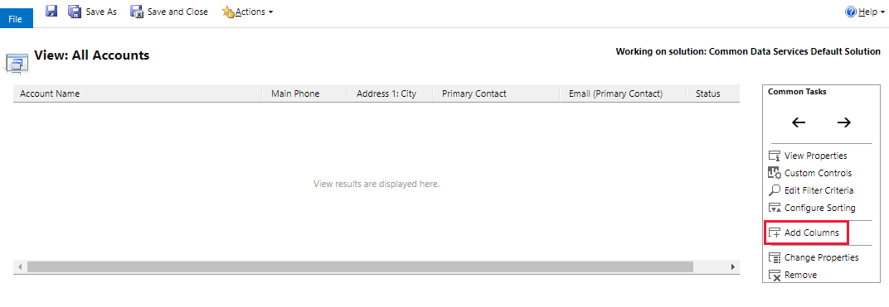

# Tutorial: Choose and configure columns in model-driven app views

   

 Along with the filter criteria, the columns visible in a PowerApps view are very important to the value provided by the view. In this tutorial, you create or edit views by performing the following tasks:  

-   [Open the view editor](choose-and-configure-columns.md#open-the-view-editor)  
   
-   [Add columns](choose-and-configure-columns.md#BKMK_AddColumns)  
  
-   [Remove columns](choose-and-configure-columns.md#BKMK_RemoveColumns)  
  
-   [Change column width](choose-and-configure-columns.md#BKMK_ChangeColumnWidth)  
  
-   [Move a column](choose-and-configure-columns.md#BKMK_MoveAColumns)  
  
-   [Enable or disable presence for a column](choose-and-configure-columns.md#BKMK_EnableOrDisablePresence)  
  
-   [Add find columns](choose-and-configure-columns.md#BKMK_AddFindColumns)  

### Open the view editor

1.  On the [PowerApps](https://web.powerapps.com/?utm_source=padocs&utm_medium=linkinadoc&utm_campaign=referralsfromdoc) site, select **Model-driven** (lower left of the navigation pane).  

    

2.  Expand **Data**, select **Entities**, select the entity that you want, and then select the **Views** tab. 

    

3. Select an existing view to open it or on the toolbar select **Add view**. 

   
### Add columns  
 You can include columns from the current entity or any of the related entities that have a 1:N entity relationship with the current entity.  
  
 For example, perhaps you want to display the owner of a user-owned entity in a column. You can choose the **Owner** field of the current entity to display the name of the owner. This will appear as a link to open the **User** record for the person who is the owner. In this case, you also have the option to [Enable or disable presence for a column](choose-and-configure-columns.md#BKMK_EnableOrDisablePresence).  
  
 If you want to display the phone number for the owner of the record, you must select **Owning User (User)** from the **Record type** drop-down and then select the **Main Phone** field.  
  
#### Add columns to views  
  
1.  While creating and editing views, select **Add Columns**. 

    

    The **Add Columns** dialog box appears.

    
  
2.  Select the **Record type** if you want to include fields from related entities.  
  
3.  You can select multiple fields, even from related entities.  
  
4.  When you have selected the fields you want, select **OK** to close the **Add Columns** dialog box.  
  
 As you add columns, you will increase the width of the view. If the width of the view exceeds the space available to show it in the page, horizontal scrollbars will allow people to scroll and see the hidden columns.  
  
> [!TIP]
>  If your view filters on data for a certain field so that only records with a certain value are shown, don’t include that column in the view. For example, if you are only showing active records, don’t include the status column in the view. Instead, name the view to indicate that all the records shown in the view are active.  
  
> [!NOTE]
>  When you add columns to Lookup views for updated entities, only the first three columns will be displayed.  
  
   
### Remove columns  
  
1.  While creating and editing views, choose the column you want to remove.  
  
2.  In the **Common Tasks** area, select **Remove**.  
  
3.  In the confirmation message, select **OK**.  
  
   
### Change column width  
  
1.  While creating and editing views, choose the column you want to change.  
  
2.  In the **Common Tasks** area, select **Change Properties**.  
  
3.  In the **Change Column Properties** dialog box, choose an option to set the column width, and then select **OK**.  
  
   
### Move a column  
  
1.  While creating and editing views, choose the column you want to move.  
  
2.  In the **Common Tasks** area, use the arrows to move the column left or right.  
  
   
### Enable or disable presence for a column  
 When the following conditions are true, people can see a Skype for Business online presence control in lists that shows if the person is available and allows people to interact with them by instant messaging:  
  
-   People use Edge or Internet Explorer.  
  
-   People have Skype for Business installed.  
  
-   People have Microsoft ActiveX enabled in Internet Explorer.  
  
-   Your organization has enabled presence for the system in the system settings.  
  
 The presence control and the setting to enable it are available only for columns that display primary fields for email-enabled entities (users, contacts, opportunities, leads, or custom entities).  
  
#### Enable or disable Skype for Business presence for a column  
  
1.  While creating and editing views, choose the column you want to change.  
  
2.  In the **Common Tasks** area, select **Change Properties**.  
  
3.  In the **Change Column Properties** dialog box, select or deselect **Enable presence for this column**, and then select **OK**.  
  
   
### Add find columns  
 Find columns are the columns searched by the application when people use the **search for records** text box displayed for lists or whenever there is the ability to search for records for an entity in the application, such as when people are searching for a record for a lookup field.  
  
1.  Open a **Quick Find** view. For information on quick find views, see [Types of views](create-edit-views.md#types-of-views).  
  
2.  Select **Add Find Columns** to open the dialog box.  
  
3.  Select the fields that contain the data that you want to search for.  
  
4.  Select **OK** to close the **Add Find Columns** dialog box.  

## Community tools

**View Layout Replicator** and **View Designer** are tools provided by the XrmToolbox community developed for Dynamics 365 customer engagement. See the [Developer tools](https://docs.microsoft.com/dynamics365/customer-engagement/developer/developer-tools) topic for community developed tools.

> [!NOTE]
> The community tools are not a product of Microsoft Dynamics and does not extend support to the community tools. 
> If you have questions pertaining to the tool, please contact the publisher. More Information: [XrmToolBox](https://www.xrmtoolbox.com). 

## Next steps
[Create or edit views](create-edit-views.md)
