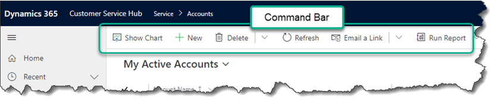
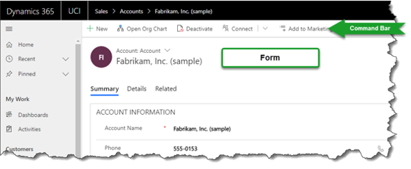
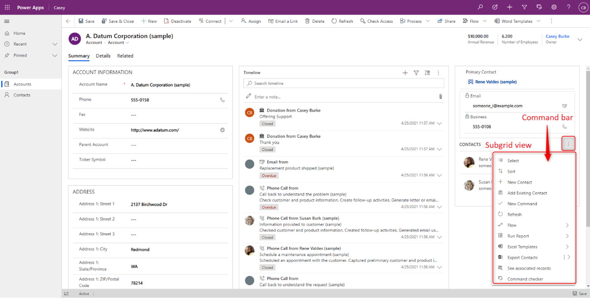
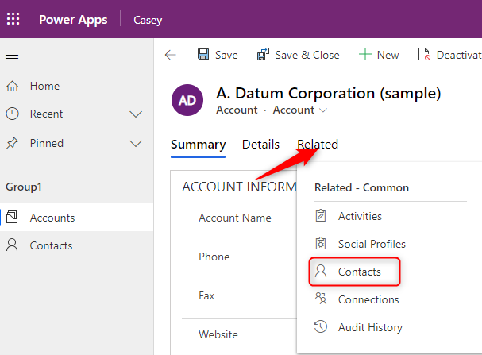
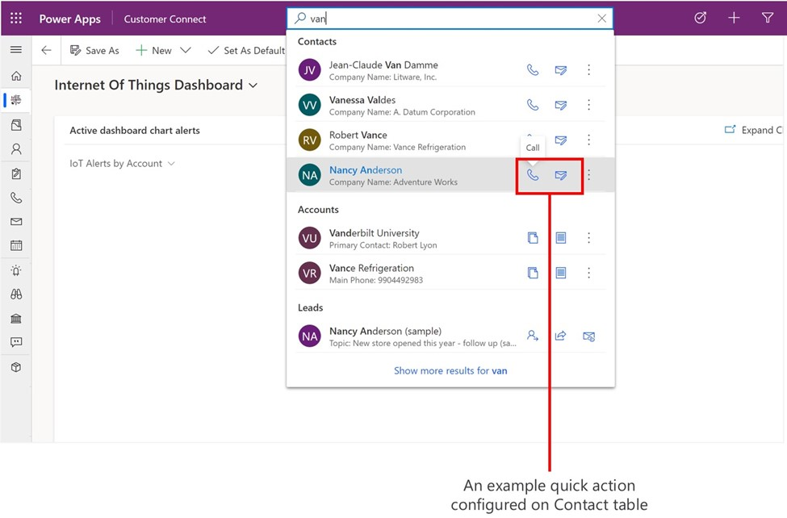

# Modern commanding overview (preview)

[!INCLUDE [cc-beta-prerelease-disclaimer](../../includes/cc-beta-prerelease-disclaimer.md)]

Command bars are at the core of every model-driven app and appear in many different locations. Commands are arranged in relation to other commands and are associated with a command bar location. The group of commands associated with a specific location make up a command bar.

> [!IMPORTANT]
> - This is a preview feature, and may not be available in all regions.
> - [!INCLUDE[cc_preview_features_definition](../../includes/cc-preview-features-definition.md)]
 
 ## Classic commanding deficiencies

Classic commands (formerly known as the ribbon) were not customizable using low code. With code, command customizations were difficult, tedious, and error prone. In order to scale commanding to low code as well as [use custom pages to converge canvas and model-driven apps](model-app-page-overview.md), it was vital to reinvent and rebuild the command infrastructure.

Classic commands had several key gaps including:
  - No low code designer. This results in many forced XML hacks that often caused breaking changes.
  - Different apps couldn’t use a different set of commands for common tables.
  - Lack of granular level scopes could impact performance due to processing unused logic on the client.
  - The legacy solution implementation was designed for the now deprecated web client. It has been highly problematic and has an overly complex structure that’s no longer needed in the Unified Interface.
  - “Ribbon” concepts that are no longer relevant: Tabs, Groups, Scaling, MaxSize, TabCommands, CustomActions, and HideCustomActions.
  - Classic “Ribbons” and commands lacked proper application lifecycle management (ALM) support and management within solutions.
  - Legacy code wasn’t capable of handling app separation, solution segmentation, solution patches, or promote and delete concept (solution upgrade).
  - Missing all core solution behaviors like add/remove, managed properties, dependencies, and so on.
  - Had a different, unconventional mechanism for localization.
  - Too flexible. Every custom action, button, group, command action, or rule, at every level can be overridden, making it hard for users to understand what has been modified.
    
## Modern commanding key improvements

Modern commanding largely addresses the above gaps and provides a modern infrastructure that will continue to scale.
  
- New infrastructure, combines benefits of canvas and model-driven apps.
- Low-code designer.
- Power Fx support for visibility and actions.
- JavaScript remains supported.
- Better ALM support.
- Better app level control – commands are applied to individual apps.
- Simple, flat data model.
- Many workarounds used today are no longer needed.
- Classic commands remain supported. Apps can run both classic and modern commands side-by-side.
- No forced customer migration.
- Arrange modern commands amongst existing classic commands.

## Command bar locations

-	**Main grid**. This command bar is displayed when using the left-hand navigation of an app to view a full page list of records in this table.
    > [!div class="mx-imgBorder"]
    > 
    
- **Main form**. This command bar is displayed on the table’s main forms. This appears at the top of the form and is not the same as the associated view or subgrid view that will appear in different areas of the form.
    > [!div class="mx-imgBorder"]
    > 
    
- **Subgrid view**. This command bar is displayed on forms of other tables that render this table’s data within a subgrid. For example, the account main form has a subgrid control that lists contact records related to the account record. To edit the below command bar, edit the command bar for the contact table then subgrid view.
    > [!div class="mx-imgBorder"]
    > 

- **Associated view**. This command bar is displayed on the form of a parent table when viewing related data in this table. For example, from the main form of an account record select the **Related** tab then select a related table like contacts.
    > [!div class="mx-imgBorder"]
    > 
    
-	**Quick actions**. There isn't a specialized entry point from the command designer because quick actions are edited from the main grid of the table.
    > [!div class="mx-imgBorder"]
    > 

## Frequently asked questions

- *Why do I see more commands in the designer than I see in my app?*
  - There are several reasons. Sometimes there is visibility logic that will hide the command when running the app. Other times these commands are dynamically injected via custom JavaScript during runtime and are not configurable. 
- *Why do I see duplicate commands in the designer?*
  - This was a common pattern used with classic commands. Both commands would not show up in runtime as they were controlled by visibility rules. The command designer will show all commands, regardless of their visibility rules. 
- *Will I receive updates during preview?*
  - Yes, you’ll receive updates weekly as we continuously ship improvements, new features, and fix bugs.

### See also
[Customize the command bar using command designer](use-command-designer.md)  
[Manage commands in solutions](manage-commands-in-solutions.md)  
[Modern commanding known limitations](command-designer-limitations.md)
