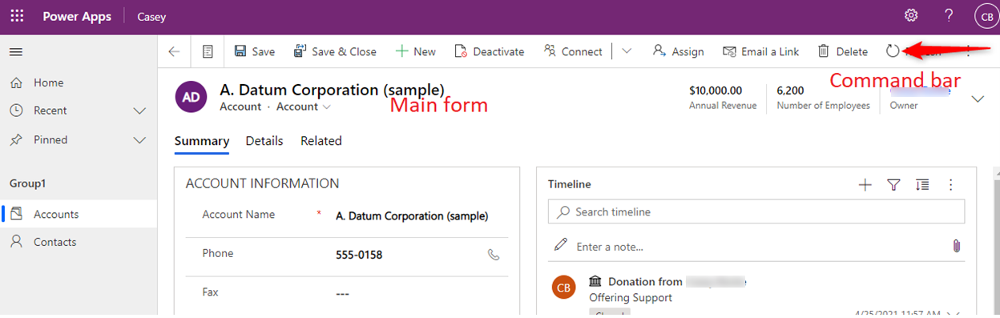
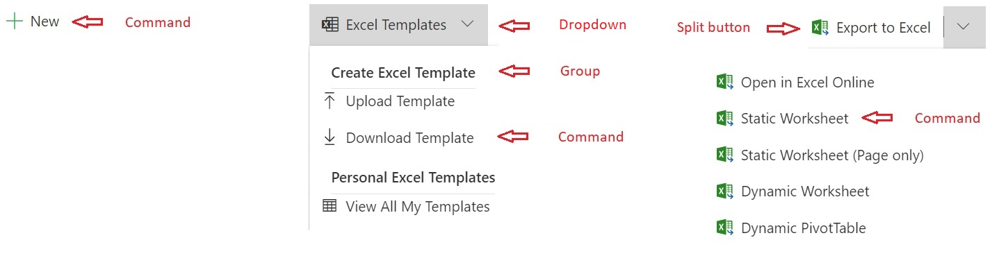

# Modern commanding overview (preview)

[!INCLUDE [cc-beta-prerelease-disclaimer](../../includes/cc-beta-prerelease-disclaimer.md)]

Commands drive core application behavior for model-driven apps. They are the buttons users interact with when playing apps and the resulting action(s) performed when a button is clicked. Each command is positioned in relation to other commands and bound to a command bar location within the app. 

At a very high level command customization fits into the following categories. Various capabilities exist within each category and are covered in more depth throughout modern commanding documentation.  
- **Display** How the button looks and where it's located in an app. For example, the button's label, icon, and accessibility labels as well as the command bar location and position within a command bar. 
- **Action** The logic that is executed when a button is clicked. For example, creating and updating data or interacting with various controls and pages inside the app.
- **Visibility** Logical conditions that specify when a button is visible or hidden to a user. For example, you may want the button visible for some users and hidden for others. Or perhaps the button should only be visible when certain criteria of the data record(s) are satisfied. 

> [!IMPORTANT]
> - This is a preview feature, and may not be available in all regions.
> - [!INCLUDE[cc_preview_features_definition](../../includes/cc-preview-features-definition.md)]

## Command bar locations

-	**Main grid**. This command bar is displayed when using the left-hand navigation of an app to view a full page list of records in this table.
    > [!div class="mx-imgBorder"]
    > 
    
- **Main form**. This command bar is displayed on the table’s main forms. This appears at the top of the form and is not the same as the associated view or subgrid view that will appear in different areas of the form.
    > [!div class="mx-imgBorder"]
    > 
    
- **Subgrid view**. This command bar is displayed on forms of other tables that render this table’s data within a subgrid. For example, the account main form has a subgrid control that lists contact records related to the account record. To edit the below command bar, edit the command bar for the contact table then subgrid view.
    > [!div class="mx-imgBorder"]
    > 

- **Associated view**. This command bar is displayed on the form of a parent table when viewing related data in this table. For example, from the main form of an account record select the **Related** tab then select a related table like contacts.
    > [!div class="mx-imgBorder"]
    > 
    
-	**Quick actions**. Quick actions are associated with the main grid location. To add or edit commands for both quick actions and main grid locations, select the desired table from within modern app designer, then edit command bar and choose the main grid location. The first five commands, determined by order, will also be shown as quick actions when playing the app. 
    > [!div class="mx-imgBorder"]
    > 

> [!NOTE]
> - Less frequently customized command bar locations are not supported in command designer. See the [Global command bar and Other ribbons](../../developer/model-driven-apps/ribbons-available.md) sections for more information on customizing commands for these locations.

## Types of commands
    > [!div class="mx-imgBorder"]
    > 
    
- **Command** Standard button. Performs an action when clicked. Can also be nested in group(s) within dropdowns and split buttons. Note these were called Flyouts in classic commanding.
- **Dropdown** Creates a menu where you can organize commands within a group.
- **Group** Add titles to groups of commands nested within dropdowns and split buttons.
- **Split button** Similar to a dropdown, but has a primary command. When the split button is clicked, the action from the primary command is executed. If the expand chevron is clicked the primary command will not be executed. Instead a list will expand to show additional groups, flyouts, and commands.

## Key differences between classic and modern commands
Classic commands (formerly known as the ribbon) were not customizable using low code. With code, command customizations were difficult, tedious, and error prone. In order to scale commanding to low code as well as use custom pages to converge canvas and model-driven apps, it was vital to reinvent and rebuild the command infrastructure. 
Modern commanding offers many new capabilities and is much simpler to use. However, when preview was announced many important parity gaps needed to be addressed. Many of those gaps have since been closed while certain differences do remain. Also note that many perceived gaps were intentionally left behind as they were identified to be not relevant with modern apps commanding design.

|Capability|Classic |Modern|
|:----|:----|:----|
|Supported in model-driven app runtime|Yes|Yes, Additionally supports Power Fx runtime.|
|Customized using |Hand editing XML within solution files or using 3rd party tools. Required time consuming solution export and import operations.|Command designer as well as Dataverse API support|
|Supports Power Fx|No|Yes. For actions and visibility|
|Time required to customize|Slow, error prone|Fast|
|Reliability and performance|Easy to make mistakes. Bad customization and lack of scoping often impact app performance|Inline error handling prevents mistakes. Power Fx optimized for better runtime performance |
|Sharing|Standard Dataverse role-based security|Non-Power Fx commands use standard Dataverse role based security. Power Fx commands currently require the command component library to be shared in addition to having an appropriate security role.|
|Solution and ALM behaviors|Inconsistent and problematic solution layering, no presence in solution interface. Many standard solution behaviors not supported such as patches, segmentation, solution upgrade, managed properties, and many more.|Standard solution layering centrally managed for multiple solution object types within Dataverse. Present in solution interface. All standard solution behaviors supported|
|Localization|Non-standard|Standardized using export & import translations for the entire solution|
|Data model|Complex. Optimized for classic ribbons and contain many properties that are no longer needed|Simple, optimized for today’s model-driven app command bars|
|Use JavaScript|Yes|Yes. Now simpler. Note: The same JavaScript can be used for classic and modern commands|
|Customize out of the box commands|Yes|Commands become editable in command designer once migrated to the modern framework. The first set is in-progress and more will be migrated incrementally. |
|Convert your own custom classic commands to modern | |Coming soon |
|App specific commands|No|Yes. Using modern command designer ensures commands are only visible within the selected app|
|Table specific commands that will display in all apps containing the table|Yes|Yes. Requires modifying the appaction definition within the solution file|
|Global commands that will display for all tables & apps for the specified command bar location|Yes|Yes. Requires modifying the appaction definition within the solution file|
|Create split buttons, flyouts, and groups|Yes|Yes|
|Dynamically populate a flyout with code|Yes|No. We recommend creating commands declaratively|
|Customize global application header commands|Yes|No|
|Customize commands for other / uncommon or obsolete command bar locations|Yes|No|
|Run a modern flow or workflow|Using JavaScript|Using JavaScript. Also supported using a custom page|

### Classic vs modern visibility rule comparisson 
Classic visibility rules often had a specific rule for each scenario. With Power Fx, a declarative function replaces many classic rules. And it’s much simpler to use.
Note classic visibility rules will also be supported soon within modern commands. However, support for classic rules was needed for reliably migrating classic commands to modern commanding and we do not intend to support classic rules customization within command designer. It’s recommended to use Power Fx going forward.	

|Use case|Classic Rule|Classic options|Power Fx visible property|
|:----|:----|:----|:----|
|Show / hide based on data value(s)|CustomRule|Use JavaScript |!IsBlank(Self.Selected.Item.Email)|
|Show/hide based on table permission|EntityPrivilegeRule|Multiple|DataSourceInfo()|
|Show/hide based on record permission|RecordPrivilegeRule|Multiple|RecordInfo()|
|Reference the control context for primary and related tables|EntityRule|PrimaryEntity. SelectedEntity|Self.Selected|
|Reference the control context|EntityRule|Form. HomePageGrid. SubGridStandard. SubGridAssociated|Self.Selected|
|Table metadata properties|EntityPropertyRule| |DataSourceInfo()|
|Show / hide based on form state. For example, show for the create form|FormStateRule|Create. Existing. ReadOnly. Disabled. BulkEdit|Self.Selected.State = FormMode.New|
|Show when > 1 records are selected in a grid|SelectionCountRule| |CountRows(Self.Selected.Items) > 1|
|Show / hide for a related table in a polymorphic lookup. For example, check whether the lookup is a user OR a team|CustomRule|PrimaryEntityTypeCode|IsType(), AsType|
|Reference environment properties (Org)|CustomRule|OrgName. OrgLcid. UserLcid|Not currently available|

## Frequently asked questions

- *Why do I see more commands in the designer than I see in my app?*
  - There are several reasons. Sometimes there is visibility logic that will hide the command when running the app. Other times these commands are dynamically injected via custom JavaScript during runtime and are not configurable. 
- *Why do I see duplicate commands in the designer?*
  - This was a common pattern used with classic commands. Both commands would not show up in runtime as they were controlled by visibility rules. The command designer will show all commands, regardless of their visibility rules. 
- *Will I receive updates during preview?*
  - Yes, you’ll receive updates weekly as we continuously ship improvements, new features, and fix bugs.

### See also
[Customize the command bar using command designer](use-command-designer.md)  
[Manage commands in solutions](manage-commands-in-solutions.md)  
[Modern commanding known limitations](command-designer-limitations.md)
