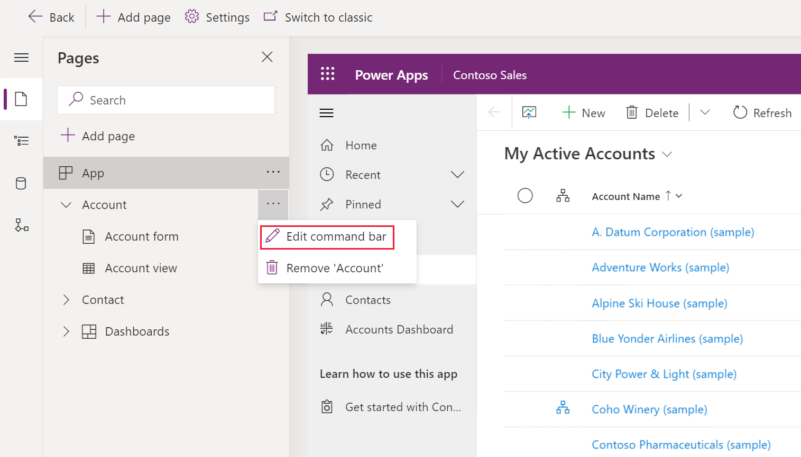
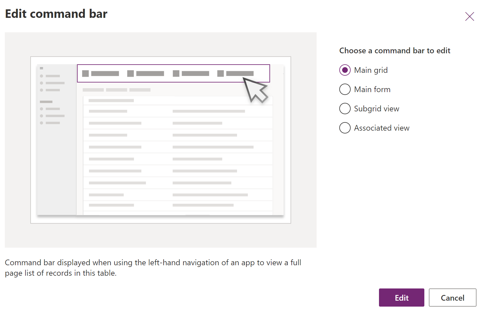
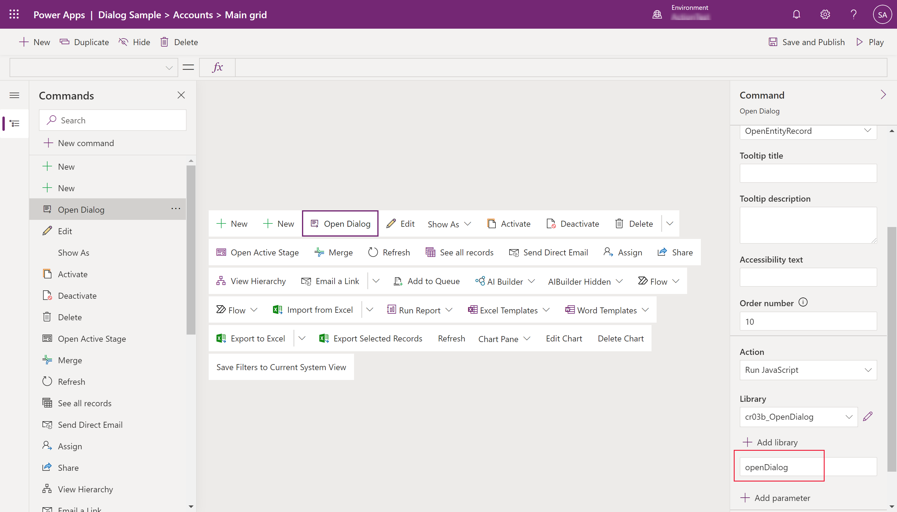

# Open custom pages as dialogs and use cloud flows (preview)

[!INCLUDE [cc-beta-prerelease-disclaimer](../../includes/cc-beta-prerelease-disclaimer.md)]

This sample demonstrates how you can build simple custom pages that open as dialogs when a command is clicked. You may also call a cloud flow from the custom page dialog. 

## Prerequisites
- [Add a custom page to your model-driven app](add-page-to-model-app.md)
- Optionally [trigger a cloud flow from the custom page](../../maker/canvas-apps/using-logic-flows.md)

## Create a command

First, you'll need to determine the table and command bar location to place the command.

1. Open the app designer, and then add the desired table to your model-driven app. More information: [Create a model-driven app that has an account table page](create-a-model-driven-app.md)
1. Publish the app.
1. Select the desired table from the **Pages** area in the app designer.
1. Select **...** (ellipsis), and then select **Edit command bar**.
    > [!div class="mx-imgBorder"]
    > 
 
1. Select the location of the command bar you want, and then select **Edit**. More information: [Command bar locations](command-designer-overview.md#command-bar-locations)
    > [!div class="mx-imgBorder"]
    > 
1. Select **+ New** on the command designer command bar, and then enter the command properties: More information:
   - [Create a JavaScript web resource for your command](#create-a-javascript-web-resource-for-your-command).
   - For other properties, see [Create a new command](use-command-designer.md#create-a-new-command).
   :::image type="content" source="media/commanddesigner-new.png" alt-text="Create a new command":::

### Create a JavaScript web resource for your command

> [!NOTE]
> This commanding customization is currently only supported using JavaScript. Currently, Power Fx isn't supported.

1. For the command properties **Action**, select **Run JavaScript**.
1. Select **+ Add library**
1. Select **New** to create a new JavaScript web resource.
1. On the Web Resource: New browser window, enter a **Name** and optionally a **Display name** name and **Description**.
1. For **Type**, select **Script (JScript)**.
1. Select **Text Editor**.
1. Paste in your JavaScript. For example, depending on the type of dialog you wish to use, copy and paste an example from [the Navigate API reference](../../developer/model-driven-apps/clientapi/navigate-to-custom-page-examples.md) .
1. Select **Save**, and then select **Publish** to save and publish the web resource.
1. Close the browser window tab to return to the command designer.

### Call the JavaScript from your command

1. In the **Add JavaScript Library** dialog, select the library you created in the previous steps, and then select **Add**.
   > [!TIP]
   >    If you can't find the web resource enter the name in the **Search** box.
   :::image type="content" source="media/add-javascript-library-command.png" alt-text="Add JavaScript library for command":::

1. In the **Command** properties pane, enter the name of the JavaScript **Function**. In this example, *openDialog* is entered.
   > [!div class="mx-imgBorder"]
   > 
1. Optionally, change the **Visibility** logic.
1. Select **Save and Publish**.

### See also

[Design a custom page for your model-driven app](design-page-for-model-app.md)

[Navigating to and from a custom page using client API](../../developer/model-driven-apps/clientapi/navigate-to-custom-page-examples.md)

[Using PowerFx in custom page](page-powerfx-in-model-app.md)
