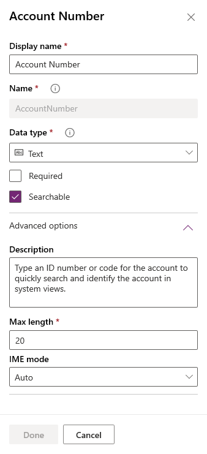
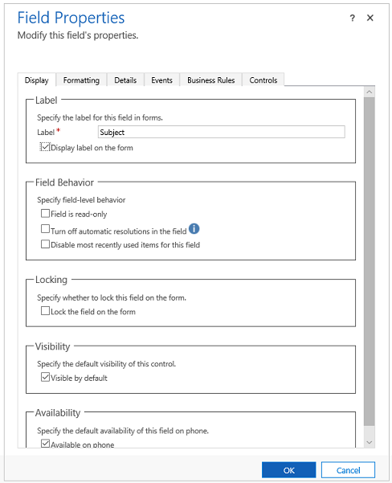

# Model-driven app common column properties

You can view and edit common properties of table columns for a model-driven app using Power Apps solution explorer or   Power Apps portal. The Power Apps portal provides an easy way to create and edit table columns with the Microsoft Dataverse.
The portal enables configuring the most common options, but certain options can only be set using solution explorer.

## Common column properties in Power Apps portal

1. From the [Power Apps portal](https://make.powerapps.com/?utm_source=padocs&utm_medium=linkinadoc&utm_campaign=referralsfromdoc), select **Data** > **Tables** and select the table that has the columns you want to view.

2. Select the column that you want to view.

    > [!div class="mx-imgBorder"]
    > 

The following table describes the common properties of columns. Certain types of columns have special properties. These are described in [Create and edit columns for Dataverse](../data-platform/create-edit-field-portal.md).

 |Property|Description|
 |--|--|
 |**Display Name**|The text to be displayed for the column in the user interface.|
 |**Name**|The unique name across your environment. A name will be generated for you based on the display name that you've entered, but you can edit it before saving. Once a column is created the name cannot be changed as it may be referenced in your applications or code. The name will have the customization prefix for your **Dataverse Default Publisher** prepended to it.|
 |**Data type**|Controls how values are stored as well as how they are formatted in some applications. Once a column is saved, you cannot change the data type with the exception of converting text columns to autonumber columns.|
 |**Required**| A row can't be saved without data in this column. |
 |**Searchable**| This column appears in Advanced Find and is available when customizing views. |
 |**Calculated or Rollup**| Use to automate manual calculations. Use values, dates, or text.|
 |**Advanced Options**| Add a description, and specify a maximum length and IME mode for the column.

There are many different types of columns, but you can only create some of them. For more information about all types of columns, see [Types of columns and column data types](../data-platform/types-of-fields.md). You can set additional options depending on your choice of **Data type**.

## Common column properties in solution explorer
 
Columns in a form display controls people use to view or edit data in a table row. Columns can be formatted to occupy up to four columns within a section.  

You can access common **Field properties** in solution explorer. Under **Components**, expand **Entities**, expand the table you want, and then select **Forms**. In the list of forms, open the form of type **Main**. Then double-click one of the columns to view common column properties.

  
The following table describes properties that all columns have. Certain types of columns have special properties. These are described in [Special column properties](special-field-properties-legacy.md).  
  
|Tab|Property|Description|  
|---------|--------------|-----------------|  
|**Display**|**Label**|**Required**: By default the label will match the display name of the column. You can override that name for the form by entering a different label here.|  
||**Display label on the form**|You can choose not to display the label at all.|  
||**Field Behavior**|Specify the column level behavior using the check boxes.|  
||**Locking**|This will prevent the column from being removed from the form accidentally. This will prevent any configuration you have applied to the column, such as event handlers, from being cleared if the column were removed. To remove this column a customizer would need to clear this setting first.|  
||**Visibility**|Showing the column is optional and can be controlled using scripts. More information: [Visibility options](visibility-options-legacy.md)|  
||**Availability**|Choose if you want the tab to be available on the phone.|
|**Formatting**|**Select the number of fields the control occupies**|When the section containing the columns has more than one column you can set the column to occupy up to the number of columns that the section has.|  
|**Details**|**Display Name**, **Name**, and **Description**|These read-only columns are for reference. Click the **Edit** button for convenient access to the column definition if you want to edit it.   Each instance of a column in the form has a name property so that they can be referenced in form scripts, but this name is managed by the application. The first instance of the column is the name of the column specified when it was created. More information: [Create and edit columns](../data-platform/create-edit-fields.md)   For each additional time that a column is included in a form, the name appends a number starting with 1 to the end. So if the column name is 'new_cost', the first instance is 'new_cost', the second is 'new_cost1', and so on for each instance of the column in the form.  **Note:** The column **Description** value provides tooltip text for the column when people place their cursor over it.|  
|**Events**|**Form Libraries**|Specify any JavaScript web resources that will be used in the column `OnChange` event handler.  |  
||**Event Handlers**|Configure the functions from the form libraries that should be called for the column `OnChange` event. More information: [Configure Event Handlers](configure-event-handlers-legacy.md)|  
|**Business Rules**|**Business Rules**|View and manage any business rules that reference this column. More information: [Create business rules and recommendations](create-business-rules-recommendations-apply-logic-form.md)|  
|**Controls**|**Controls**|Add controls and specify their availability on Web, Phone and Tablet .|  

## Next steps

[Use the Main form and its components](use-main-form-and-components.md)

[!INCLUDE[footer-include](../../includes/footer-banner.md)]