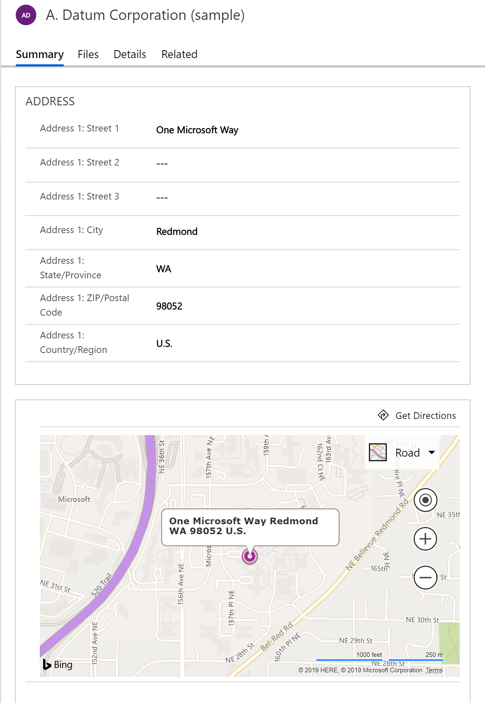
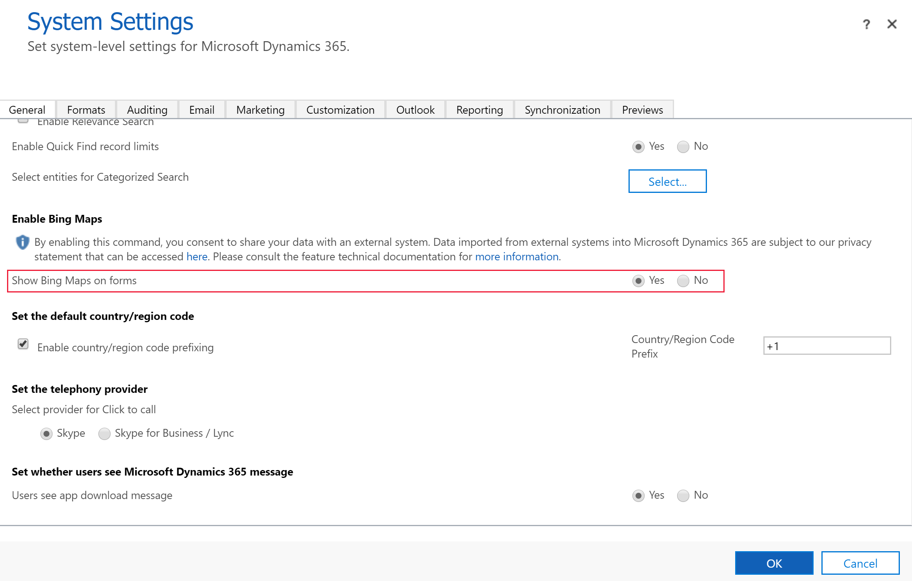
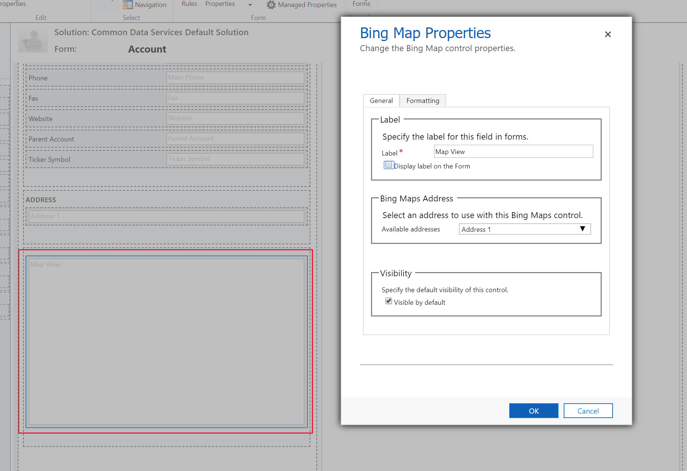

# Configure a map on a form

[!INCLUDE [cc-data-platform-banner](../../includes/cc-data-platform-banner.md)]

By default, the Bing maps control is configured on the main form for both the account and contact tables, which provides the ability to display a map on table rows. Although not configured by default, the Bing maps control can be added to the system user table. The Bing maps control can also be used with some tables included with Dynamics 365 apps, such as Dynamics 365 Sales and Dynamics 365 Customer Service. For example, the lead, quote, order, invoice, and competitor tables. The Bing maps control can't be used with custom tables.  

When enabled, the map displays the location specified in the address composite columns for the given row. 

> [!div class="mx-imgBorder"] 
> 

> [!IMPORTANT]
> To use maps the system setting Show Bing Maps on forms must be enabled. More information: [Enable maps for your environment](#enable-maps-for-your-environment)

You can remove the maps area in the form editor or add it back by using the **Bing Maps** button on the **Insert** tab of the classic form editor.

## Enable maps for your environment
1. Open a model driven app and then select **Settings** > **Advanced Settings**. 
2. Select **Settings** > **Administration** > **System Settings**. 
3. On the **General** tab, select **Show Bing Maps on forms**, and then select **OK**. 
 
    

## Configure a map 
1. Sign in to [Power Apps](https://make.powerapps.com/?utm_source=padocs&utm_medium=linkinadoc&utm_campaign=referralsfromdoc). 
2. Go to **Data** > **Tables**, and then select the table that you want to configure a map on the main form. 
3. Select the **Forms** tab, and then select the main form, and then on the command bar select **Switch to classic**. 
4. On the classic form designer double-click the **Map View** control to view and edit the properties. More information: [View and edit map properties](#view-and-edit-map-properties)

    

To remove the map control from the form, select the **Map View** control, and then press the Delete key.

## View and edit map properties

|      Tab       |                        Property                         |                                                                                                  Description                                                                                                   |
|----------------|---------------------------------------------------------|----------------------------------------------------------------------------------------------------------------------------------------------------------------------------------------------------------------|
|  **General**   |                        **Label**                        |                                                                              **Required**: A label to display for the Bing maps.                                                                               |
|                |              **Display label on the form**              |                                                                                     Whether the label should be displayed.                                                                                     |
|                | **Select an address to use with the Bing maps control** |                                                                        Choose which address should be used to provide data for the map.                                                                        |
|                |                 **Visible by default**                  | Showing the Bing maps is optional and can be controlled using business rules or scripts. More information: [Visibility options](visibility-options-legacy.md) |
| **Formatting** |  **Select the number of columns the control occupies**  |                              When the section containing the Bing maps has more than one column you can set the column to occupy up to the number of columns that the section has.                              |
|                |   **Select the number of rows the control occupies**    |                                                                  You can control the height of the Bing maps by specifying a number of rows.                                                                   |
|                |     **Automatically expand to use available space**     |                                                                        You can allow the Bing maps height to expand to available space.                                                                        |

### See also
[Create and design model-driven app forms](create-design-forms.md) 

[!INCLUDE[footer-include](../../includes/footer-banner.md)]