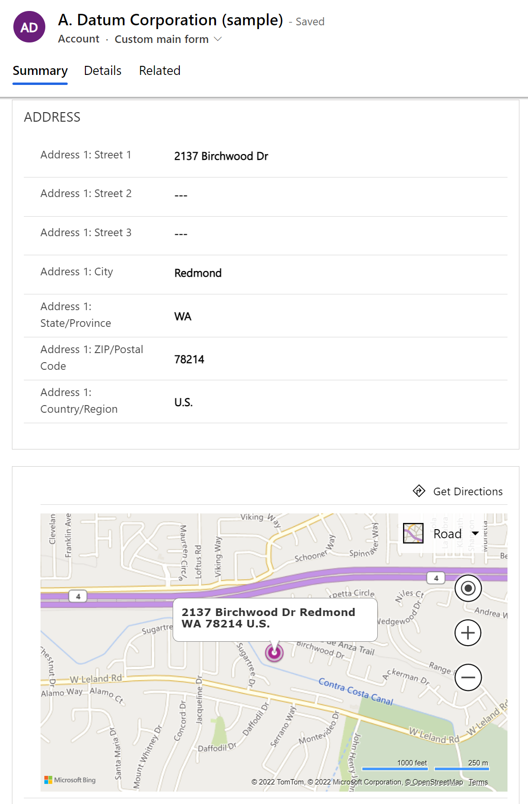

# Configure a map on a form

By default, the map control is configured on the main form for both the account and contact tables, which provides the ability to display a map on table records. Although not configured by default, the map control can be added to the system user table. The map control can also be used with some Dataverse standard tables and Dynamics 365 apps tables. The map control can't be used with custom tables. More information: [Tables that can be used with the map control](#tables-that-can-be-used-with-the-map-control)

When enabled, the map displays the location specified in the address composite columns for the given record.

> [!div class="mx-imgBorder"]
> 

> [!IMPORTANT]
> - To use the map component the **Bing Maps** setting must be **On** under the **Embedded content** section of environment settings in the Power Platform admin center. More information: [Manage Bing Maps for your organization](/power-platform/admin/manage-bing-maps-organization)
>
> - A form can only have one map component.

## Tables that can be used with the map control

- Contact
- Account
- System User
- Competitor1
- Invoice1
- Quote1
- SalesOrder1
- Lead1

1Requires a customer engagement app.

## Add and configure a map for a system form

1. Sign in to [Power Apps](https://make.powerapps.com/?utm_source=padocs&utm_medium=linkinadoc&utm_campaign=referralsfromdoc).

1. Select **Tables** on the left navigation pane, and then select the table where you want to configure a map on the main form. [!INCLUDE [left-navigation-pane](../../includes/left-navigation-pane.md)]

1. Select the **Forms** area, and then open the system main form you want.

1. On the **Components** left pane, expand **Display**, and then select **Map**. Or, if the map component is already on the form, select it on the form designer canvas.

## View and edit map properties

|      Area       |                        Property                         |                                                                                                  Description                                                                                                   |
|----------------|---------------------------------------------------------|----------------------------------------------------------------------------------------------------------------------------------------------------------------------------------------------------------------|
|  **Display options**   |                        **Label**                        |                                                                              **Required**: A label to display for the map.         |
|  **Display options**    |              **Hide label**              |                                                                                     Whether the label should be displayed.                                                                                     |
| **Display options**     |     **Hide**                  | Showing the map is optional and can be controlled using business rules or scripts. More information: [Visibility options](visibility-options-legacy.md) |
|  **Display options**    | **Bing Maps address** |  Choose which address should be used to provide data for the map.             |
| **Formatting** |  **Component width**  |    When the section containing the map has more than one column, you can set the column to occupy up to the number of columns that the section has.                              |
| **Formatting**     |     **Use all available vertical space**    | You can allow the map height to expand to available space.                 |

## Configure a map using the classic form editor

You can remove the maps area in the form editor or add it back by using the **Bing Maps** button on the **Insert** tab of the classic form editor. More information: [Configure Bing Maps to be displayed on forms](/dynamics365/customerengagement/on-premises/customize/configure-bing-maps-legacy)

### See also

[Create and design model-driven app forms](create-design-forms.md) 

[!INCLUDE[footer-include](../../includes/footer-banner.md)]
