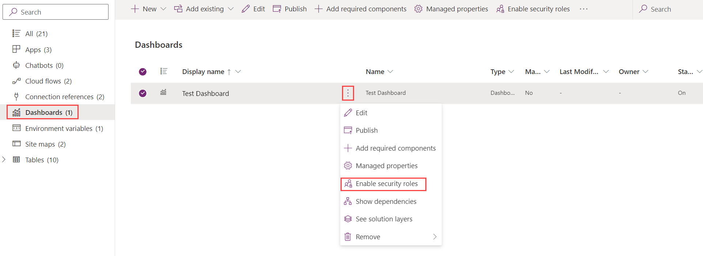

# Create and configure model-driven app interactive experience dashboards

[!INCLUDE [cc-data-platform-banner](../../includes/cc-data-platform-banner.md)]

Interactive experience dashboards can be a one-stop workplace for app users, such as service reps, to see workload information and take action. They're fully configurable, security-role based, and deliver workload information across multiple streams in real time. Interactive dashboard users don't need to page through the application looking for a particular row; they can act on a it directly from the dashboard. 

 The interactive experience dashboards come in two forms: multi-stream and single-stream. In addition, multi-stream dashboards can be home page or table-specific dashboards. The table-specific dashboards are configured in a different part of the user interface and partially preloaded with the table-specific configuration information.  
  
 The multi-stream dashboards display data in real time over multiple data streams. There’s no limit on how many streams you can configure on the dashboard. The data in a stream can be based only on one table, but, each stream can be based on a different table. In the table-specific dashboards, all streams are based on the same table. The data flows from various views or queues, such as **My Activities**, **My Cases**, or **Cases in the Banking Queue**. 
 
> [!NOTE]
> The examples described here use the Case table, which is available with the Dynamics 365 Customer Service app.
  
 The single-stream dashboards display real-time data over one stream based on a table view or queue. The tiles are positioned on the right side of the dashboards and are always shown. The single-stream dashboards are typically helpful to Tier 2 service leads or managers, who monitor fewer, but more complex or escalated cases.  
  
 Multi-stream and single-stream dashboards contain interactive charts that provide a count of relevant rows, such as cases by priority or by status. These charts also act as visual filters. The visual filters (interactive charts) are based on multiple tables and in the single-stream dashboards, the table in the data stream defines the visual filter table.   
  
 Users can apply additional filtering with global filter and timeframe filter. The global filter works at a column level on all charts, and also on streams and tiles that are based on the filter table (you specify the filter table when you configure the visual filters). 
  
> [!NOTE]
>  The interactive dashboards are solution aware and can be exported and then imported into a different environment as a solution. However, the queues that the streams and tiles are based on aren’t solution aware. Before importing the dashboard solution into the target system, the queues have to be manually created in the target system in **Settings** > **Service Management** > **Queues**. After you create the queues, import the dashboard solution to the target system, and then edit the streams or tiles that are based on the queues  to assign the newly created queues appropriately.  
  
 The illustrations in this topic show multi-stream and single-stream dashboards with the header pane. Below the header you see visual filters and streams. In the single-stream dashboard, you also see tiles. For each dashboard type, you can choose from several different layouts that are also shown. The dashboard header contains the following controls and select-able icons, from left to right: dashboard picker, refresh, visual filter icon, global filter icon, and timeframe filter.  
  
### Multi-stream dashboard standard view  
 In the multi-stream dashboard, you see a row of visual filters at the top with the data streams below them.  
 
 
   
### Multi-stream dashboard tile view  
 The same dashboard, only in the tile view.  
  
   
  
### Multi-stream dashboard layouts  
 For multi-stream dashboards, you can choose from four different layouts.  

 > [!div class="mx-imgBorder"] 
 >   
  
### Multi-stream table-specific dashboard  
 The table-specific dashboard for the case table is shown here.  
  
   
  
### Single-stream dashboard  
 The single-stream dashboard contains the data stream on the left and visual filters and tiles on the right.  
  
   
  
### Single-stream dashboard layouts  
 For single-stream dashboards, you can choose from four different layouts.  
 
 > [!div class="mx-imgBorder"] 
 >   
  
   
## Configure filter columns, and security roles for the interactive dashboards  
 When you configure interactive dashboards, your first task is to enable filter columns and security roles, so that interactive dashboards can be configured for them. Notice that interactive dashboards are enabled for all tables and custom tables by default. 
  
### Configure filter columns  
 For a column to appear in the global filter and be included in the data stream sort, you must set two flags:

- Appears in global filter in interactive experience
- Sortable in interactive experience dashboard

In this example there are two interactive dashboard options available in the Case table for the **IsEscalated** column.  

 > [!div class="mx-imgBorder"] 
 >   
  
### Configure the 'Appears in global filter in interactive experience' option

1.	Sign in to [Power Apps](https://make.powerapps.com/?utm_source=padocs&utm_medium=linkinadoc&utm_campaign=referralsfromdoc). 
2.  Select **Solutions**, open the solution you want, and then on the toolbar select **Switch to classic**. 
3. Under **Components**, expand **Tables**, and then expand the table you want.
4. In the navigation pane, select **Columns** and in the grid, double-click the column you want to enable.
5. In the **General** tab, select the **Appears in global filter in interactive experience** check box. Select **Save and Close**.
6. Select **Publish All Customizations** for your changes to take effect.
  
 The columns that you enable for **Appears in global filter in interactive experience** appear in the global filter flyout window when the global filter icon is clicked on the dashboard header. In the flyout window, the service reps can select the columns on which they want to filter globally, in charts, and also in streams and tiles that are based on the filter table.   
  
 The global filter flyout window is shown here:  
  
   
  
> [!TIP]
>  When you configure a visual filter based on the columns like priority or status, a best practice is to also enable these columns (priority, status) to appear in the global filter.  
  
### Configure the 'Sortable in interactive experience dashboard' option
  
1.	Sign in to [Power Apps](https://make.powerapps.com/?utm_source=padocs&utm_medium=linkinadoc&utm_campaign=referralsfromdoc). 
2.  Select **Solutions**, open the solution you want, and then on the toolbar select **Switch to classic**. 
3. Under **Components**, expand **Tables**, and then expand the table you want.
4. In the navigation pane, select **Columns** and in the grid, double-click the column you want to enable.
5. In the **General** tab, select the **Sortable in interactive experience dashboard** check box. Select **Save and Close**.
6. Select **Publish All Customizations** for your changes to take effect.
  
The columns that you configure for sorting appear in the drop-down list on the stream header. 

The following illustration shows the flyout dialog with the list of the available columns for sorting, in the drop-down list. The default sort is always set on the **Modified On** column.  
  
     
    
### Enable security roles  
 Select and enable security roles that will be able to view the interactive dashboards.  
  
#### Enable security roles for interactive dashboards

1.	Sign in to [Power Apps](https://make.powerapps.com/?utm_source=padocs&utm_medium=linkinadoc&utm_campaign=referralsfromdoc). 
  
2.  Select **Solutions**, and then open the solution you want. 

3.  Select the dashboard that you want and then on the toolbar select **Enable security roles**. 
  
    > [!div class="mx-imgBorder"] 
    > 

4.  In the **Assign Security Roles** dialog, select the **Display only to these selected security roles** option and select the roles that you want to enable. Select **OK**.  

         
  
5.  Select **Publish** for your changes to take effect.    
  
  
   
## Create interactive experience dashboards  
The following sections describe how to create and then configure the various types of interactive dashboards.  
  
### Configure a multi-stream interactive dashboard using the 4-column layout  
 
1.	Sign in to [Power Apps](https://make.powerapps.com/?utm_source=padocs&utm_medium=linkinadoc&utm_campaign=referralsfromdoc). 
  
2.  Select **Solutions**, open the solution you want, and then on the toolbar select **Switch to classic**. 

3.  In the left navigation pane, select **Dashboards**, on the toolbar select **New**, and then select **Interactive experience dashboard**. 

    
  
4.  Choose the layout, either 2, 3, or 4 column width.  
  
5.  When the dashboard form opens, fill in the filtering information at the top of form, as shown here.  
 
    > [!div class="mx-imgBorder"] 
    >   
  
   - **Filter Table**: The visual filters and global filter attributes are based on this table.  
      
   - **Table View**: The visual filters are based on this view.  
      
   - **Filter By**: The column that the time frame filter applies to.  
      
   - **Time Frame**: The default time frame filter value for the **Filter By** column.  
      
 After you  have specified the filtering information, start adding components for the charts and the data streams. To add a component, simply select the element in the center of the chart or stream, and when the dialog appears, select the required information from the drop-down list, as shown in the following illustrations.  
  
 Add the **Cases By Priority** doughnut chart.
  
 > [!div class="mx-imgBorder"] 
 >   
  
 Some charts, such as bar charts or pie charts, render showing the data stored in the system. The doughnut charts and tag charts load as static images and don’t show the preview of the actual data.  
  
> [!NOTE]
>  The charts configured for the visual filters can use the columns of the **Filter** table as well as related tables. When you use charts based on related table columns, the customer service representatives can filter charts using these related table columns. The columns that are based on the related table usually have the following format in the chart configuration window: “field name (entity name)”, such as the **Modified By (Delegate)** column. To create multi-entity charts, you must add  columns of a related table to any of the views, and then use these columns while creating charts.  
 
 > [!div class="mx-imgBorder"] 
 >   
  
 Next, configure the streams. Just like with adding components in the charts, select the element inside the stream panel. When the dialog appears, select **View** or **Queue** depending on what element you want the stream to use. Enter the required information, as shown in the following illustration.  
  
 Configure the stream for the **Items available to work on** as shown here:  
  
   

> [!NOTE]
>  The **Queue** option is available in the dialog box only for queue-enabled tables. For table dashboards, if the table is not queue enabled, you won't see the **Queue** option in the dialog box. You can only use the **View option** in the stream of dashboards for tables that are not queue enabled.    
 
The following illustration is an example of a fully configured chart panel and stream panel:  
 
 > [!div class="mx-imgBorder"] 
 >   
  
 After you have completed configuring the dashboard, save it and publish the customizations for your changes to take effect.   
  
#### Edit or delete individual streams of an existing dashboard  
  
1. Sign in to [Power Apps](https://make.powerapps.com/?utm_source=padocs&utm_medium=linkinadoc&utm_campaign=referralsfromdoc).   
  
2. Select **Solutions**, open the solution you want, and then open the interactive dashboard.  
  
3.  Select the stream that you want to edit to select it, and then select **Edit Component**.  
  
4.  Depending on whether you want to add a view or queue to the stream, select the view or queue details for the stream, and then select **Set**.  
  
5.  Select **Save**.  
  
 You can also delete an individual stream from a dashboard. To do this, select the stream, and then on the toolbar, select **Delete**.  
  
### Create a table-specific dashboard  
 A table-specific dashboard is a multi-stream dashboard. Configuring this dashboard is similar to configuring a home page multi-stream dashboard, but you do it in the different place in the UI and there are other minor differences. 

For example, instead of selecting a table, some columns in the table-specific dashboard are preset to the table for which you are creating the dashboard.  
  
1.	Sign in to [Power Apps](https://make.powerapps.com/?utm_source=padocs&utm_medium=linkinadoc&utm_campaign=referralsfromdoc).

2.  Select **Data** > **Tables** > select the table you want. 

3.  Select the **Dashboards** tab, and then on the toolbar select **Add dashboard**.  
4.  Choose the layout, either 2, 3, or 4 column width.    
  
5.  When the dashboard form opens, the **Filter Table** is preset to the table for which you are creating the dashboard. The **Table View** drop-down list contains the available views for the table. Select the view and fill in the rest of the required information on the page.  
  
 The rest of the setup is very similar to the home page multi-stream dashboard setup described in the previous section.  
  
### Configure a single-stream dashboard  
 Configuring a single-stream dashboard is similar to the multi-stream dashboard. All UI navigation steps are the same as for the multi-stream dashboard. You can choose a layout that includes tiles or the layout that doesn’t include tiles. If the tiles are included, they are always displayed on the dashboard. To configure a tile, you select the icon in the center of the tile. When the **Add Tile** window opens, fill in the required data. The following illustration is an example of the tile setup.  
  
   
  
## Configure dashboard colors

You can configure a particular color that will appear in the charts and streams for specific column values. For example, high priority cases can be shown in red, medium priority cases in blue, and low priority cases in green in the interactive charts. In the streams, there will be a thin vertical line in color next to the work item description.  
  
> [!IMPORTANT]
>  - The color coding isn’t available for the tag charts and doughnut charts. These charts appear on the dashboard in white, gray, and black shades.
>  - With interactive dashboards, a chart uses the color assigned to the categories that make up the different values, even if the chart is configured to use random colors, when the chart is configured to be grouped by any of the following column types:
>     - Choice
>     - Yes/No
>     - Status Reason
> 
>    More information: [Chart colors are not correct on dashboards]( https://support.microsoft.com/topic/chart-colors-are-not-correct-on-dashboards-82dd1165-b509-ab64-954e-2e09a3487fd7)
  
1.  Open [solution explorer](advanced-navigation.md#solution-explorer).  
2.  Under **Components**, expand **Tables**, and then expand the table you want. If the table you want isn't displayed select **Add Existing** to add it.  
  
3.  In the navigation pane, select **Columns**. In the grid, double-click the column that you want to configure the color for.  
  
4.  In the **General** tab, in the **Type** sub-area, select **Yes** and then select **Edit**.  
  
5.  When the **Modify List Value** dialog appears, set the new value in the **Color** text box. Select **OK**.  
  
6.  Select **Save and Close**.  
  
7.  Select **Publish** for your changes to take effect.  
  
In the following example, we’re changing the color for the **IsEscalated** column. Use the **Edit** button to open the **Modify List Value** dialog box:  
 
 > [!div class="mx-imgBorder"] 
 >   
  
When the **Modify List Value** dialog box opens, enter the hexadecimal color code, such as #800000 shown here:  
  
   

Similarly, if you go to the **Priority** column to modify the colors of the case priority options, choose the color in the **Options** sub-area of the **General** tab, as shown below:

   
  
### See also  
 
[Create or edit dashboards](create-edit-dashboards.md)
 

[!INCLUDE[footer-include](../../includes/footer-banner.md)]