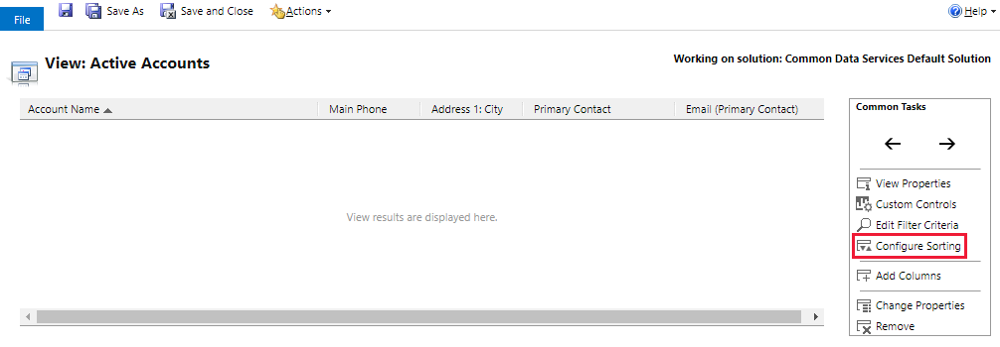

# Sort rows in a model-driven app view

[!INCLUDE [cc-data-platform-banner](../../includes/cc-data-platform-banner.md)]

When you create or edit a view you can configure the sort order for either ascending or descending.

To change the sort order in the view designer, see [Create a public view in Power Apps](create-edit-views-app-designer.md#create-a-public-view-in-power-apps).

## Change the sort order using solution explorer

1.  Open [solution explorer](advanced-navigation.md#solution-explorer), expand **Entities**, select the table you want, select **Views**, and then open the view you want.

2.  In the view designer, select **Configure Sorting**.  

    > [!div class="mx-imgBorder"] 
    > 
  
3.  In the **Configure Sort Order** dialog box, in the **Sort By** list, select the column you want to sort, then select **Ascending Order** or **Descending Order**.  
  
4.  Select **OK** to close the **Configure Sort Order** dialog box. 

    > [!IMPORTANT]
    > Grids in Unified Interface apps take the list of displayed columns from the underlying FetchXML of the view. If the FetchXML that is returned from Microsoft Dataverse does not have a column, then that column is not displayed. This is in contrast to the classic web application, where if a column is not present in FetchXML but is in LayoutXML, such a column is automatically added to the list of displayed columns. Unified Interface apps use OData directly with FetchXML to retrieve data from the server.

## Next steps
[Create or edit a view](create-edit-views.md)
[Use FetchXML to query data](../../developer/data-platform/use-fetchxml-construct-query.md)

[!INCLUDE[footer-include](../../includes/footer-banner.md)]