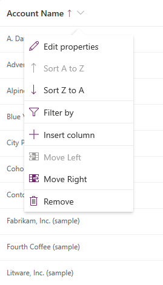

# Sort rows in a model-driven app view

[!INCLUDE [cc-data-platform-banner](../../includes/cc-data-platform-banner.md)]

When you create or edit a view, you can configure the sort order for either ascending or descending.

To change the sort order in the view designer, see [Create a public view in Power Apps](create-edit-views-app-designer.md#create-a-public-view-in-power-apps).

## Change the sort order of a view

1.  Sign in to [Power Apps](https://make.powerapps.com/?utm_source=padocs&utm_medium=linkinadoc&utm_campaign=referralsfromdoc).  

2.  Select **Solutions**, open the solution you want, select **Tables**, open the table you want, and then select the **Views** tab.

3.  Select a view to open it in the view designer.

    > [!div class="mx-imgBorder"] 
    > 

4.  Select a column name in the column head, and from the column menu, select **Sort A to Z** or **Sort Z to A**. The sort order is indicated in the column head with an up arrow or a down arrow.

    The sort order can be changed by using the view properties panel. 

5.  If a sort order has not been set for the view, select **Sort by**, and then select the primary sort by column.

6.  To sort the view by additional columns, select **Then sort by** and then select a sort by column for the view.

    :::image type="content" source="media/create-or-edit-model-driven-app-view/sort-view-by-multiple-columns.png" alt-text="Sorting a table view by multiple columns":::

7.  To remove a sort expression, select **Remove sort expression** (the **X** button).

## Next steps

[Table views overview](create-edit-views.md)

[Setting managed properties for views](managed-properties-views.md)

[!INCLUDE[footer-include](../../includes/footer-banner.md)]