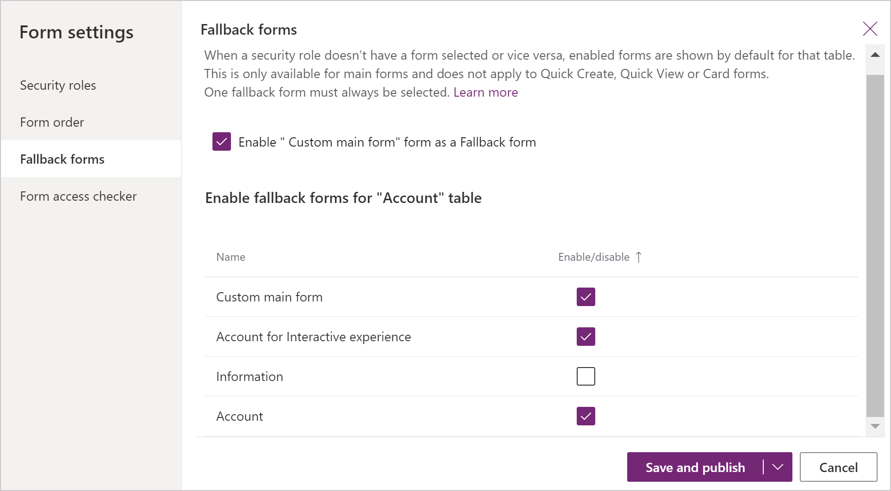

# Manage model-driven app forms settings

Power Apps forms settings are a set of capabilities that make it easy for model-driven app makers to configure how users will access forms in a solution or application. From **Form settings**, there are three different areas a maker can choose from: 
- [Set security roles for a form](#set-security-roles-for-a-form).  
- [Set the form order](#set-the-form-order).
- [Set the fallback form for a table](#set-the-fallback-form-for-a-table). 

You can access form settings from the **Forms** tab in Power Apps or command bar in the form designer. 

## Set security roles for a form
  
 Different people in your organization may interact with the same data in different ways. Managers may depend on being able to quickly scan information in a row and service people may require a form that streamlines data entry. You can accommodate different requirements by assigning forms to the security roles that different groups of people belong to.  
  
 When you have more than one main or other form type defined for a table, you can select which forms users will be able to use based on their security roles. Because each table must be able to display a form for any user, at least one form must be designated as a ”fallback” form – a form visible to users whose security roles do not have any forms explicitly assigned to them.  
  
> [!NOTE]
> - Quick Create, Quick View, and Card forms can't be assigned to security roles.  
> - Another option makers have to control form access is to make a main form inactive. You can set an active or inactive state to main forms. This feature was included primarily to manage new forms included when Microsoft Dataverse environments upgrade but you can use it to prevent users from being able to use any main form.   
  
### Assign a security role to a form
1. Sign into Power Apps, select **Solutions**, open the solution you want, select a table, and then select the **Forms** tab. 
2. Next to the main form you want to configure the security roles for a form, select **...,** and then select **Form settings**. 
3. In the left navigation on the **Form settings** page, select **Security role**.  
4. Choose from the following options: 
   - To set the security roles for every user select **Everyone**. 
   - To set the access to the form for one or more specific security roles, select **Specific security roles**. Then, select the security roles you want to grant access from the list of security roles that have been set up for your environment.  
     > [!div class="mx-imgBorder"] 
     > 
5. Select **Save and Publish**.

## Set the form order
When you have multiple main, quick create, quick view, or card forms for a table, you can assign a form order. The form order determines which of the available forms will be shown by default. The available main forms can be further controlled by assigning security roles to the form. 

Notice that the form order does not set who can see the form, that is managed by setting security roles. More information: [Set security roles for a form](#set-security-roles-for-a-form)

1. Sign into Power Apps, select **Solutions**, open the solution you want, select a table, and then select the **Forms** tab. 
2. Next to the main form you want to configure the fallback form for, select **...**, and then select **Form settings**. 
3. In the left navigation on the **Form settings** page, select **Form order**. 
4. Select the form set that you want, such as **Main Form**, **Quick Create Form**, **Quick View Form** or **Card Form**. 
5. Change the order by dragging and dropping the form up and down the list in the order you want it to be shown to your users. You can also use these keyboard shortcuts: Tab/Tab + Shift to move the focus, Space to select or release a form, and Down/Up arrow keys to move a form. Select **Save and publish**. 
   
To set the form order using solution explorer, see [Assign model-driven app form order](assign-form-order.md). 

## Set the fallback form for a table
Setting the fallback form for a table is important to ensure that if a user does not have any assigned security roles or there are no assigned security roles for a main form type there is always a “default” form that will show for that table. Fallback forms are only available with main forms and don't apply to quick create, quick view, and card forms.

There are a few different strategies to consider when you manage the fallback form for an table.  
  
### All users view the same form  
If you do not require multiple forms for a table you do not need a fallback form.  
  
### Create a contingency form  
If you are using role-based forms because you want to restrict the information people might view or edit, consider creating a form that has a minimum of information displayed. Then, select specific security roles, but do not select any roles except System Administrator. The result is that this form will never be seen by anyone except the System Administrator and anyone whose security roles have not been associated with a specific form. You could include a HTML web resource in the form with information about why little information is visible in the form and a link to information about how to request being added to a security role that is associated with a from or to include a new security role for a form.  
  
### Create a generic form  
 If you use role-based forms to provide a customized experience based on a user’s role, you can set your least specialized form as the fallback form and configure it to display for everyone. Then, create customized forms for specific security roles and configure those forms to only display for security roles that require them. Do not enable these forms for fallback. Finally, in the **Form settings** configure the **Form order** to specify which forms to display ranking them from most exclusive to least exclusive. Your fallback form will be at the bottom of the list. This strategy will cause people seeing the form that has been customized for their role as the default form, yet they can still use the form selector to select the most common form if they want. Whatever form they select will remain their default form until they select a different form.  
  
### Set the fallback form for a table

1. Sign into Power Apps, select **Solutions**, open the solution you want, select a table, and then select the **Forms** tab. 
2. Next to the main form you want to configure the fallback form for, select **...**, and then select **Form settings**. 
3. In the left navigation on the **Form settings** page, select **Fallback forms**. 
4. To disable a form from the fallback order, clear the checkbox. In this example the **Information** form will be removed from the fallback order. 
   > [!div class="mx-imgBorder"] 
   > 
   To enable a form for fallback select the checkbox next to the form to enable it.
5. Select **Save and publish**. 

## Use form scripting  
The Client API form context (formContext) provides a reference to the form or to an item on the form, such as, a quick view control or a row in an editable grid, against which the current code is executed. More information: [Client API form context](/dynamics365/customer-engagement/developer/clientapi/clientapi-form-context)

> [!IMPORTANT]
> The Xrm.Page object is [deprecated](/dynamics365/get-started/whats-new/customer-engagement/important-changes-coming#some-client-apis-are-deprecated), and you should use the [getFormContext](../../developer/model-driven-apps/clientapi/reference/executioncontext/getformcontext.md) method of the passed in execution context object to return reference to the appropriate form or an item on the form.

### See also  

[Overview of the model-driven form designer](form-designer-overview.md)

[!INCLUDE[footer-include](../../includes/footer-banner.md)]