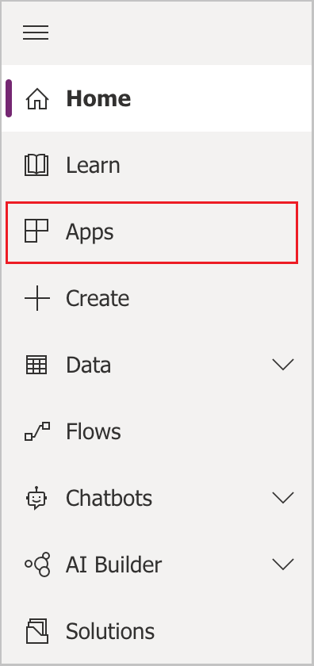
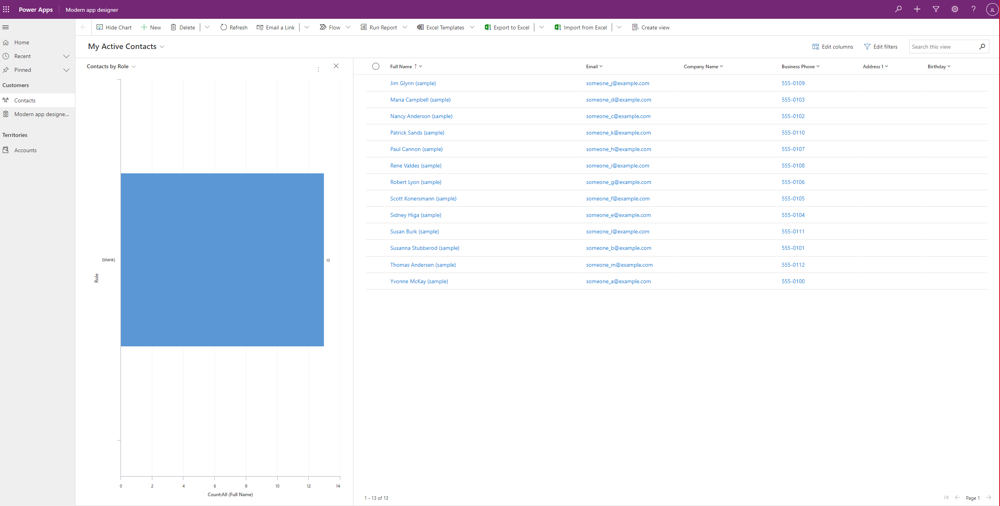

# Example: Create a model-driven app

Model-driven app design is a component-focused approach to app development. Model driven apps are especially well suited for process driven apps that are data dense and make it very easy for users to move between related records. For example, if you are building an app to manage a complex process, such as onboarding new employees, managing a sales process, or member relationships in an organization like a bank, a model driven app is a great choice. Model driven apps also allow you to quickly build an app by combining components like forms, views, charts, and dashboards. In this lesson we will create a model-driven app by using one of the standard tables that is available in Microsoft Dataverse, the account entity.

## Sign in to Power Apps

Sign in to [Power Apps](https://make.powerapps.com/). If you don't already have a PowerApps account, select the **Get started free** link.

## Understanding environments

An environment in Power Apps is a space to store, manage, and share your organization’s business data, apps, chatbots, and flows. It also serves as a container to separate apps that might have different roles, security requirements , or target audiences.

Each environment can have one Dataverse database. 

## Create your model-driven app

1.  Select the environment you want, or go to the [Power Platform admin center](https://admin.powerplatform.microsoft.com/) to create a new one. You can select the environment by selecting “environment” in the upper right corner.

2.  We recommend creating your model driven app from a solution. A solution is a package containing Dataverse tables, forms, views, apps, flows, and other components. By building your model driven app in a solution, you can easily move it to other environments or preserve a copy in your source control repository. For more information about creating a solution, see [Create a solution](https://docs.microsoft.com/powerapps/maker/data-platform/create-solution).

3.  Create a solution. For this example, we will call our solution **Power Apps Training**. Next we will add the tables that will be in our Model-driven app.

4.  In your solution, select **Add existing** and select **Table.**

5.  From **Add existing tables** screen, select the **Account** table, then select **Next**.

6.  Check the **Include all components** checkbox and select **Add.**

Now that we have a solution and have added the Account table to it, we are ready to create our model-driven app.

1. In your solution, select **New**, then select **App** and then select **Model-driven app.**

2. Select **Modern app designer** then select **Next**

   

3.  Choose a name for app then select **Create**

    

## Add pages to your app

Next we will add a new page to the model-driven app.  Select **New page** from the **Pages** menu.

Choose **Table based view and form** then select Next.

Choose the **Account** table then select Add. 

The Account form and view now appear in the pages menu.  Select **Account view** and then select **Manage views**.

Pick the following views and select Save: **Active Accounts**, **All Accounts**, **My Active Accounts, Account Advanced** **Find**, and **Account Lookup**.

## Publish your app

On the app designer toolbar, select **Publish**.

After publishing the app it's ready for you to run or share with others.

## Run your app on desktop

To run your app, log in to Power Apps and select Apps on the left navigation menu.

Select the app from the app list.  The app will open in browser.

## Run your app on mobile

To test your Power App on your mobile device, follow these steps:

1.  Download the app from your mobile app store

-   IOS: [‎Power Apps on the App Store (apple.com)](https://apps.apple.com/us/app/power-apps/id1047318566)

-   Android: [Power Apps - Apps on Google Play](https://play.google.com/store/apps/details?id=com.microsoft.msapps&hl=en_US&gl=US)

1.  Log in using your Microsoft work or school account

2.  Select your app from the list