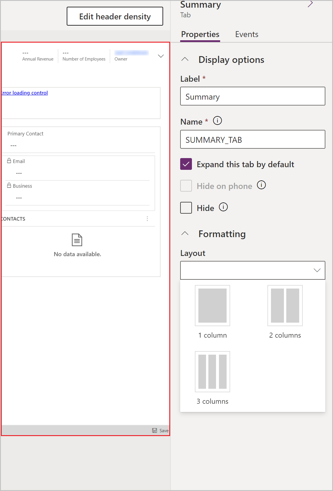
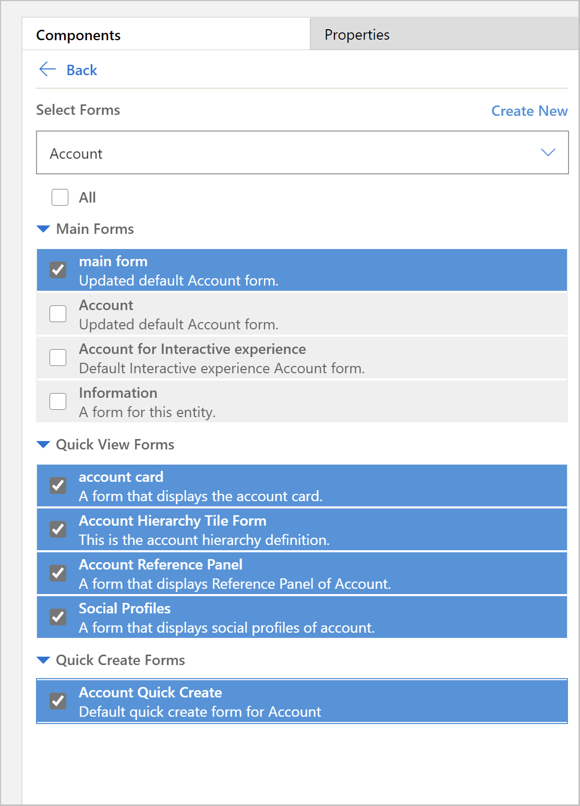

# Example: Create and Customize Model-Driven Forms

In model-driven Power Apps, forms provide the user interface that people use to interact with the data with which they need to work. A table can have one or more form, and forms come in different types.

| **Form type**    | **Description**                                                                                                                                                                                                                         | **More information**                                                                                                                        |
|------------------|-----------------------------------------------------------------------------------------------------------------------------------------------------------------------------------------------------------------------------------------|---------------------------------------------------------------------------------------------------------------------------------------------|
| **Main**         | Used in model-driven apps, Dynamics 365 for tablets, and Dynamics 365 for Outlook.  These forms provide the main user interface for interacting with table data.                                                                        | [Design considerations for main forms](https://docs.microsoft.com/en-us/powerapps/maker/model-driven-apps/design-considerations-main-forms) |
| **Quick Create** | Used in model-driven apps, Dynamics 365 for tablets, and Dynamics 365 for Outlook.  For updated tables, these forms provide a basic form optimized for creating new rows.                                                               | [Create and edit quick create forms](https://docs.microsoft.com/en-us/powerapps/maker/model-driven-apps/create-edit-quick-view-forms)       |
| **Quick View**   | Used in model-driven apps, Dynamics 365 for tablets, and Dynamics 365 for Outlook.  For updated tables, these forms appear within the main form to display additional data for a row that is referenced by a lookup column in the form. | [Create and edit quick view forms](https://docs.microsoft.com/en-us/powerapps/maker/model-driven-apps/create-edit-quick-view-forms)         |
| **Card**         | Used in views for Power Apps apps. Card forms are designed to present information in a compact format that is suitable for mobile devices.                                                                                              | [Create a card form](https://docs.microsoft.com/en-us/powerapps/maker/model-driven-apps/create-card-forms)                                  |

In this lesson, we will be configuring a Main type form. This is the primary form type that users see when they open records in model-driven apps.

## Create a form

Let’s create a new form for the **Account** table and add it to our model-driven app. In this example we will use the **Manage customers** app that we created in the lesson **Create a model-driven app** (insert link here)

1.  Sign in to [Power Apps](https://make.powerapps.com/?utm_source=padocs&utm_medium=linkinadoc&utm_campaign=referralsfromdoc).
2.  Choose **Solutions** from the left-navigation menu, open the **Contoso** solution then select the **Account** table.
3.  Browse to the Forms tab.
4.  Select **Add Form** from the top-menu and choose **Main Form**.

## Configure a form

These are the properties available to configure a form when you create or edit a
form using the form designer.

| **CONFIGURE A FORM** |                                                                                                                                                                                                                                                      |
|----------------------|------------------------------------------------------------------------------------------------------------------------------------------------------------------------------------------------------------------------------------------------------|
| **Name**             | **Description**                                                                                                                                                                                                                                      |
| **Title**            | Enter a name that is meaningful to other makers and app users. This name is shown to app users. If users have access to multiple forms for a table they will use this name to differentiate between the available forms.  This property is required. |
| **Description**      | Enter a description that explains how the form is different from other main forms. This description is only shown to makers in the list of forms for a table in the solution explorer.                                                               |
| **Max Width**        | Set a maximum width (in pixels) to limit the width of the form. The default value is 1900.  This property is required.                                                                                                                               |
| **Show image**       | Show the table’s **Primary Image** if it has one set. This setting will enable showing the image column in the header of the form.  See Enable or disable table options for more information about table options.                                    |

### Understanding form layout

Main forms have a default three column layout. Model-driven form fields and components are grouped into Tabs (primary grouping) and Sections (secondary grouping). Tabs separate the form into logical pages, while sections separate the content within a tab. 

### Changing the tab layout
If you wish to use a different layout than three column in a tab, follow these steps:

1.	In Form Designer, select the tab name
2.	In the Properties pane on right, expand the Formatting  toggle
3.	Select the Layout drop-down
4.	Select desired layout 

### Add items to the form
Using the left side panel, you can add various items to the form:

•	**Components**: From this tab you can add new tabs, sections, or visual controls

•	**Table Columns**: From this tab you can add fields to your form

•	**Tree View**: From this tab you can select to navigate to the form header, footer, or any tab or section on the form. This is useful when configuring forms with many tabs.

•	**Form Libraries**: Model-driven forms allow you to add JavaScript libraries to further extend your form behavior.  

### Exercise: Add a new section and fields to the form

By default the Account form includes a single address section; however, the Account table also includes a second address. In cases where  you need to track shipping and billing addresses, it is very common to add the second address to the form. Follow these steps to add a new section and Address 2 fields to the form:

1.	Select the Address section of the form in the Form Designer
2.	On left side of Form Designer select the Components tab
3.	Select 1 Column Section
4.	A new section will be added below the Address section
5.	In the right-side property pane, change Label field to ADDRESS 2

6.	In left side panel, select the Table Column tab
7.	Select Address 2: Street 1 from the table column list to add the field to the Address 2 section
8.	Repeat the process to add the following fields:
•	Address 2: Street 2
•	Address 2: Street 3
•	Address 2: City
•	Address 2: State/Province
•	Address 2: Zip/Postal Code
•	Address 2: Country/Region
*Note: you can also drag and drop fields, in case you want to move them to a different section*
9.  When finished, select Save
10.	Select Publish
11.	Close the Form Designer Window
12.	Return to App Designer and refresh your browser
13.	You will now see your new Main Form in the form list

## Control which form is visible in your model-driven app

If your app includes multiple model-driven main forms, users can select which form to view. If you want to restrict users of your app to only view records with your newly configured form, follow these steps:

1.	In App Designer, select **Switch to Classic**.  Then select the Forms tile for the Account entity
2.	Uncheck the All checkbox
3.	Select the forms that you want users of your app to see in the app

4.	In App Designer, select Save
5.	Select Publish

We recommend that you check all quick view forms and quick create type forms, unless you have specific reasons to not check them. Only select the main form(s) that you want users to see. You must also ensure that your new form is enabled for a security role that users of the app have been assigned.

For more details, see [Assign security roles to a form | Microsoft Docs](https://docs.microsoft.com/en-us/dynamics365/customerengagement/on-premises/admin/assign-security-roles-form)

## View your new form
Now that you have created and modified a new form, let’s test it out. Follow these steps to view your new form:

1.	In App Designer, select the Play button
2.	Open an Account record
3.	You should now see your new Account form with a section for Address 2

