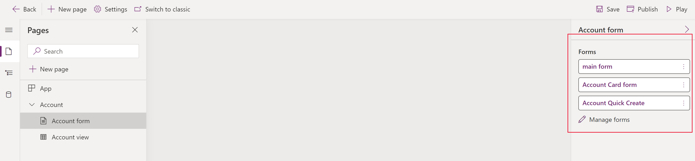

# Create and customize a model-driven app form

In model-driven Power Apps, forms provide the user interface that people use to interact with the data with which they need to work. A table can have one or more forms, and forms come in different types. The different types are main, quick create, quick view, and card. For more information about form types, see [Type of model-driven app forms in Power Apps](types-forms.md).

In this tutorial, you create a main type form and then add the form to a model-driven app. The main form is the primary form type that users see when they open records in model-driven apps.

Main forms have a default three-column layout. Model-driven form fields and components are grouped into tabs (primary grouping) and sections (secondary grouping). Tabs separate the form into logical pages, while sections separate the content within a tab.

## Create and configure a form

1. Sign in to [Power Apps](https://make.powerapps.com/?utm_source=padocs&utm_medium=linkinadoc&utm_campaign=referralsfromdoc).
1. Select **Data** > **Tables** > **Account**.
1. Select the **Forms** tab.
1. Select **Add Form** from the command bar, and then select **Main Form**.
1. The form designer opens for you to configure the properties for the form.

| Property| Description                                                                                                                                                                                                                                                     |
|----------------------|------------------------------------------------------------------------------------------------------------------------------------------------------------------------------------------------------------------------------------------------------|
| **Title**            | Enter a name that is meaningful to other makers and app users. This name is shown to app users. If users have access to multiple forms for a table, they will use this name to differentiate between the available forms.  This property is required. |
| **Description**      | Enter a description that explains how the form is different from other main forms. This description is only shown to makers in the form designer and in the list of forms for a table in the solution explorer.                                                               |
| **Max Width**        | Set a maximum width (in pixels) to limit the width of the form. The default value is 1900.  This property is required.                                                                                                                               |
| **Show image**       | Show the table’s **Primary Image** if it has one set. This setting will enable showing the image column in the header of the form. For more information about table options, see [Enable or disable table options](../data-platform/edit-entities.md#enable-or-disable-table-options) .                                    |

### Change the tab layout
If you wish to use a different layout than the default three columns in a tab, follow these steps:

1. Select the tab name, such as **Summary**.
1. In the **Properties** pane on right, select the **Formatting** area to expand it.
1. Select the **Layout** drop-down list, and then select your desired layout, such as **1 column** or **2 columns**.
   :::image type="content" source="media/create-and-edit-a-model-driven-form/changing-the-tab layout-1.png" alt-text="Use a different layout than the default three column in a tab layout.":::

### Add items to the form

Using the left side panel in the form designer, you can add different items to the form depending on which tab you select.

#### Components

From this tab you can add new form tabs, sections, or visual controls. More information: [Add, configure, move, or delete components on a form](add-move-configure-or-delete-components-on-form.md)

#### Table columns

From this tab you can add form fields, also called table columns. More information: [Add, configure, move, or delete columns on a form](add-move-or-delete-fields-on-form.md)

#### Tree view

From this tab you can select to navigate to the form header, footer, or any tab or section on the form. This is useful when configuring forms with many tabs. More information: [Using the tree view in the form designer](using-tree-view-on-form.md)

#### Form libraries

Model-driven forms allow you to add JavaScript libraries to further extend your form behavior.  

### Exercise: Add a new section and fields to the form

By default, the account form includes a single address section. However, the account table also includes a second address set. In cases where  you need to track shipping and billing addresses, it's common to add the second address set to the form. Follow these steps to add a new **ADDRESS 2** section and associated columns to the form.

1. Select the **Address** section of the form in the form designer.
1. On the left pane of the form designer select the **Components** tab, and then select **1 Column Section**.
   A new section is added below the **ADDRESS** section.
1. In the right **Properties** pane, change the **Label** from **New Section** to *ADDRESS 2*.
   

1. On left pane, select the **Table columns** tab.
1. With the *ADDRESS 2* section still selected, select **Address 2: Street 1** from the table column list to add the field to the **ADDRESS 2** section.
1. Repeat the previous step to add the following fields:
   - **Address 2: Street 2**
   - **Address 2: Street 3**
   - **Address 2: City**
   - **Address 2: State/Province**
   - **Address 2: Zip/Postal Code**
   - **Address 2: Country/Region**

   :::image type="content" source="media/create-and-edit-a-model-driven-form/new-address2-section.png" alt-text="New address 2 section with related columns.":::
   > [!NOTE]
   > You can also drag and drop fields. This is especially useful when you want to move columns to a different area or section.
1. On the form designer command bar select **Save**, and then select **Publish**.
1. Close the form designer tab in your browser.

## Control which form is visible in your model-driven app

If your app includes multiple model-driven main forms, users can select which form to view. If you want to restrict users of your app to only view records with your newly configured form, follow these steps.

1. Sign in to [Power Apps](https://make.powerapps.com/?utm_source=padocs&utm_medium=linkinadoc&utm_campaign=referralsfromdoc).
1. Go to **Apps**, select **...** next to a model-driven app, such as the Account Tracking app you can create following this article: [Build your first model-driven app](build-first-model-driven-app.md), and then select **Edit**.
1. In app designer, select a form, such as the account main form.
1. On the right pane, select **Manage forms**.
1. Select the forms that you want to display in the app, such as **main form**, **Account Card form**, and **Account Quick Create**. Clear the other forms, such as **Account**.
   
1. Select **Save**, and then select **Publish** to reflect the changes in the app.

### Controlling access to your forms

We recommend that you select all quick view forms and quick create type forms, unless you have specific reasons to not check them. Only select the main form or forms that you want users to see. You must also ensure that your new form is enabled for a security role that users of the app have been assigned. You can further control how users will access forms in an app by configuring the form order and fallback form. For more information, see these articles:
- [Set security roles for a form](control-access-forms.md#set-security-roles-for-a-form)
- [Set the form order](control-access-forms.md#set-the-form-order)
- [Set the fallback form for a table](control-access-forms.md#set-the-fallback-form-for-a-table)

## View your new form

Now that you have created and modified a new form, let’s test it out. Follow these steps to view your new form:
1. In app designer, select **Play**.
1. Open an account record.
1. The new main form with the section for **ADDRESS 2** is displayed. If your new account **main form** isn't displayed, select **main form** from the form selector in the upper left of the form.
   