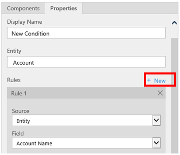
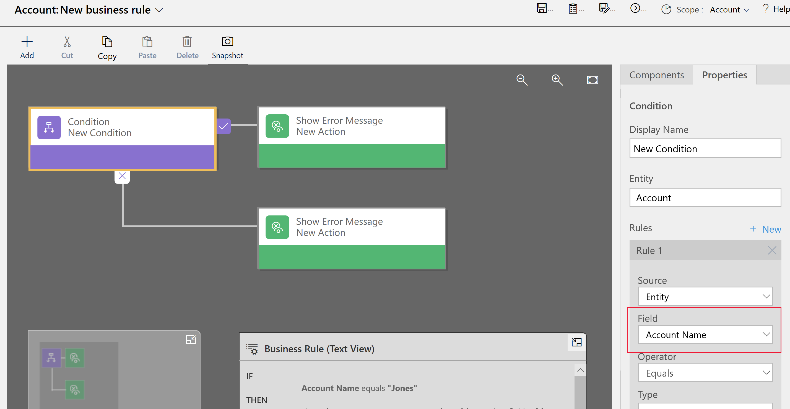
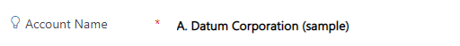
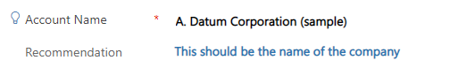

# Create business rules to apply logic in a model-driven app form

Very often it's necessary to add in business logic to ensure that columns in a model-driven app are shown, hidden, or set with the correct values.

This article shows how to create [business rules](model-driven-app-glossary.md#business-rule) and recommendations to apply form logic in a model-driven app without writing JavaScript code or creating plug-ins. Business rules provide a simple interface to implement and maintain fast-changing and commonly used rules. They can be applied to main and quick create forms. Business rules work in model-driven apps, legacy web apps, Dynamics 365 for tablets, and Dynamics 365 for Outlook (online or offline mode).

By combining conditions and actions, the following actions are possible with business rules:  
  
-   Set column values  
  
-   Clear column values  
  
-   Set column requirement levels  
  
-   Show or hide columns  
  
-   Enable or disable columns  
  
-   Validate data and show error messages  
  
-   Create business recommendations based on business intelligence.  

> [!NOTE]
> To define a business rule for a table so that it applies to all forms, see [Create a business rule for a table](../data-platform/data-platform-create-business-rule.md).
>
> Business rules don’t work with multi-select choices.
  
## View, edit, or create a business rule in Power Apps

1. Sign in to [Power Apps](https://make.powerapps.com/?utm_source=padocs&utm_medium=linkinadoc&utm_campaign=referralsfromdoc).  
1. Select **Solutions** on the left navigation pane, open the solution you want, and then open or add the table you want.
1. Select **New**, and then under **Customizations**, select **Business rule**. [!INCLUDE [left-navigation-pane](../../includes/left-navigation-pane.md)]

The business rules designer opens. Next step: [Set the business rule properties](#set-the-business-rule-properties)

## View, edit, or create a business rule in form designer

1. On form designer left navigation pane, select **Business rules**.

1. Select from these options: 
   - By default, only active business rules for the form are displayed. Clear **Show only active business rules** to view deactivated business rules for the form.
   - To create a business rule, select **New business rule**.
   - Select the business rule to view properties and edit the business rule.
   :::image type="content" source="media/business-rule-properties.png" alt-text="Business rule properties.":::

## Set the business rule properties

When the business rule designer window opens for a new rule, a single condition is already created. Every rule starts with a condition. The business rule takes one or more actions based on that condition.
 
:::image type="content" source="media/business-rules-design-window.png" alt-text="Sample model-driven app" lightbox="media/business-rules-design-window.png":::

Enter or select the following properties from the business rule command bar.

1. **Business rule name**: By default, the rule is named *New business rule*. We recommend you enter a meaningful name for the business rule.
1. **Description**: Optionally, add a description.  
1. **Scope**: The scope of the business rule determines which forms the business rule will be applied. You set the scope, according to these options:  
  
    :::row:::
     :::row-end:::
    :::row:::
    :::column span="":::
       **If you select this item...**
    :::column-end:::
    :::column span="":::
       **The scope is set to...**
    :::column-end:::
    :::row-end:::
    :::row:::
    :::column span="":::
       **Entity**
    :::column-end:::
    :::column span="":::
       The table and all forms for the table
    :::column-end:::
    :::row-end:::
    :::row:::
    :::column span="":::
       **All Forms**
    :::column-end:::
    :::column span="":::
       All forms for the table
    :::column-end:::
    :::row-end:::
    :::row:::
    :::column span="":::
       Specific form (account **Main Form**, for example)
    :::column-end:::
    :::column span="":::
       Just that form
    :::column-end:::
    :::row-end:::

> [!NOTE]
> To modify an existing business rule, you must deactivate it before you can modify it.

## Build the business rule

1. **Add conditions.** To add more conditions to your business rule:  
  
    1. Drag the **Condition** component from the **Components** tab to a plus sign in the designer.  
  
          
  
    2. To set properties for the condition, select the **Condition** component in the designer window, and then set the properties in the **Properties** tab on the right side of the screen. As properties are set, an expression is created at the bottom of the **Properties** tab.  
  
    3. To add an additional clause (an AND or OR)  to the  condition, select **New** in the **Properties** tab to create a new rule, and then set the properties for that rule. In the **Rule Logic** column, you can specify whether to add the new rule as an AND or an OR.  
  
          
  
    4. Once finished setting properties for the condition, select **Apply**.  
  
2. **Add actions.** To add an action:  
  
    1.  Drag one of the action components from the **Components** tab to a plus sign next to **Condition** component. Drag the action to a plus sign next to a check mark if you want the business rule to take that action when the condition is met, or to a plus sign next to an  x if you want the business rule to take that action if the condition isn't met.  
  
          
  
    2.  To set properties for the action, select the **Action** component in the designer window, and then set the properties in the **Properties** tab.  
  
    3.  When finished setting properties, select **Apply**.  
  
3. **Add a business recommendation.** To add a business recommendation:  
  
    1. Drag the **Recommendation** component from the **Components** tab to a plus sign next to a **Condition** component. Drag the **Recommendation** component to a plus sign next to a check mark if you want the business rule to take that action when the condition is met, or to a plus sign next to an  x if you want the business rule to take that action if the condition isn't met.  
  
    2. To set properties for the recommendation, select the **Recommendation** component in the designer window, and then set the properties in the **Properties** tab.  
  
    3. To add more actions to the recommendation, drag them from the **Components** tab, and then set properties for each action in the **Properties** tab.  
  
       > [!NOTE]
       >  When you create a recommendation, a single action is added by default. To see all the actions in a recommendation, select **Details** on the **Recommendation** component.  
  
    4. When you're finished setting properties, select **Apply**.  
  
4. To validate the business rule, select **Validate** on the action bar.  
  
5. To save the business rule, select **Save** on the action bar.  
  
6. To activate the business rule, select it in the Solution Explorer window, and then select **Activate**. It isn't possible to activate the business rule from the designer window.  
  
> [!TIP]
> Here are a few tips to keep in mind as you work on business rules in the designer window:  
>
> - To take a snapshot of everything in the **Business Rule** window, select **Snapshot** on the action bar. This is useful, for example, when getting feedback from team members.  
> - Use the mini-map to navigate quickly to different parts of the process. This is useful when working on a complicated process that scrolls off the screen.  
> - As you add conditions, actions, and business recommendations to your business rule, code for the business rule is built and appears at the bottom of the designer window. This code is read-only.  
  
## Localize error messages used in business rules

If more than one language is provisioned for your environment, it's worth localizing any error messages that are set. Each time a message is set, a label is generated by the system. If the translations in your environment are set, localized versions of your messages can be added and then imported back into the system. This enables people using languages other than your base language to view the translated messages.  

## Common issues

This section describes common issues that might occur when you use business rules.

### Full Name column and Address column not supported with Unified Interface apps

Actions or conditions that use a composite column like the **Full Name** `fullname` column or an **Address** column aren't supported in apps based on Unified Interface.  Alternatively, you can use actions or conditions with the constituent columns. For example, for the **Full Name** column, you can use actions or conditions on the  **First Name** (firstname) and **Last Name** (lastname) columns.

### Business rules don't execute for some users

Make sure that users have a security role that includes, at a minimum, user scope read privileges on the Process table. By default, the Basic User security role has this privilege.

### Business rules don't fire on editable grid on a dashboard

Entity scoped business rules won't fire on an editable grid when the editable grid is configured on a dashboard page.

### Is the business rule not firing for a form?

A business rule might not execute because the column referenced in the business rule isn't included with the form.

1. Open solution explorer. Expand the table that you want, and then select **Forms**. 
1. Open the form, and then on the form designer ribbon select **Business Rules**.
1. In the form designer, open the business rule.
1. In the business rule designer, select each condition and action to verify all the columns referenced in each condition and action. 

   > [!div class="mx-imgBorder"] 
   > 

1. Verify that each column referenced in the business rule is also included on the form. If not, add the missing column to the form.

   > [!div class="mx-imgBorder"] 
   > 

A business rule might also not execute because a column referenced in the business rule is a composite column. The constituent columns of the composite column can be used instead.

### Unsupported column types

Columns of type unique identifier and rollup columns aren't supported with business rules.

There are a few special columns which support localizable values, such as the **Name** column for the **Product** table that's included with Dynamics 365 for Sales apps. Columns that support localizable values aren't supported with business rules.

## Frequently asked questions (FAQ)

*Can business rules unlock columns on a read-only form?*
- Yes, a business rule can unlock columns and edit actions on a read-only form.

*How do I troubleshoot a business rule that isn't working?* 
- See [Is your business rule not firing for a form?](create-business-rules-recommendations-apply-logic-form.md#is-the-business-rule-not-firing-for-a-form) in this article.

*What do recommendations look like within a form?*

Recommendations show a light bulb next to the column label.
-   

Select the light bulb to expand the view and show the recommendation.
-   

## See also

 [Create custom business logic through processes](guide-staff-through-common-tasks-processes.md)

 [Create a business process flow](/flow/create-business-process-flow)   

[!INCLUDE[footer-include](../../includes/footer-banner.md)]
