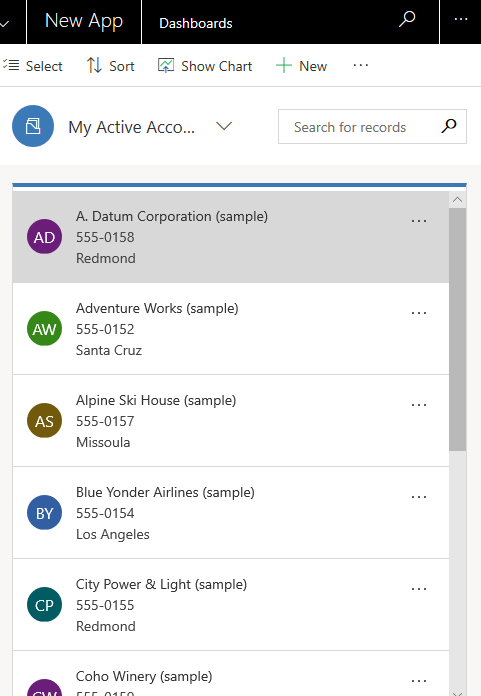
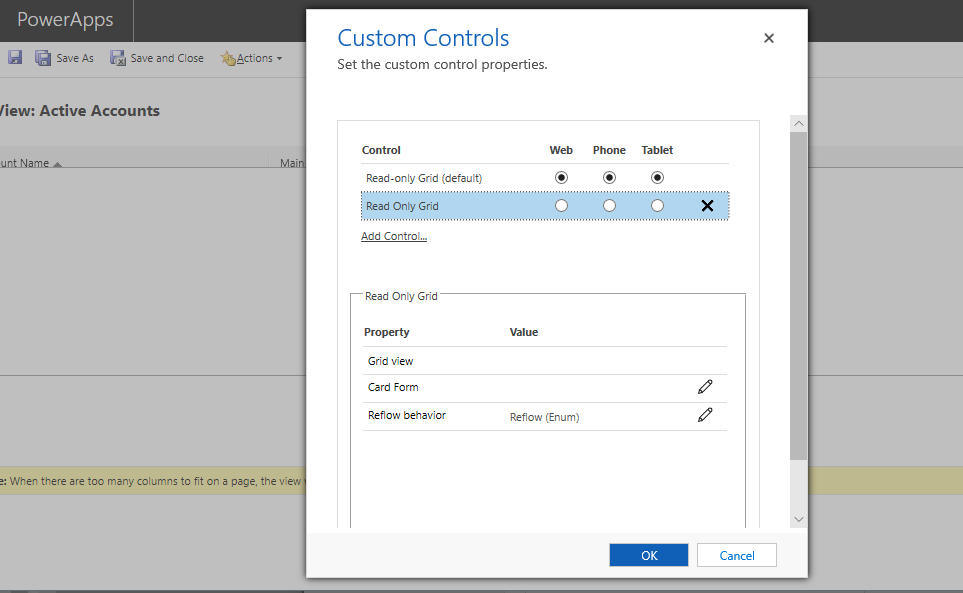

# Create a card form

Card forms are used in views for Unified Interface apps. Card forms are designed to present information in a compact format that is suitable for **mobile devices**. For example, the default card form for the My Active Accounts view defines the information displayed for each account row.

> [!div class="mx-imgBorder"]
> 

Although card forms can be created and edited in the same way as other form types, card forms are added to apps differently. Instead of adding a form as an app component, custom card forms are added to views by using the **Read Only Grid** control.

## Create a card form

1. To create a card form, sign in to [Power Apps](https://make.powerapps.com/?utm_source=padocs&utm_medium=linkinadoc&utm_campaign=referralsfromdoc).
2. Expand **Data**, select **Tables**, select the table you want, and then select the **Forms** tab.
3. On the toolbar select **Add form**, and then select **Card form**. Alternatively, you can open an existing **Form type** that's a **Card** form to edit it.

:::image type="content" source="../../maker/model-driven-apps/media/create-card-form.png" alt-text="Create card form":::

4. Add the columns that you want. We recommend that you limit the number of columns so that the form displays well on small screens.
5. Select **Save** and then select **Publish**.

## Add a card form to a view

1. Sign in to [Power Apps](https://make.powerapps.com/?utm_source=padocs&utm_medium=linkinadoc&utm_campaign=referralsfromdoc).
2. Expand **Data**, select the table you want, and then select the **Views** tab.
3. Select the view that you want, and then on the view designer toolbar, select **Switch to classic**.
4. Select **Custom Controls** from the **Common Tasks** pane.

:::image type="content" source="../../maker/model-driven-apps/media/add-custom-control.png" alt-text="Advanced Settings":::

5. Select **Add Control**, from the list of controls select **Read Only Grid**, and then select **Add**.

   > [!NOTE]
   > There are two read only grid controls. The default read only grid control that is named **Read-only Grid (default)** doesn’t support custom card forms.

6. From the **Read Only Grid** properties page configure the following properties, and then select **OK**. 
   - **Card Form**. Select the pencil icon  and then select the card form you want to display in the view. By default, the primary table associated with the view is already selected, but you can change it. 
   - **Reflow behavior**. If you want to change whether the card form displays when resized, select the pencil icon . More information: [Allow grid to reflow into list](specify-properties-for-unified-interface-apps.md#allow-grid-to-reflow-into-list)  
   - Select the client types, **Web**, **Phone**, or **Tablet**, where you want the **Read Only Grid** control to display.

     

7. Select **OK** to close the **Custom Controls** properties page.
8. On the classic view designer toolbar, select **Save and Close**.

## See also

[Use custom controls for model-driven app data visualizations](use-custom-controls-data-visualizations.md)

[!INCLUDE[footer-include](../../includes/footer-banner.md)]