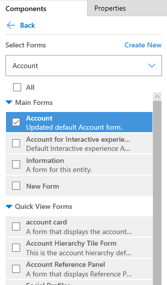

# Create and design model-driven app forms 

With Power Apps model-driven apps, forms provide the user interface that people use to interact with the data they need to do their work. It's important that the forms people use are designed to allow them to find or enter the information they need efficiently.

:::image type="content" source="../../maker/model-driven-apps/media/form-no-header.png" alt-text="Example model-driven App form":::

In the default solution or an unmanaged solution, it is possible to create new forms or edit existing forms for all tables that allow form customization.

### Forms inside unmanaged solutions

In an unmanaged solution, it is possible to edit the properties, including columns, views and forms, for an unmanaged custom table that was created for the solution.  Unmanaged solutions are where app developers go to author changes that they require and typically exist in a **development** environment.

### Forms inside managed solutions

In managed solution, typically in a **production** environment, it is not possible by default to create new forms or edit existing forms for tables. However, if the managed properties for a table in the managed solution are set to allow customization, it is can add or edit forms for that table.

[Learn more about solutions](../../maker/data-platform/solutions-overview.md)

## Form Types
There are different types of forms, and each type has a specific functionality or use.  These include :-

- main (the main user interface)
- quick create (rapid data entry)
- quick view (to see related data)
- card form (a compact view)
  
For more information: [Types of forms in Power Apps](types-forms.md).  

 
   

## Create or edit a form

The fundamentals of building a model-driven app include creating a table, configuring data views in addition to creating and editing forms.

Before beginning to build forms it is worth deciding whether you have all the columns necessary to solve your business problem, in addition to having a sense at the outset as to how to lay these out in terms of sections and tabs.  Broadly speaking, the complexity of your forms will be a reflection of the number of columns in your table in addition to the complexity of your business process.

[Learn to create, edit, or configure forms using the form designer](create-and-edit-forms.md)

## Delete a form
To delete a form, sign in to Power Apps and go to **Solutions** > Open the solution you want > select the table that you want > **Forms** tab. Select the form, and then select **Delete** on the command bar.

There are a couple of reasons you may not be able to delete a form.

|Reason  |Work around  |
|---------|---------|
| Every table requires at least one main form and it is the only main form for the table.   |  Create a new main form for the table. Then delete the main form you tried earlier.  More information: [Create a form](create-and-edit-forms.md#create-a-form)   |
| Every table requires one designated fallback form and it is the only fallback form.   | Create a new form for the table and set as the fallback. Or designate another existing form as the fallback form. Then delete the form you tried earlier. More information: [Set the fallback form for a table](control-access-forms.md#set-the-fallback-form-for-a-table)     |

## Controlling the display of a form within an app

Tables can have multiple forms.  The use of the forms is controlled through the model driven app.  This allows for designers to be able to use the same table in different ways depending on the audience by controlling the display.

By default **all** forms are made available to users, however through the app designer the specific form can be restricted.

### Steps to updating the forms displayed in an app

1. Sign in to [Power Apps](https://make.powerapps.com/?utm_source=padocs&utm_medium=linkinadoc&utm_campaign=referralsfromdoc).
2. Navigate to the solution to be updated.
3. Open the model-driven app in app designer.
4. In the **Table View** area, select **Forms** next to the table.  The components tab will become visible.

:::image type="content" source="../../maker/model-driven-apps/media/create-and-edit-a-model-driven-form/select-forms-to-display-app-app-designer.png" alt-text="select forms to display in the app designer":::

5. On the **Components** tab, verify the main forms that are included for the app. Verify that the form you want to display is checked. If not, select it, save, and then publish the app.

   > [!div class="mx-imgBorder"] 
   > 

## Setting the default form for an app

A form can be set as the default form through the form order configuration **or** when a user sets the default form as a personalization setting.

When we set the default form order this is done at the level of the **table** and not the app.  Therefore, one form order per table.

1. Sign in to [Power Apps](https://make.powerapps.com/?utm_source=padocs&utm_medium=linkinadoc&utm_campaign=referralsfromdoc).
2. Select **Dataverse** and navigate to the required table.
3. Select the **Forms** tab, select the ellipses (...) and select **Form settings**

:::image type="content" source="../../maker/model-driven-apps/media/create-and-edit-a-model-driven-form/form-settings-navigation.png" alt-text="select forms settings":::

4. In the form settings dialogue select **form order** and then the **form set**, or form type, you would like to order.

:::image type="content" source="../../maker/model-driven-apps/media/create-and-edit-a-model-driven-form/form-settings-order.png" alt-text="select forms settings":::

5. Once in the form order area use the handles to move the order of the forms.

6. Select **Save and Publish** to save the form order changes.

## Updated versus classic tables  
Power Apps provides many options for designing forms using the form designer.
  
There are still a number of tables, referred to here as classic tables, that retain the appearance and capabilities from earlier versions. These tables are used less often. They are listed here:  

:::row:::
   :::column span="":::
      Address
   :::column-end:::
   :::column span="":::
      Article
   :::column-end:::
   :::column span="":::
      Article Comment
   :::column-end:::
   :::column span="":::
      Bulk Delete Operation
   :::column-end:::
   :::column span="":::
      Connection
   :::column-end:::
:::row-end:::
:::row:::
   :::column span="":::
      Discount
   :::column-end:::
   :::column span="":::
      Discount List
   :::column-end:::
   :::column span="":::
      Document Location
   :::column-end:::
   :::column span="":::
      Email Attachment
   :::column-end:::
   :::column span="":::
      Follow
   :::column-end:::
:::row-end:::
:::row:::
   :::column span="":::
      Goal
   :::column-end:::
   :::column span="":::
      Goal Metric
   :::column-end:::
   :::column span="":::
      Import Source File
   :::column-end:::
   :::column span="":::
      Invoice Product
   :::column-end:::
   :::column span="":::
      Order Product
   :::column-end:::
:::row-end:::
:::row:::
   :::column span="":::
      Price List
   :::column-end:::
   :::column span="":::
      Queue Item
   :::column-end:::
   :::column span="":::
      Quote Product
   :::column-end:::
   :::column span="":::
      Rollup Field
   :::column-end:::
   :::column span="":::
      Rollup Query
   :::column-end:::
:::row-end:::
:::row:::
   :::column span="":::
      Saved View
   :::column-end:::
   :::column span="":::
      Service
   :::column-end:::
   :::column span="":::
      Service Activity
   :::column-end:::
   :::column span="":::
      SharePoint Site
   :::column-end:::
   :::column span="":::
      Site
   :::column-end:::
:::row-end:::
:::row:::
   :::column span="":::
      Territory
   :::column-end:::
   :::column span="":::
      Unit
   :::column-end:::
   :::column span="":::
      Unit Group
   :::column-end:::
   :::column span="":::
             
   :::column-end:::
   :::column span="":::
           
   :::column-end:::
:::row-end:::

## Main form dialogs
With the client API, you can use main form dialogs so users can open a related row table on a parent or base form without navigating away from the form. More information: [Open main form in a dialog using client API](../../developer/model-driven-apps/customize-entity-forms.md#open-main-form-in-a-dialog-using-client-api)

### Related topics  
[Creating custom tables](../../maker/data-platform/create-custom-entity.md)   
[Assign form order](assign-form-order.md)  
[Control access to forms](control-access-forms.md)  
[How main forms appear in different clients](main-form-presentations.md)  

[!INCLUDE[footer-include](../../includes/footer-banner.md)]
