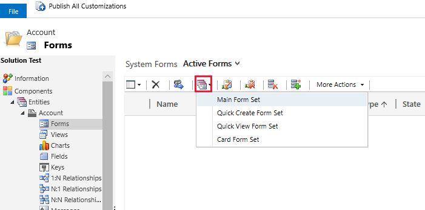
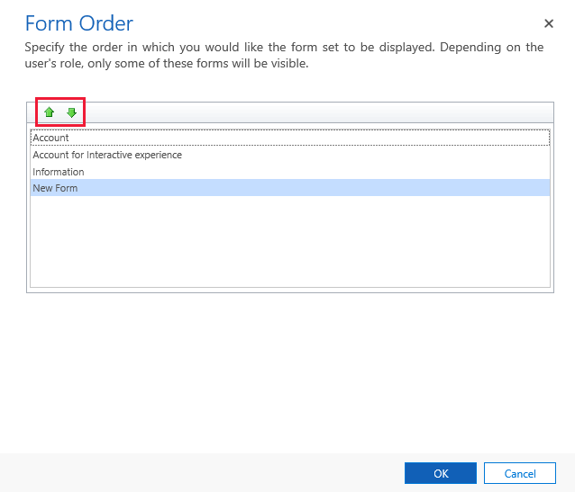
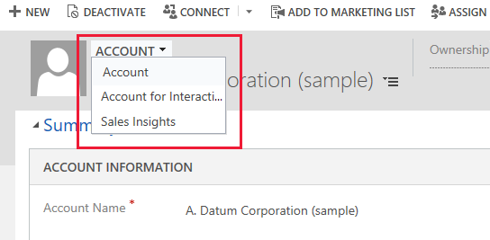

# Create and design model-driven app forms 

With Power Apps, forms provide the user interface that people use to interact with the data they need to do their work. It's important that the forms people use are designed to allow them to find or enter the information they need efficiently. 

In the default solution or an unmanaged solution, you can create new forms or edit existing forms for all tables that allow form customization. 
In an unmanaged solution, you can edit the managed properties for an unmanaged custom table that was created for the solution.
If you’re viewing a managed solution, you can’t create new forms or edit existing forms for tables. However, if the managed properties for a table in the managed solution are set to allow customization, you can add or edit forms for that table. 
  

 
## Type of forms
There are different types of forms, and each type has a specific functionality or use. More information: [Type of forms in Power Apps](types-forms.md).  

## Main form dialogs
With the client API, you can use main form dialogs so users can open a related row table on a parent or base form without navigating away from the form. More information: [Open main form in a dialog using client API](../../developer/model-driven-apps/customize-entity-forms.md#open-main-form-in-a-dialog-using-client-api) 
  
   
## Updated versus classic tables  
Power Apps provides many options for designing forms. With Unified Interface, most tables were updated to better suit the responsive interface. Updated tables as well as your own custom tables include support for the Dynamics 365 for tablets client, business process flows, and business rules. When you use these tables, you can design once and deploy to all clients.  
  
There are still a number of tables, referred to here as classic tables, that retain the appearance and capabilities from earlier versions. These tables are used less often. They are listed here:  

:::row:::
   :::column span="":::
      Address
   :::column-end:::
   :::column span="":::
      Article
   :::column-end:::
   :::column span="":::
      Article Comment
   :::column-end:::
   :::column span="":::
      Bulk Delete Operation
   :::column-end:::
   :::column span="":::
      Connection
   :::column-end:::
:::row-end:::
:::row:::
   :::column span="":::
      Discount
   :::column-end:::
   :::column span="":::
      Discount List
   :::column-end:::
   :::column span="":::
      Document Location
   :::column-end:::
   :::column span="":::
      Email Attachment
   :::column-end:::
   :::column span="":::
      Follow
   :::column-end:::
:::row-end:::
:::row:::
   :::column span="":::
      Goal
   :::column-end:::
   :::column span="":::
      Goal Metric
   :::column-end:::
   :::column span="":::
      Import Source File
   :::column-end:::
   :::column span="":::
      Invoice Product
   :::column-end:::
   :::column span="":::
      Order Product
   :::column-end:::
:::row-end:::
:::row:::
   :::column span="":::
      Price List
   :::column-end:::
   :::column span="":::
      Queue Item
   :::column-end:::
   :::column span="":::
      Quote Product
   :::column-end:::
   :::column span="":::
      Rollup Field
   :::column-end:::
   :::column span="":::
      Rollup Query
   :::column-end:::
:::row-end:::
:::row:::
   :::column span="":::
      Saved View
   :::column-end:::
   :::column span="":::
      Service
   :::column-end:::
   :::column span="":::
      Service Activity
   :::column-end:::
   :::column span="":::
      SharePoint Site
   :::column-end:::
   :::column span="":::
      Site
   :::column-end:::
:::row-end:::
:::row:::
   :::column span="":::
      Territory
   :::column-end:::
   :::column span="":::
      Unit
   :::column-end:::
   :::column span="":::
      Unit Group
   :::column-end:::
   :::column span="":::
             
   :::column-end:::
   :::column span="":::
           
   :::column-end:::
:::row-end:::

## Create or edit a form

Create or edit forms for model-driven apps. More information: [Create, edit, or configure forms using the form designer](create-and-edit-forms.md)

## Delete a form
To delete a form, sign in to Power Apps and go to **Solutions** > Open the solution you want > select the table that you want > **Forms** tab. Select the form, and then select **Delete** on the command bar.

There are a couple of reasons you may not be able to delete a form.

|Reason  |Work around  |
|---------|---------|
| Every table requires at least one main form and it is the only main form for the table.   |  Create a new main form for the table. Then delete the main form you tried earlier.  More information: [Create a form](create-and-edit-forms.md#create-a-form)   |
| Every table requires one designated fallback form and it is the only fallback form.   | Create a new form for the table and set as the fallback. Or designate another existing form as the fallback form. Then delete the form you tried earlier. More information: [Set the fallback form for a table](control-access-forms.md#set-the-fallback-form-for-a-table)     |

## Form display FAQ

### Why is my form not visible in the form selector drop down in my app?
A form may not be available because it hasn’t been added to the app.
1. Open the app in app designer.
2. In the **Table View** area, select **Forms** next to the table.
3. On the **Components** tab, verify the main forms that are included for the app. Verify that the form you want to display is checked. If not, select it, save, and then publish the app.

   > [!div class="mx-imgBorder"] 
   > 
   
### Why isn't my form displayed as the default form in the app?
A form can be set as the default form through the form order configuration or when a user sets the default form as a personalization setting.
1. Open solution explorer. Expand the table that has the forms you want to order, and then select **Forms**.
2. On the toolbar select **Form Order** > **Main Form Set**. 

   > [!div class="mx-imgBorder"] 
   > 
   
3. The form order is displayed. Select the form and use the up and down arrows to move the form within the form order. The form at the top of the list is the default form. 

   > [!div class="mx-imgBorder"] 
   > 
   
4. Select **OK** to save the form order changes.
5. On the form designer toolbar, select **Publish** to make the form order available in apps.
 
#### Form order user personalization setting
Notice that, when an app user changes the form selection in the form selector drop down of an app, that form becomes the default form for the user. This personalization overrides the default form specified for the table in the app.

   > [!div class="mx-imgBorder"] 
   > 

### Related topics  
    
[Assign form order](assign-form-order.md)  
[Control access to forms](control-access-forms.md)  
[How main forms appear in different clients](main-form-presentations.md)  

[!INCLUDE[footer-include](../../includes/footer-banner.md)]
