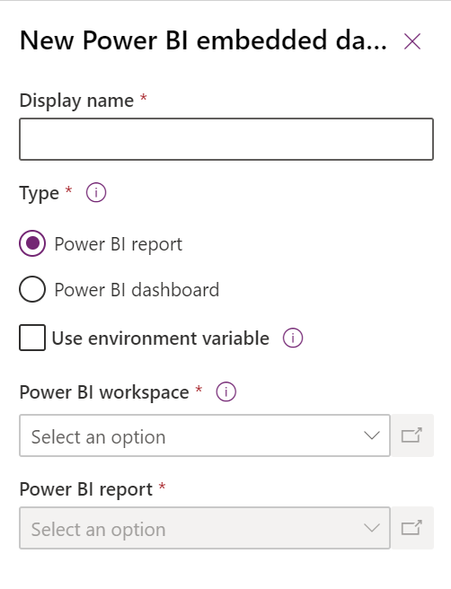

# Create or edit a Power BI embedded dashboard (preview)

[!INCLUDE [cc-beta-prerelease-disclaimer](../../includes/cc-beta-prerelease-disclaimer.md)]

This article explains how to setup and use a system dashboard that references a Power BI report or dashboard in a model-driven app. 

To learn more about Power BI reports and dashboards, see <a href="https://docs.microsoft.com/power-bi/create-reports/">Create Power BI Reports</a>. 

> [!IMPORTANT]
> - This is a private preview feature and requires an maker & environment feature flags to be enabled to author and view a Power BI embedded page in a model-driven app.
> - [!INCLUDE[cc_preview_features_definition](../../includes/cc-preview-features-definition.md)]

## Create a system dashboard with Power BI embedded

This procedure shows you how to setup a Power BI embedded page for a single environment connected to a Power BI workspace. 

1. Go to the **Solutions** area in <a href="https://make.powerapps.com">make.powerapps.com</a>, then create or edit a solution. 

    > [!NOTE]
    > Append "?powerappsPortal.powerbiAllowAsSystemDashboard=true" to the URL to enable the private preview

2. Select **New** > **Dashboards** > **Power BI embedded**.

    > [!div class="mx-imgBorder"] 
    > 

3. Enter the following information in the **New Power BI embedded** dialog that appears: 
   -  Enter a name for the dashboard, which will be shown to the user in the selector on the **Dashboards** page. 
   - Select the type, either **Power BI report** or **Power BI dashboard**. 
   - Select a Power BI workspace. 
   - Select a Power BI report or dashboard.

    > [!div class="mx-imgBorder"] 
    > 

4. Select **Save** to save and publish the system dashboard. 

## Add a Power BI embedded page to a model-driven app

1. Create or edit an existing model-driven app using the app designer.

2. Select the **Dashboards** subarea on the app designer canvas. 

    > [!div class="mx-imgBorder"] 
    > 

3. In the dashboards property pane, there is a **Power BI embedded page** category. Clear **All** to select specific dashboards. Optionally, the Power BI embedded page can be set as the default dashboard in the sitemap.

    > [!div class="mx-imgBorder"] 
    > 

4. Open **Sitemap** from the app designer, then select the existing **Dashboards** subarea or insert one.

5. Open the **Default Dashboard** property and then select the Power BI embedded dashboard name.

    > [!div class="mx-imgBorder"] 
    > 

6. To save your changes and make them available to users, save and publish the model-driven app.

## Select the Power BI embedded page in the model-driven app 

  > [!Note]
  > During the private preview phase, a server feature flag needs to be enabled per environment to allow viewing the Power BI embedded page in a model-driven app 

1. Play the model-driven app, and then select a dashboard from the left navigation pane. 

2. Open the dashboard selector and select the Power BI embedded page. 

<!-- Reference this section for "Use environment variable" Learn more link -->
## Create Power BI embedded page with an Environment Variable

When a solution with a Power BI embedded component will be moved to other environments, you can turn on **Use environment variable** to configure the dashboard. For each environment, you can specify the workspace and either a dashboard or report to reference. Environment variables allow configuration without unmanaged customizations.

1. Create or edit an existing Power BI embedded dashboard.

2. Select **Use environment variable**.

    > [!div class="mx-imgBorder"] 
    > 

3. Open the **Power BI environment variable** selector and then select **New environment variable**.

    > [!div class="mx-imgBorder"] 
    > 

    A nested panel opens where you create the environment variable. The environment variable properties are automatically filled using the dashboard **Display Name** and **Name**.

    You can configure the workspace and report or dashboard. The values are stored as JSON. 

    > [!div class="mx-imgBorder"] 
    > 

4. Save the environment variable. The default and current values for workspace and report or dashboard are displayed. 

    > [!div class="mx-imgBorder"] 
    > 

## Related

* [Create or edit model-driven app dashboards](create-edit-dashboards.md)

* [View entity data in Power BI Desktop](../common-data-service/view-entity-data-power-bi.md)

* [Environment variables overview](../common-data-service/environmentvariables.md)
